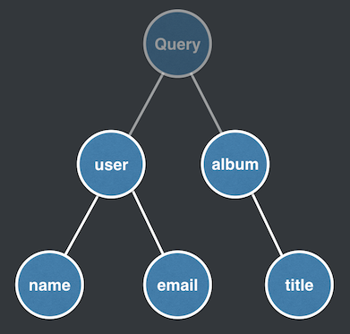

# GraphQL Resolvers: Best Practices

https://medium.com/paypal-tech/graphql-resolvers-best-practices-cd36fdbcef55

## Resolvers

Every field on every type is backed by a function called `resolvers`

Resolvers can return primitives or objects.
Resolvers can be asynchronous too

## Queries execution

Queries are `parsed`, `validated`, and `executed`

1. Parse - into an abstract syntax tree (AST)
2. Validate - AST validated against the schema
3. Execute - Runtime walks through AST from root of tree down, invoking resolvers, collecting results, emitting JSON

### Example

This query ...

```graphql
query {
  user {
    name
    email
  }
  album {
    title
  }
}
```

... is parsed into the below abstract syntax tree:



Two root fields `user` and `album` resolvers are executed in parallel.
These fields are executed breadth-first before children (ie `name`, `email`, and `title`) are resolved

## Resolvers

Resolvers take 4 arguments `root`, `args`, `context`, and `info`.

- `root` - from parent type
- `args` - arguments to the field
- `context` - mutable object provided to all resolvers
- `info` - field specific information relevant to query

Example

```typescript
export default {
  Event: {
    title: (root, args, context, info) => {
      // Do stuff
    },
  },
};
```

## Passing data between resolvers

`Context` is a mutable object provided to resolvers. They are created and destroyed between each request.

`Context` is a great place to store common Auth data, models/fetchers for API and databases

It is not recommended to use `context` as a general purpose cache

Example schema

```typescript
type Query {
  event(id: ID!): Event
}

type Event {
  title: String
  photoUrl: String
}
```

Example resolver

```typescript
export default {
  Event: {
    title: async ({ id }, args, context) => {
      const event = await getEvent(id);

      // Store event in context for later
      context.event = event;

      return event.title;
    },
    photoUrl: async (root, args, context) => {
      // Not deterministic
      // `context.event` might not exist
      return context.event.photoUrl;
    },
  },
};
```

When `title` is invoked, event result is stored in `context`.
When `photoUrl` is invoked, event is pulled out of `context` but it is not guaranteed `title` will be executed before `photoUrl`

It is best to _avoid mutating context inside resolvers_

## Passing data from parent to child

`root` argument is used for passing data from parent to child

For this example, we might want to fetch the data once on the top level as all fields depend on the same data

```typescript
type Event {
  title: String
  photoUrl: String
}
```

Fetching using the top level `event` resolver and provides results to `title` and `photoUrl`:

```typescript
export default {
  Query: {
    event: async (root, { id }) => await getEvent(id),
  },
  Event: {
    title: ({ title }) => title,
    photoUrl: ({ photoUrl }) => photoUrl,
  },
};
```

We dont even need to specify bottom two resolvers, by using default resolvers as `getEvent()` has `title` and `photoUrl` property

```typescript
export default {
  Query: {
    event: async (root, { id }) => await getEvent(id),
  },
};
```

However, this can lead to overfetching

### 1. Multi-layered data fetching

Example: if we require to display `attendees`

```typescript
type Event {
  title: String
  photoUrl: String
  attendees: [Person]
}
```

Here we have two options: fetch data at `event` resolver; or fetch data at `attendees` resolver

1. Fetching with `event` resolver

```typescript
export default {
  Query: {
    event: async (root, { id }) => {
      const event = await getEvent(id);
      const attendees = await getAttendeesFromEvent(id);

      return {
        ...event,
        attendees,
      };
    },
  },
};
```

If client queries `title` and `photoUrl` and not `attendees` then this is inefficient

2. Fetching with `attendees` resolver

```typescript
export default {
  Query: {
    event: async (root, { id }) => await getEvent(id),
  },
  Event: {
    attendees: async (root, { id }) => await getAttendeesFromEvent(id),
  },
};
```

If client queries only `attendees` then this is inefficient

### 2. N+1 problem

Because data is fetch at field-level, we risk overfetching.

Example with `events` field that returns all events:

```typescript
type Query {
  event(id: ID): Event
  events: [Event]
}

type Event {
  title: String
  photoUrl: String
  attendees: [Person]
}

type Person {
  id: ID
  name: String
}
```

Example of query for all `events` with title and `attendees`

```graphql
query {
  events {
    title
    attendees {
      name
    }
  }
}
```

If client queries all `events` and `attendees`, we risk overfetching because `attendees` can attend more than one event. We may make duplicate requests

To solve this we need batch and de-dupe requests. Popular options in JavaScripts are dataloader and Apollo data sources

## Fetching data at a field level

What if child fields are responsible for fetchign their own data

```typescript
export default {
  Query: {
    event: async (root, { id }) => ({ id }),
  },
  Event: {
    title: async ({ id }) => {
      const { title } = await getEvent(id);

      return title;
    },
    photoUrl: async ({ id }) => {
      const { photoUrl } = await getEvent(id);

      return photoUrl;
    },
    attendees: async ({ id }) => {
      await getAttendeesFromEvent(id);
    },
  },
};
```

Fields are responsible for their own data fetching!

Benefits

- Code is easy to reason and debug
- Code is testable in smaller units
- Repeated `getEvent()` might be code smell but it is worth the simplicity

However, if client queries `title` and `photoUrl`, there are still 2 `getEvent` calls as per N+1 problem. This can be managed with libraries like dataLoader and Apollo data sources

## Best practices summary

- Fetching and passing data from parent to child should be used sparingly

- Use libraries to de-dupe downstream requests

- Be aware of any pressure causing on data sources

- Don't mutate `context` to ensure deterministic code

- Write resolvers that are readable, maintainable, testable. Don't be clever

- Make resolvers as thin as possible. Extract out data fetching logic to reusable async functions
