# IAM lab
- [IAM lab](#iam-lab)
  - [Definitions](#definitions)
  - [Users](#users)
  - [Groups](#groups)
  - [Policies](#policies)
  - [Assigning users to groups](#assigning-users-to-groups)
  - [Testing permissions](#testing-permissions)
    - [User-1 S3 support - create S3 bucket test](#user-1-s3-support---create-s3-bucket-test)
    - [User-2 EC2 support - stopping ec2](#user-2-ec2-support---stopping-ec2)
    - [User-3 EC2 admin - view start and stop ec2](#user-3-ec2-admin---view-start-and-stop-ec2)

## Definitions
- IAM lets you manage users and permissions. Can be service or resource levels
- Manage users, security creds
- Users can access resources with credentials
- IAM is a global service all across all available AWS regions. 

Multiple groups within the account
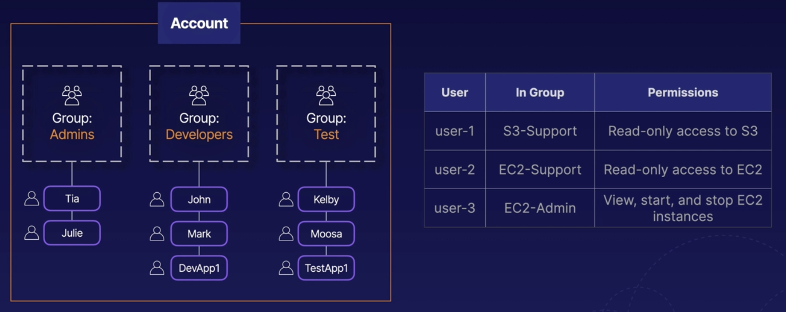

## Users

Multiple users here
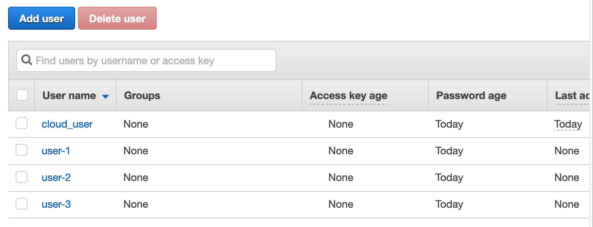

Each users have unique arn
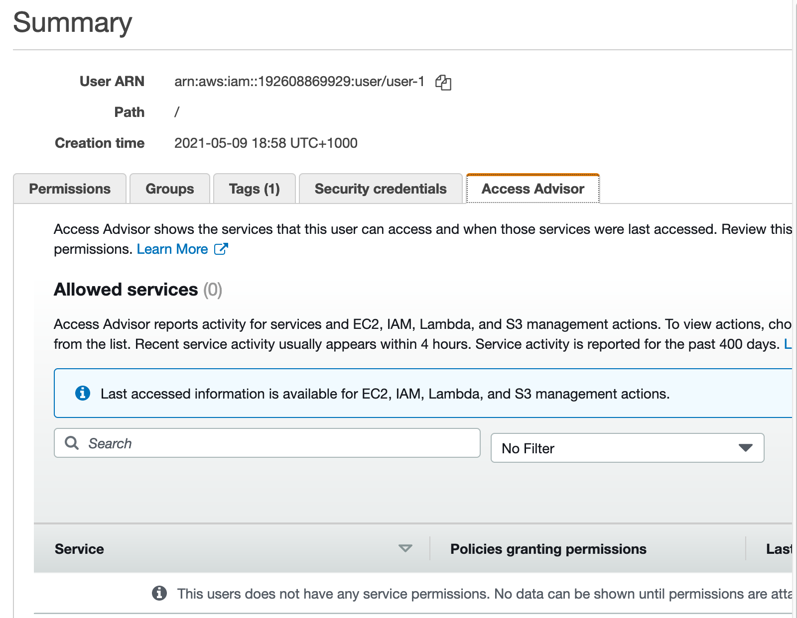

## Groups

Groups can be assigned polciies
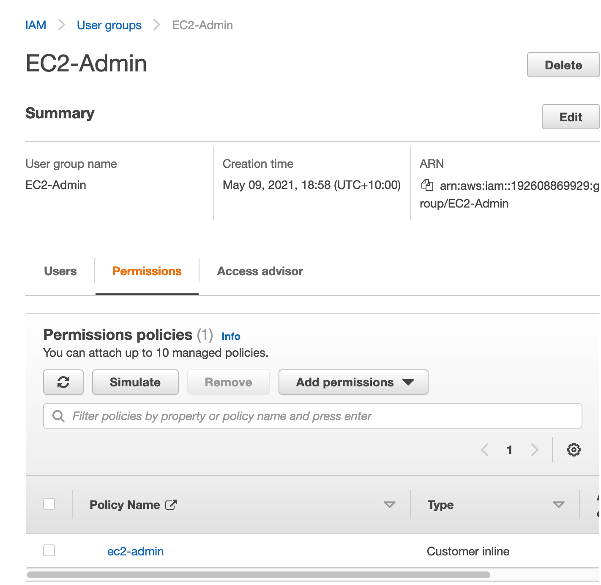

- Managed policies - shared policies, any users or groups permissions will automatically be updated as policy gets updated
- Inline policies - one off situations attached to one user or one group

## Policies

Policy in json defining granular access to AWS resources. 

EC2-Admin group has this policy attached which allows EC2 admin access
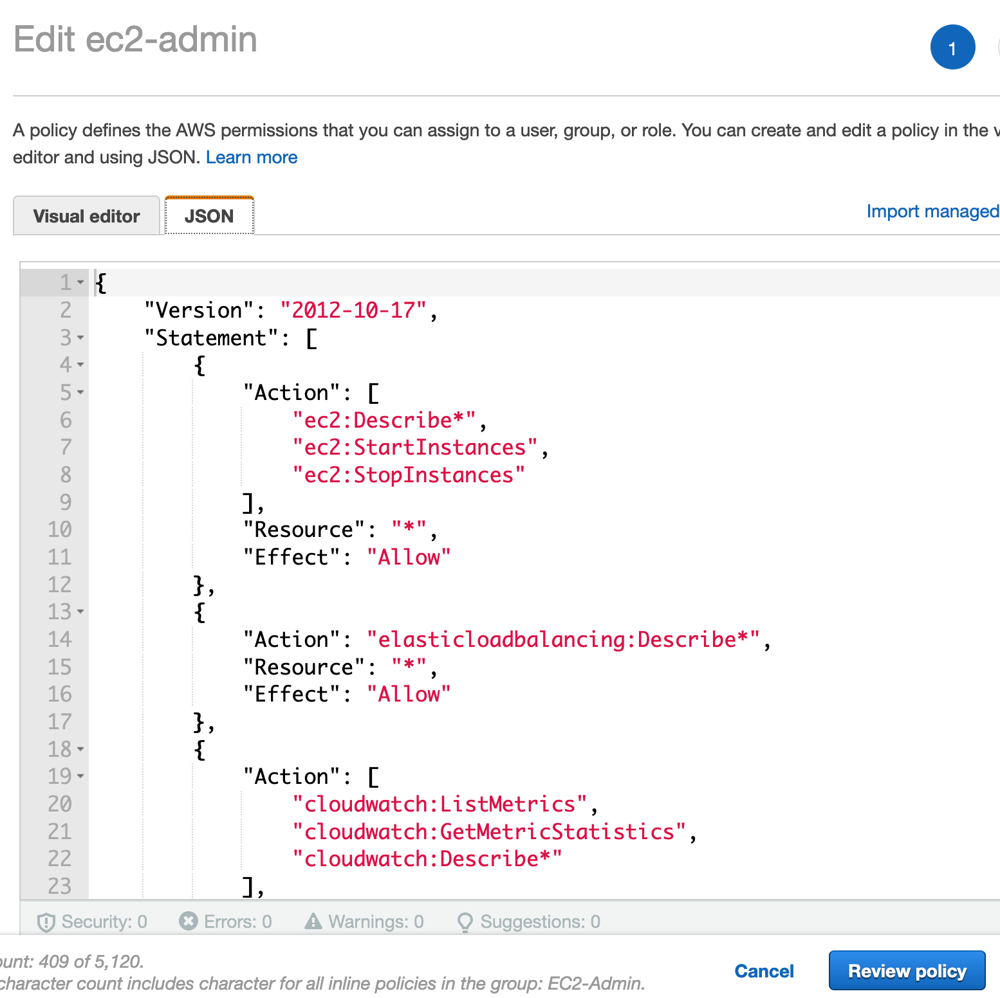

EC2-Support group with EC2 read only access policy
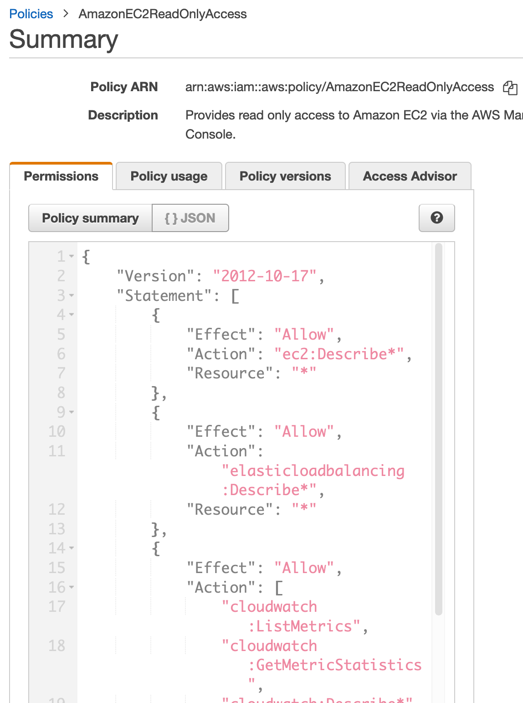

S3-Support group with S3 read only access
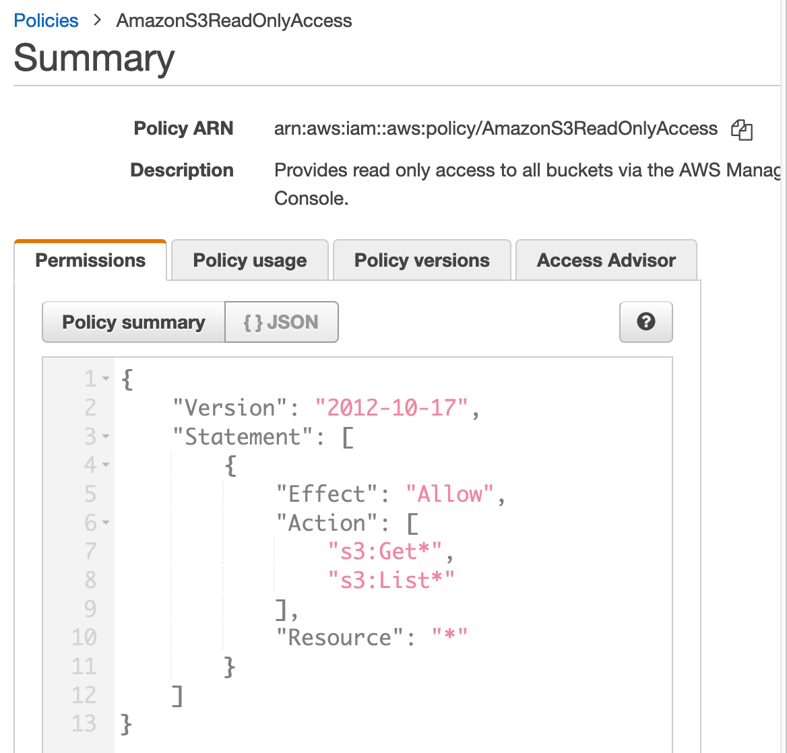

## Assigning users to groups

Assign user-1 to S3 support group
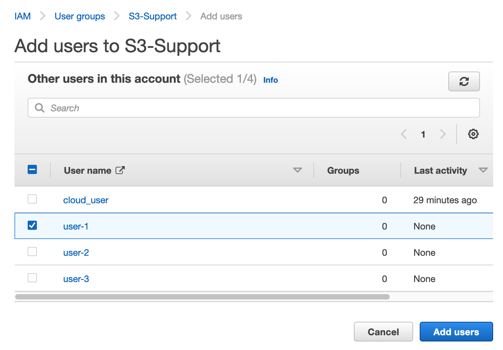

All 3 users assigned 
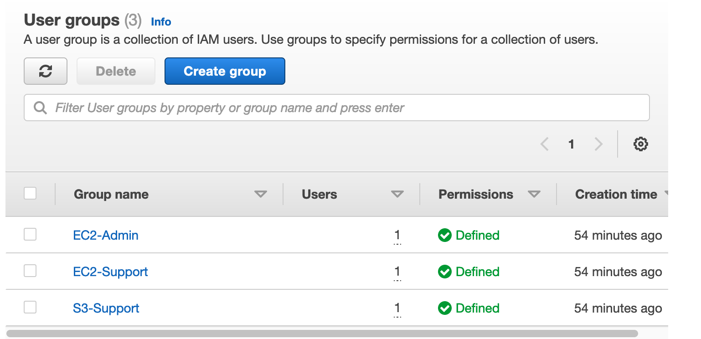

We can modify permissions inside users screen
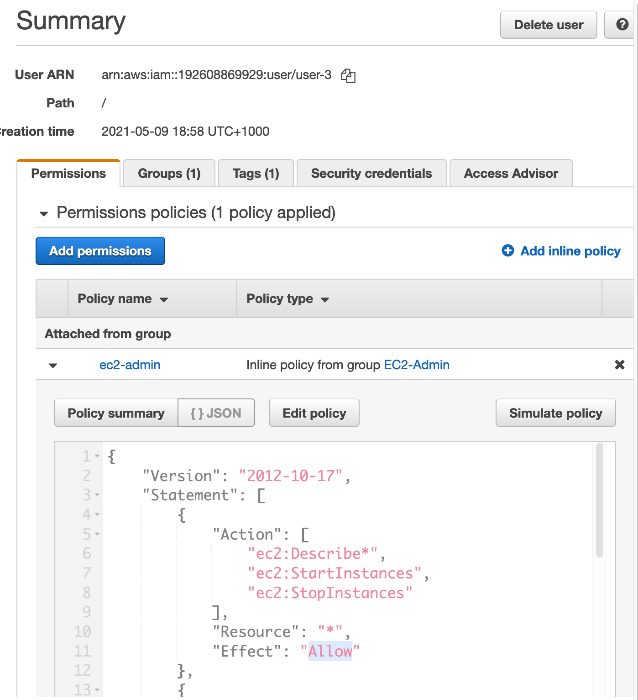

## Testing permissions

### User-1 S3 support - create S3 bucket test
Logging in as user-1, user-1 cannot create s3 buckets
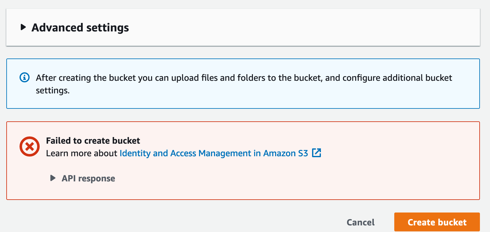

### User-2 EC2 support - stopping ec2
User-2 cannot stop EC2 instances
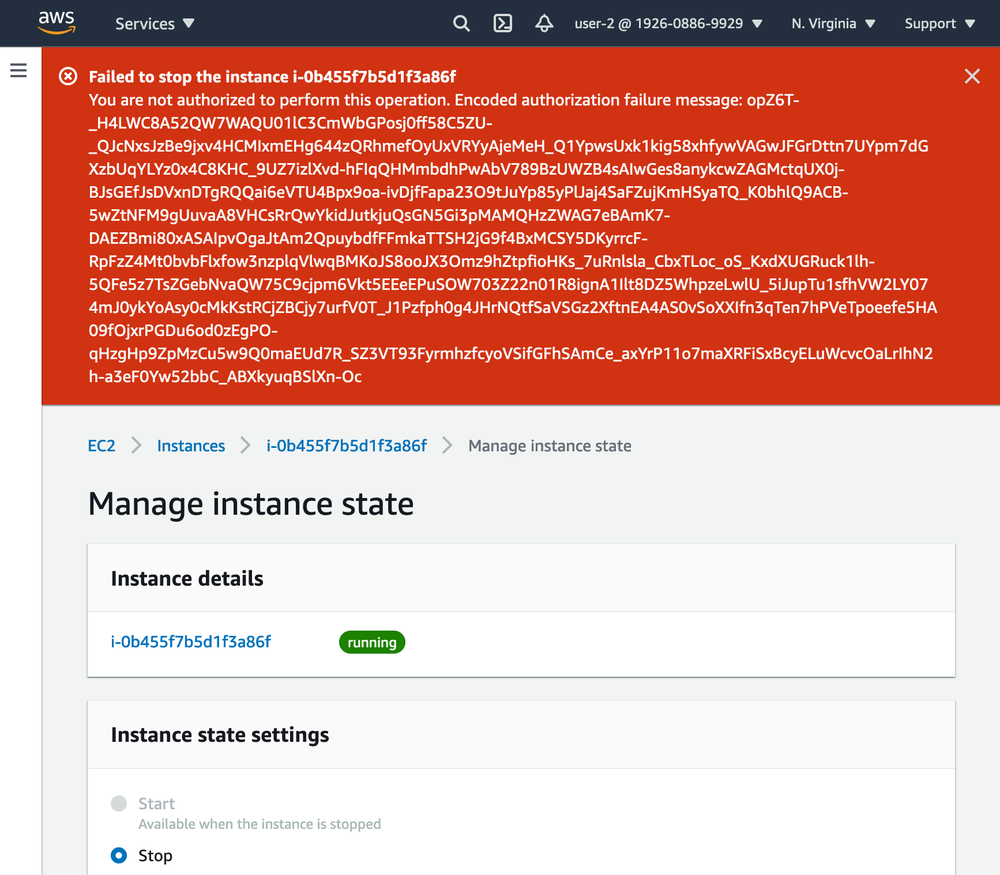

But user-2 can view running instances
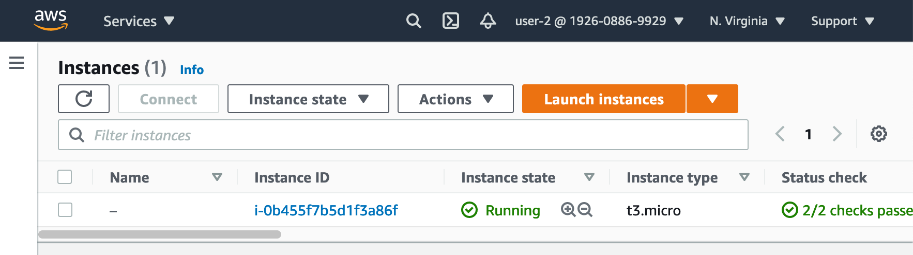

### User-3 EC2 admin - view start and stop ec2
User-3 can manage EC2s
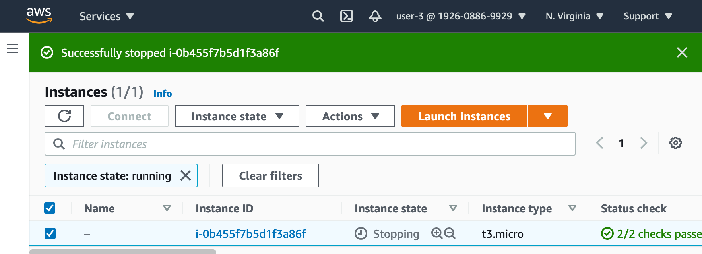
