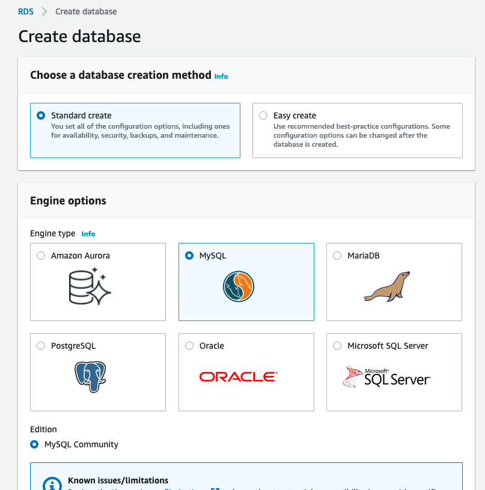
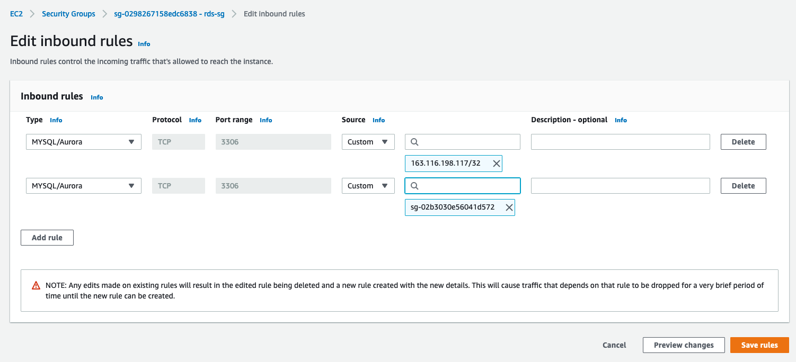
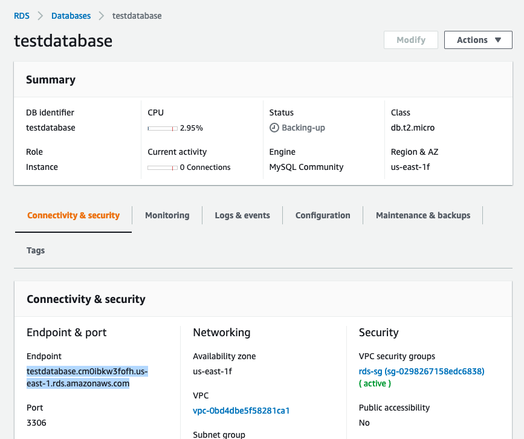

# RDS Demo
- [RDS Demo](#rds-demo)
  - [Objectives](#objectives)
  - [Create database](#create-database)
  - [Launch EC2](#launch-ec2)
  - [Connect RDS instance](#connect-rds-instance)

## Objectives 
- Launch RDS instance
- Launch EC2 instance
- Connect RDS Instance using Mysql database client

## Create database



##  Launch EC2

Create run script
```
#!/bin/bash
yum update -y
yum install mysql -y
```

Save key pair and ssh into EC2 instance
```
> chmod 400 rdsdemo.pem
> ssh -i rdsdemo.pem ec2-user@3.87.147.250
The authenticity of host '3.87.147.250 (3.87.147.250)' can't be established.
ECDSA key fingerprint is SHA256:VDNzHiha3CPiAiYc6PcfIjto5fl6KZ46qfOWjqIA+1k.
Are you sure you want to continue connecting (yes/no/[fingerprint])? yes
Warning: Permanently added '3.87.147.250' (ECDSA) to the list of known hosts.

       __|  __|_  )
       _|  (     /   Amazon Linux 2 AMI
      ___|\___|___|

https://aws.amazon.com/amazon-linux-2/
```

##  Connect RDS instance

Check if mysql installed
```
[ec2-user@ip-172-31-22-55 ~]$ mysql --version
mysql  Ver 15.1 Distrib 5.5.68-MariaDB, for Linux (x86_64) using readline 5.1
```

Go to RDS and find the rds security group and edit to allow ec2 security group inbound



Find RDS DNS name endpoint



Connect to the database

```
[ec2-user@ip-172-31-22-55 ~]$ mysql -u testdatabase -p -h testdatabase.cm0ibkw3fofh.us-east-1.rds.amazonaws.com testdatabase
Enter password:
Welcome to the MariaDB monitor.  Commands end with ; or \g.
Your MySQL connection id is 13
Server version: 8.0.20 Source distribution

Copyright (c) 2000, 2018, Oracle, MariaDB Corporation Ab and others.

Type 'help;' or '\h' for help. Type '\c' to clear the current input statement.

MySQL [testdatabase]>
```

Details of the database
```
MySQL [testdatabase]> status
--------------
mysql  Ver 15.1 Distrib 5.5.68-MariaDB, for Linux (x86_64) using readline 5.1

Connection id:		13
Current database:	testdatabase
Current user:		testdatabase@172.31.22.55
SSL:			Not in use
Current pager:		stdout
Using outfile:		''
Using delimiter:	;
Server:			MySQL
Server version:		8.0.20 Source distribution
Protocol version:	10
Connection:		testdatabase.cm0ibkw3fofh.us-east-1.rds.amazonaws.com via TCP/IP
Server characterset:	utf8mb4
Db     characterset:	utf8mb4
Client characterset:	utf8
Conn.  characterset:	utf8
TCP port:		3306
Uptime:			6 min 59 sec

Threads: 3  Questions: 9327  Slow queries: 0  Opens: 235  Flush tables: 3  Open tables: 141  Queries per second avg: 22.260
--------------
```

Show databases
```
MySQL [testdatabase]> show databases;
+--------------------+
| Database           |
+--------------------+
| information_schema |
| mysql              |
| performance_schema |
| testdatabase       |
+--------------------+
4 rows in set (0.01 sec)
```
