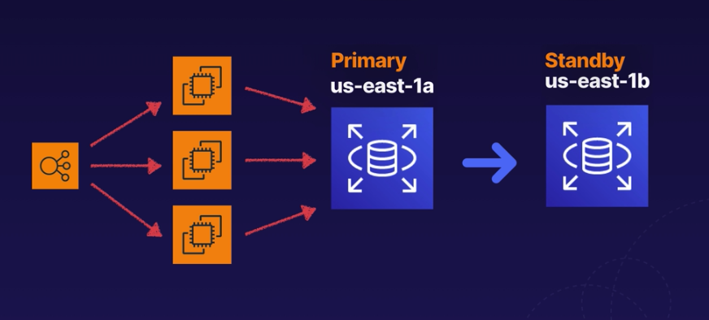
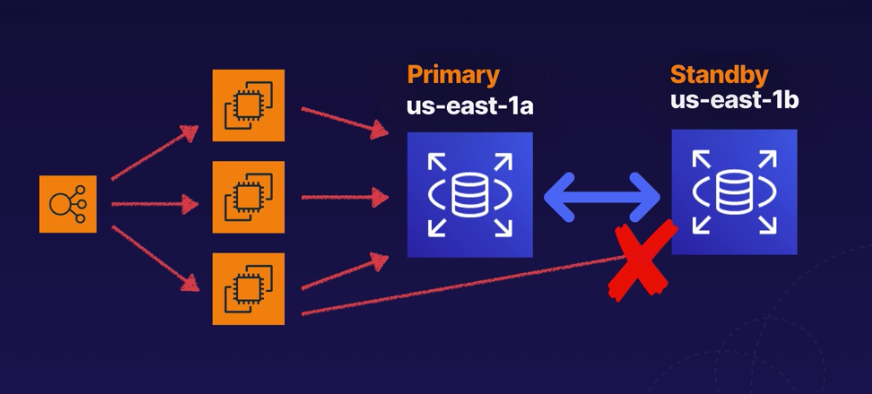
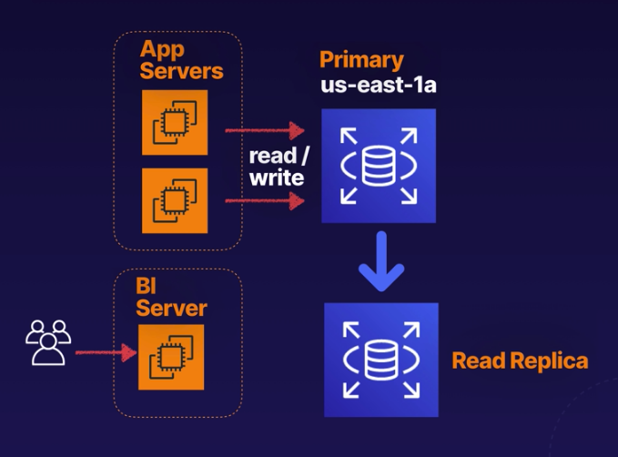

# RDS Multi-AZ and Read Replicas

- [RDS Multi-AZ and Read Replicas](#rds-multi-az-and-read-replicas)
  - [Multi Az](#multi-az)
  - [Read Replicas](#read-replicas)
  - [Comparisons](#comparisons)
    - [Multi AZ](#multi-az-1)
    - [Read replica](#read-replica)

## Multi Az
- Exact copy of production database in another availablity zone
- Standby normally not visible
- RDS automatically failover to standby instances
- All databases types can do this

- For DR not for improving performance

## Read Replicas
- Read only copy of primary database
- For read performance / scaling
- Takes read load of primary database
- Can be in same AZ or cross AZ or cross region
- Each read replica has own DNS endpoint different from primary database
- Read replica can be promoted to independent database
- Need automatic backup enabled
- Multiple read replicas supported (<=5 database instances)

## Comparisons
### Multi AZ
- Exact copy of production database
- Used for DR
- In failure, RDS will automatically failover to standby

### Read replica
- Read only copy of primary database in same AZ, cross AZ or cross region
- Used to increase or scale read performance
- Great for read heavy workloads, take load from primary database for read only workloads eg. BI reporting jobs
