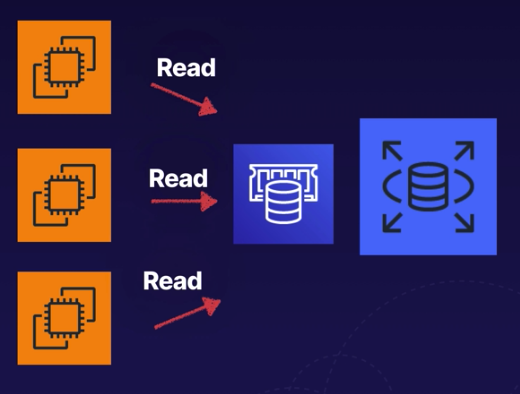

# Elasticache

## Definition
- In memory cache (key value)
- Improve database performance
- Retrieve here first before slower disk base storage
- Great for read-heavy database workloads
- Query elasticache instead of the database to speed up

## Types
- Memcached
  - Great for basic object caching
  - Scales horizontally but theres no persistence, or multi Az or failover
  - Good for basic caching
- Redis
  - Sophisticated, persistence, replication, multi AZ, fail over
  - Complex data types like lists and hashes

## Scenarios
- Not help heavy write loads (scale up database instead)
- OLAP queries - use RedShift data warehouse instead

## Summary
- In memory cache designed to improve read performance
### Memcached
- In memory key value data store
- Object caching is primary goal
- Keep thuings simple
- Dont need persistnece or multi AZ
- Dont need advance data types or sorting data
###  Redis
- In memory key value data store
- Performing sorting
- Advanced data types supported such as lists and hashes
- Select if you need data persistence or multi AZ

