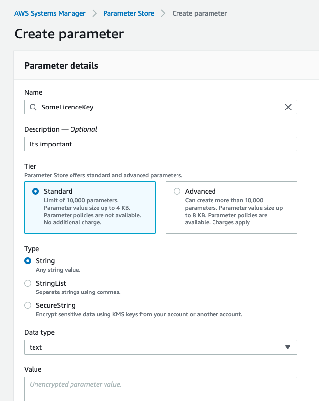
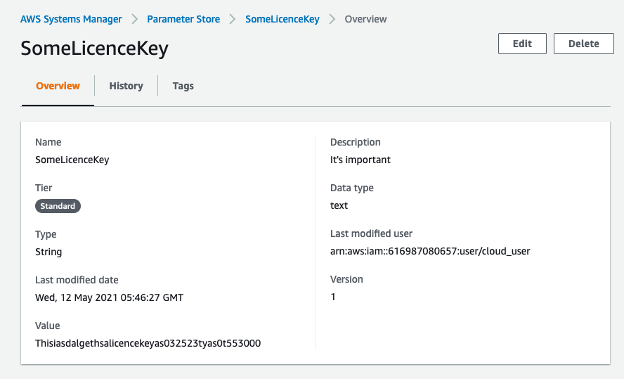

# System Manager Parameter Store

## Definition
- Avoid hard coding parameters in code, maintain confidentiality
- Info needs to be passed to EC2 as a bootstrap script
- Eg. license keys, database connection information, usernames, passwords
- Can be encrypted values with KMS
- Can be referenced using parameter name
- Can pass parameter by name to cloudformation, can be access by ec2, lambda, codebuild, codedeploy, codepipeline

