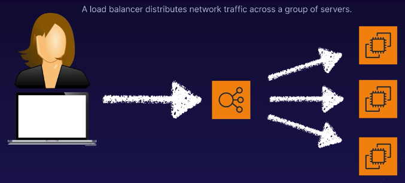
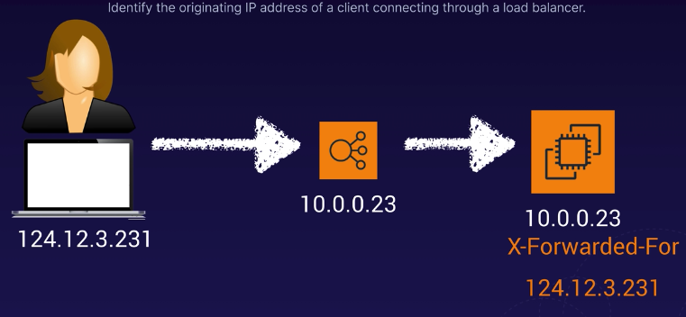

# Elastic Load Balancer

- [Elastic Load Balancer](#elastic-load-balancer)
  - [Definition](#definition)
  - [Options](#options)
  - [1. Application load balancer](#1-application-load-balancer)
  - [2. Network load balancer (High performance TCP traffic)](#2-network-load-balancer-high-performance-tcp-traffic)
  - [3. Classic load balancer](#3-classic-load-balancer)
  - [X-Forwarded-For header](#x-forwarded-for-header)
  - [Common load balancer errors](#common-load-balancer-errors)
  - [Summary](#summary)

## Definition
- Load balancer distributes network traffic across a group of servers
- Send request to the least busy server / round robin
- If a webserver fail, load balancer stop sending request to that server
- Can easily increase capacity when needed (add more servers and register to load balancer)

## Options
1. Application load balancer (HTTP/HTTPS)
2. Network load balancer (TCP and high performance)
3. Classic load balancer (HTTP/HTTPS and TCP, but legacy)

## 1. Application load balancer
- HTTP/HTTPS
- Operate at layer 7 of OSI model
- OSI model
  - 7. Application layer - What user sees, HTTP
  - 6. Presentation layer - data in usable format. Encryption, SSH protocol
  - 5. Session layer - maintain connections and sessions
  - 4. Transport layer - transmit data using TCP and UDP
  - 3. Network layer - logically routes packets based on IP address
  - 2. Data link layer - physically transmits data based on MAC addresses
  - 1. Physical layer - transmit bits and bytes over physical devices

- Application aware
  - Route request based on application logic eg. HTTP header

## 2. Network load balancer (High performance TCP traffic)
- Layer 4 (transport layer)
- Millions of request while maintaining low latency
- Most expensive

## 3. Classic load balancer
- Legacy
- Some layer 7 specific features eg. (`X-Forwarded-For` headers and sticky sessions)
- TCP layer 4 load balancing based on TCP

##  X-Forwarded-For header
- Web server only see load balancer IP address
- Want to know where request coming from (trusted network, allowed country)

## Common load balancer errors
- Error 504 gateway timeout
  - Target failed to respond. Possible reasons:
    - Elastic load balancer could not establish a connection to target eg. webserver, database, Lambda
    - Application issue
  - eg. making payment online, bank too slow to respond

## Summary

1. Application load balancer (HTTP/HTTPS)
   - Intelligent load balancing, routes based on type of request
2. Network load balancer (TCP and high performance)
3. Classic load balancer (HTTP/HTTPS and TCP, but legacy)
- Look for end user IPv4 address in the `X-Forwarded-For` header
- 504 Error - gateway timeout. Application not responding within the timeout preiod. Troubleshoot the web app or database server
