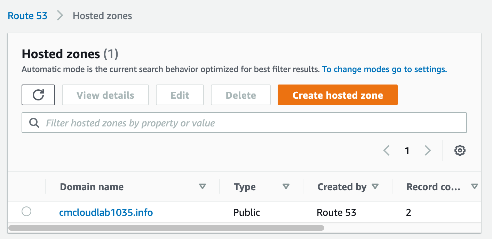
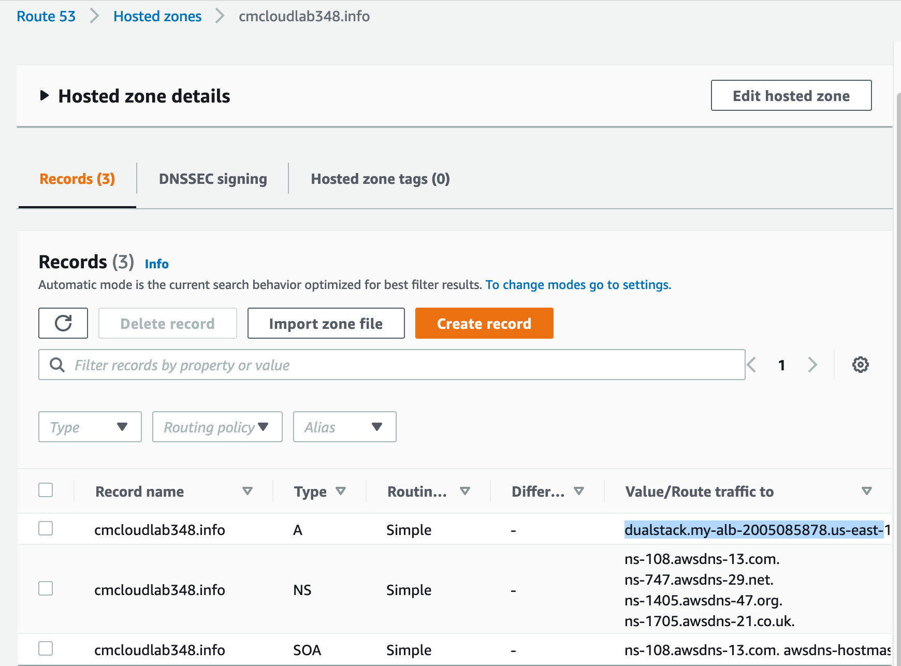

# Route 53

- [Route 53](#route-53)
  - [Definition](#definition)
  - [Demo](#demo)

## Definition
- Amazon DNS service
- Allows mapping domain name to: EC2, load balances, S3 buckets

## Demo
1. Launch EC2 and install httpd

Create a run script on instance creation
```
#!/bin/bash
yum update -y
yum install httpd -y
echo "<html><body><h1>Route53 demo</h1></body></html>" > /var/www/html/index.html
systemctl start httpd
systemctl enable httpd
```

Add HTTP allow rule to security group

2. Create Application load balancer and configure EC2 as target

Configure target group as instance, target to `/index.html`. Add instance and provision

Also configure security group from default security group to launch security group to also accpet connections from port 80


3. Configure Route53 hosted zone. Map friendly domain name to application load balancer

The current load balancer address does not have a friendly domain name

There is already a registered domain name here



Create an A record under hosted zones and alias mapping between amazon address



The website is now accessible via the domain name


