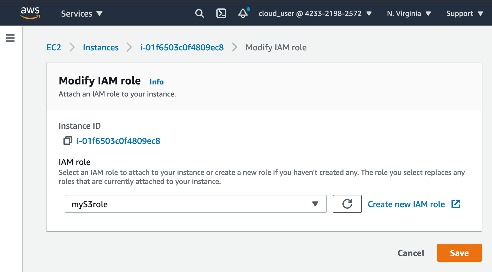

# EC2 with S3 access role

## Summary
- Roles are preferred option
- Roles provide access without hard coding credentials 
- Policies control roles permissions
- Update policy attached to a role takes immediate effect
- Possible to attach and detach roles to running instances without stopping/terminating instances

## Create new EC2 and attach S3 full access policy

SSH in
```
> chmod 400 s3roledemo.pem
> ssh -i s3roledemo.pem ec2-user@34.224.3.179
The authenticity of host '34.224.3.179 (34.224.3.179)' can't be established.
ECDSA key fingerprint is SHA256:wuP6abSneSHfQGEuYwP0f8cCTSx3vP5iHOcbDTEGr24.
Are you sure you want to continue connecting (yes/no/[fingerprint])? yes
Warning: Permanently added '34.224.3.179' (ECDSA) to the list of known hosts.

       __|  __|_  )
       _|  (     /   Amazon Linux 2 AMI
      ___|\___|___|

https://aws.amazon.com/amazon-linux-2/
[ec2-user@ip-172-31-60-90 ~]$ aws s3 ls
```

Make a bucket, no errors accessing that bucket
```
[ec2-user@ip-172-31-60-90 ~]$ aws s3 mb s3://mybucket-raph-zsasdf234612
make_bucket: mybucket-raph-zsasdf234612
[ec2-user@ip-172-31-60-90 ~]$ aws s3 ls
2021-05-09 00:37:38 mybucket-raph-zsasdf234612
```

Create file and upload to bucket
```
[ec2-user@ip-172-31-60-90 ~]$ echo "Test file" > test.txt
[ec2-user@ip-172-31-60-90 ~]$ aws s3 cp test.txt s3://mybucket-raph-zsasdf234612
upload: ./test.txt to s3://mybucket-raph-zsasdf234612/test.txt
[ec2-user@ip-172-31-60-90 ~]$ aws s3 ls s3://mybucket-raph-zsasdf234612
2021-05-09 00:38:14         10 test.txt
```

We can see the IAM role access key and secret key under aws configure
```
[ec2-user@ip-172-31-60-90 ~]$ aws configure list
      Name                    Value             Type    Location
      ----                    -----             ----    --------
   profile                <not set>             None    None
access_key     ****************G45G         iam-role
secret_key     ****************wFc9         iam-role
    region                <not set>             None    None
```

In AWS console, if the S3 role has been removed we can no longer access S3 bucket



```
[ec2-user@ip-172-31-60-90 ~]$ aws s3 ls
Unable to locate credentials. You can configure credentials by running "aws configure".
```

And if the role is added back, we see the access key and secret key added back but it is a new temporary generated creds
```
[ec2-user@ip-172-31-60-90 ~]$ aws configure list
      Name                    Value             Type    Location
      ----                    -----             ----    --------
   profile                <not set>             None    None
access_key     ****************JBEV         iam-role
secret_key     ****************Sgpu         iam-role
    region                <not set>             None    None
```

