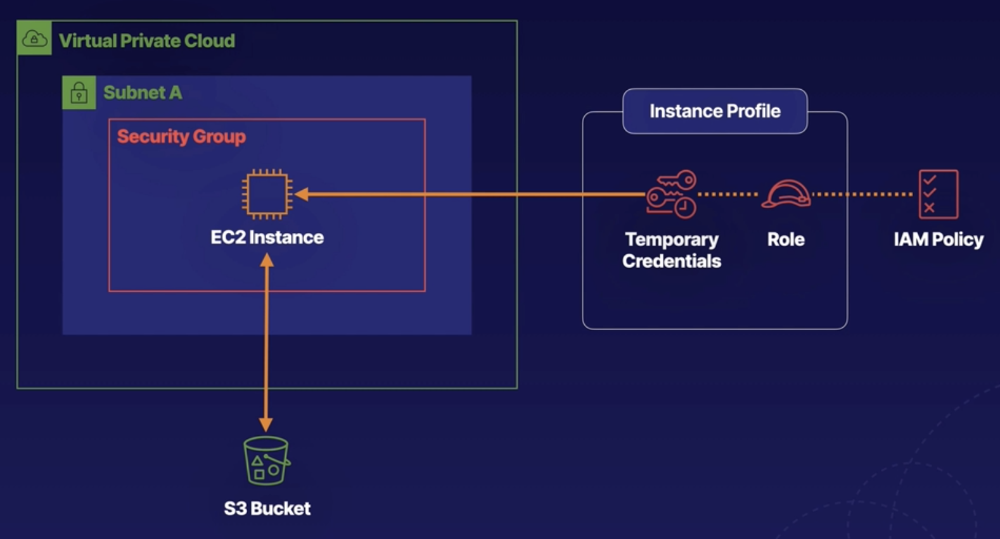
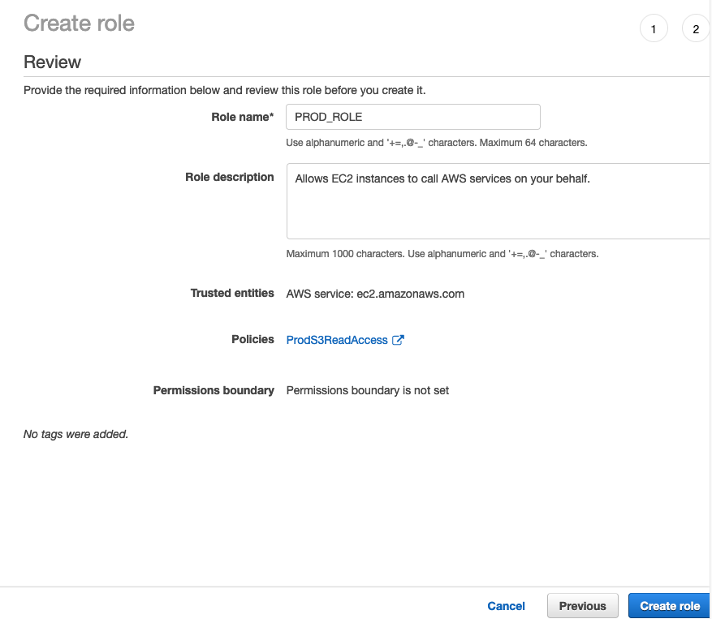
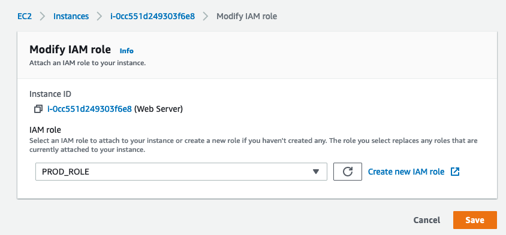

# Lab

- [Lab](#lab)
  - [Preface](#preface)
  - [Steps](#steps)
  - [CLI method](#cli-method)
    - [Bastion host](#bastion-host)
    - [Web server](#web-server)
    - [Summary](#summary)
  - [AWS management console method](#aws-management-console-method)

## Preface
- EC2 instance must provide AWS credentials with every request
- Storing and rotating credentials in each EC2 instances is a lot of work to rotate etc.
- Create roles, associate permissions, associate role to EC2
- Creation and use of instance profile is handled automatically

## Steps
1. Create role associate permissions with those roles (what can I do)
2. Associate role with EC2 instance profile (who am i)
   1. Instance profile provide temporary short lived credentials that are rotated automatically.



## CLI method
### Bastion host
- We ssh to this bastion host (EC2) as development / administrative machine

Configure aws policy
```
[cloud_user@ip-10-0-1-49 ~]$ aws configure
AWS Access Key ID [None]:
AWS Secret Access Key [None]:
Default region name [None]: us-east-1
Default output format [None]: json
```

Create trust policy - allow EC2 to assume this role
```
[cloud_user@ip-10-0-1-49 ~]$ vim trust_policy_ec2.json
[cloud_user@ip-10-0-1-49 ~]$ cat trust_policy_ec2.json
{
	"Version": "2012-10-17",
	"Statement": [
		{
			"Effect": "Allow",
			"Principal": {"Service": "ec2.amazonaws.com"},
			"Action": "sts:AssumeRole"
		}
	]
}
```

Create role
```
[cloud_user@ip-10-0-1-46 ~]$ aws iam create-role --role-name DEV_ROLE --assume-role-policy-document file://trust_policy_ec2.json
{
    "Role": {
        "AssumeRolePolicyDocument": {
            "Version": "2012-10-17",
            "Statement": [
                {
                    "Action": "sts:AssumeRole",
                    "Effect": "Allow",
                    "Principal": {
                        "Service": "ec2.amazonaws.com"
                    }
                }
            ]
        },
        "RoleId": "AROAZ42Z67XCJTUFYNMDJ",
        "CreateDate": "2021-05-09T08:18:33Z",
        "RoleName": "DEV_ROLE",
        "Path": "/",
        "Arn": "arn:aws:iam::680404123076:role/DEV_ROLE"
    }
}
```

Create IAM policy for read access of bucket. Get and list operation of the bucket
`/*` - within the bucket
```
[cloud_user@ip-10-0-1-46 ~]$ vim dev_s3_read_access.json
[cloud_user@ip-10-0-1-46 ~]$ cat dev_s3_read_access.json
{
	"Version": "2012-10-17",
	"Statement": [
		{
			"Sid": "AllowUserToSeeBucketListInTheConsole",
			"Action": ["s3:ListAllMyBuckets", "s3:GetBucketLocation"],
			"Effect": "Allow",
			"Resource": ["arn:aws:s3:::*"]
		},
		{
			"Effect": "Allow",
			"Action": [
				"s3:Get*",
				"s3:List*"
			],
			"Resource": [
				"arn:aws:s3:::cfst-3035-efe54731a232b61f164a397f66b-s3bucketdev-11xpl1094brd/*",
				"arn:aws:s3:::cfst-3035-efe54731a232b61f164a397f66b-s3bucketdev-11xpl1094brd"
			]
		}
	]
}
```

Create policy and attach
```
[cloud_user@ip-10-0-1-46 ~]$ aws iam create-policy --policy-name DevS3ReadAccess --policy-document file://dev_s3_read_access.json
{
    "Policy": {
        "PolicyName": "DevS3ReadAccess",
        "PermissionsBoundaryUsageCount": 0,
        "CreateDate": "2021-05-09T08:26:15Z",
        "AttachmentCount": 0,
        "IsAttachable": true,
        "PolicyId": "ANPAZ42Z67XCF3AUGGECH",
        "DefaultVersionId": "v1",
        "Path": "/",
        "Arn": "arn:aws:iam::680404123076:policy/DevS3ReadAccess",
        "UpdateDate": "2021-05-09T08:26:15Z"
    }
}
```

Associate policy with the role
```
[cloud_user@ip-10-0-1-46 ~]$ aws iam attach-role-policy --role-name DEV_ROLE --policy-arn "arn:aws:iam::680404123076:policy/DevS3ReadAccess"
[cloud_user@ip-10-0-1-46 ~]$ aws iam list-attached-role-policies --role-name DEV_ROLE
{
    "AttachedPolicies": [
        {
            "PolicyName": "DevS3ReadAccess",
            "PolicyArn": "arn:aws:iam::680404123076:policy/DevS3ReadAccess"
        }
    ]
}
```

Create instance profile
```
[cloud_user@ip-10-0-1-46 ~]$ aws iam add-role-to-instance-profile --instance-profile-name DEV_PROFILE --role-name DEV_ROLE
[cloud_user@ip-10-0-1-46 ~]$ aws iam get-instance-profile --instance-profile-name DEV_PROFILE
{
    "InstanceProfile": {
        "InstanceProfileId": "AIPAZ42Z67XCPNXGD6MNV",
        "Roles": [
            {
                "AssumeRolePolicyDocument": {
                    "Version": "2012-10-17",
                    "Statement": [
                        {
                            "Action": "sts:AssumeRole",
                            "Effect": "Allow",
                            "Principal": {
                                "Service": "ec2.amazonaws.com"
                            }
                        }
                    ]
                },
                "RoleId": "AROAZ42Z67XCJTUFYNMDJ",
                "CreateDate": "2021-05-09T08:18:33Z",
                "RoleName": "DEV_ROLE",
                "Path": "/",
                "Arn": "arn:aws:iam::680404123076:role/DEV_ROLE"
            }
        ],
        "CreateDate": "2021-05-09T08:28:41Z",
        "InstanceProfileName": "DEV_PROFILE",
        "Path": "/",
        "Arn": "arn:aws:iam::680404123076:instance-profile/DEV_PROFILE"
    }
}
```

Associate instance profile with EC2 instance id
```
[cloud_user@ip-10-0-1-46 ~]$ aws ec2 associate-iam-instance-profile --instance-id i-0cc551d249303f6e8 --iam-instance-profile Name="DEV_PROFILE"
{
    "IamInstanceProfileAssociation": {
        "InstanceId": "i-0cc551d249303f6e8",
        "State": "associating",
        "AssociationId": "iip-assoc-071e76b58e9c77c2f",
        "IamInstanceProfile": {
            "Id": "AIPAZ42Z67XCPNXGD6MNV",
            "Arn": "arn:aws:iam::680404123076:instance-profile/DEV_PROFILE"
        }
    }
}
```

Check
```
[cloud_user@ip-10-0-1-46 ~]$ aws ec2 associate-iam-instance-profile --instance-id i-0cc551d249303f6e8 --iam-instance-profile Name="DEV_PROFILE"
{
    "IamInstanceProfileAssociation": {
        "InstanceId": "i-0cc551d249303f6e8",
        "State": "associating",
        "AssociationId": "iip-assoc-071e76b58e9c77c2f",
        "IamInstanceProfile": {
            "Id": "AIPAZ42Z67XCPNXGD6MNV",
            "Arn": "arn:aws:iam::680404123076:instance-profile/DEV_PROFILE"
        }
    }
}
[cloud_user@ip-10-0-1-46 ~]$ aws ec2 describe-instances --instance-ids i-0cc551d249303f6e8
{
    "Reservations": [
        {
            "Instances": [
                {
                    "Monitoring": {
                        "State": "disabled"
                    },
                    "PublicDnsName": "ec2-3-80-52-234.compute-1.amazonaws.com",
                    "State": {
                        "Code": 16,
                        "Name": "running"
                    },
                    "EbsOptimized": false,
                    "LaunchTime": "2021-05-09T07:54:26.000Z",
                    "PublicIpAddress": "3.80.52.234",
                    "PrivateIpAddress": "10.0.1.139",
                    "ProductCodes": [],
                    "VpcId": "vpc-0a06d5996f3fc6f06",
                    "CpuOptions": {
                        "CoreCount": 1,
                        "ThreadsPerCore": 2
                    },
                    "StateTransitionReason": "",
                    "InstanceId": "i-0cc551d249303f6e8",
                    "EnaSupport": true,
                    "ImageId": "ami-0a16233627f2c1a13",
                    "PrivateDnsName": "ip-10-0-1-139.ec2.internal",
                    "SecurityGroups": [
                        {
                            "GroupName": "cfst-3035-efe54731a232b61f164a397f66be4bea-SecurityGroupHTTPAndSSH-1J2INZ4IZMS1F",
                            "GroupId": "sg-0de1ede35e255293c"
                        }
                    ],
                    "ClientToken": "cfst-EC2In-163UFKF91QQXG",
                    "SubnetId": "subnet-0a46a8890d551e3aa",
                    "InstanceType": "t3.micro",
                    "CapacityReservationSpecification": {
                        "CapacityReservationPreference": "open"
                    },
                    "NetworkInterfaces": [
                        {
                            "Status": "in-use",
                            "MacAddress": "0a:7e:57:08:19:ab",
                            "SourceDestCheck": true,
                            "VpcId": "vpc-0a06d5996f3fc6f06",
                            "Description": "",
                            "NetworkInterfaceId": "eni-05306b81a66ddd148",
                            "PrivateIpAddresses": [
                                {
                                    "PrivateDnsName": "ip-10-0-1-139.ec2.internal",
                                    "PrivateIpAddress": "10.0.1.139",
                                    "Primary": true,
                                    "Association": {
                                        "PublicIp": "3.80.52.234",
                                        "PublicDnsName": "ec2-3-80-52-234.compute-1.amazonaws.com",
                                        "IpOwnerId": "amazon"
                                    }
                                }
                            ],
                            "PrivateDnsName": "ip-10-0-1-139.ec2.internal",
                            "InterfaceType": "interface",
                            "Attachment": {
                                "Status": "attached",
                                "DeviceIndex": 0,
                                "DeleteOnTermination": true,
                                "AttachmentId": "eni-attach-0a20fb195f7c71817",
                                "AttachTime": "2021-05-09T07:54:26.000Z"
                            },
                            "Groups": [
                                {
                                    "GroupName": "cfst-3035-efe54731a232b61f164a397f66be4bea-SecurityGroupHTTPAndSSH-1J2INZ4IZMS1F",
                                    "GroupId": "sg-0de1ede35e255293c"
                                }
                            ],
                            "Ipv6Addresses": [],
                            "OwnerId": "680404123076",
                            "PrivateIpAddress": "10.0.1.139",
                            "SubnetId": "subnet-0a46a8890d551e3aa",
                            "Association": {
                                "PublicIp": "3.80.52.234",
                                "PublicDnsName": "ec2-3-80-52-234.compute-1.amazonaws.com",
                                "IpOwnerId": "amazon"
                            }
                        }
                    ],
                    "SourceDestCheck": true,
                    "Placement": {
                        "Tenancy": "default",
                        "GroupName": "",
                        "AvailabilityZone": "us-east-1a"
                    },
                    "Hypervisor": "xen",
                    "BlockDeviceMappings": [
                        {
                            "DeviceName": "/dev/xvda",
                            "Ebs": {
                                "Status": "attached",
                                "DeleteOnTermination": true,
                                "VolumeId": "vol-09b0d403a73f78c2f",
                                "AttachTime": "2021-05-09T07:54:28.000Z"
                            }
                        }
                    ],
                    "Architecture": "x86_64",
                    "RootDeviceType": "ebs",
                    "IamInstanceProfile": {
                        "Id": "AIPAZ42Z67XCPNXGD6MNV",
                        "Arn": "arn:aws:iam::680404123076:instance-profile/DEV_PROFILE"
                    },
                    "RootDeviceName": "/dev/xvda",
                    "VirtualizationType": "hvm",
                    "Tags": [
                        {
                            "Value": "arn:aws:cloudformation:us-east-1:680404123076:stack/cfst-3035-efe54731a232b61f164a397f66be4bea/ab3133c0-b09b-11eb-92e6-0a3fc8cbcb75",
                            "Key": "Application"
                        },
                        {
                            "Value": "sloth",
                            "Key": "UserId"
                        },
                        {
                            "Value": "cfst-3035-efe54731a232b61f164a397f66be4bea",
                            "Key": "aws:cloudformation:stack-name"
                        },
                        {
                            "Value": "Web Server",
                            "Key": "Name"
                        },
                        {
                            "Value": "arn:aws:cloudformation:us-east-1:680404123076:stack/cfst-3035-efe54731a232b61f164a397f66be4bea/ab3133c0-b09b-11eb-92e6-0a3fc8cbcb75",
                            "Key": "aws:cloudformation:stack-id"
                        },
                        {
                            "Value": "EC2InstanceWebServer",
                            "Key": "aws:cloudformation:logical-id"
                        }
                    ],
                    "HibernationOptions": {
                        "Configured": false
                    },
                    "MetadataOptions": {
                        "State": "applied",
                        "HttpEndpoint": "enabled",
                        "HttpTokens": "optional",
                        "HttpPutResponseHopLimit": 1
                    },
                    "AmiLaunchIndex": 0
                }
            ],
            "ReservationId": "r-093dd1eab3056be2a",
            "RequesterId": "043234062703",
            "Groups": [],
            "OwnerId": "680404123076"
        }
    ]
}
```

### Web server 

Check if web server ec2 has assumed the DEV_ROLE
```
> ssh cloud_user@3.80.52.234
The authenticity of host '3.80.52.234 (3.80.52.234)' can't be established.
ECDSA key fingerprint is SHA256:IxvbbECRBDi/xHeoX/5fwihkAweBITK1Z2HmBeOOzTc.
Are you sure you want to continue connecting (yes/no/[fingerprint])? yes
Warning: Permanently added '3.80.52.234' (ECDSA) to the list of known hosts.
Password:

       __|  __|_  )
       _|  (     /   Amazon Linux 2 AMI
      ___|\___|___|

https://aws.amazon.com/amazon-linux-2/
[cloud_user@ip-10-0-1-139 ~]$ aws sts get-caller-identity
{
    "Account": "680404123076",
    "UserId": "AROAZ42Z67XCJTUFYNMDJ:i-0cc551d249303f6e8",
    "Arn": "arn:aws:sts::680404123076:assumed-role/DEV_ROLE/i-0cc551d249303f6e8"
}
```

The web server can read S3 buckets
```
[cloud_user@ip-10-0-1-139 ~]$ aws s3 ls
2021-05-09 07:53:47 cfst-3035-efe54731a232b61f164-s3bucketengineering-yhu1u0nhfeq7
2021-05-09 07:53:47 cfst-3035-efe54731a232b61f164-s3bucketlookupfiles-ujh1kbdcod8j
2021-05-09 07:53:47 cfst-3035-efe54731a232b61f164a39-cloudtrailbucket-f6jogr1qdca6
2021-05-09 07:53:47 cfst-3035-efe54731a232b61f164a397f-s3bucketsecret-1mgw1j6b46o9j
2021-05-09 07:53:47 cfst-3035-efe54731a232b61f164a397f66-s3bucketprod-9imv2kk8ekaz
2021-05-09 07:53:47 cfst-3035-efe54731a232b61f164a397f66b-s3bucketdev-11xpl1094brd
[cloud_user@ip-10-0-1-139 ~]$ aws s3 ls s3://cfst-3035-efe54731a232b61f164a397f66b-s3bucketdev-11xpl1094brd
2021-05-09 07:55:03         41 file1-cfst-3035-efe54731a232b61f164a397f66b-s3bucketdev-11xpl1094brd
2021-05-09 07:55:03         41 file2-cfst-3035-efe54731a232b61f164a397f66b-s3bucketdev-11xpl1094brd
2021-05-09 07:55:03         41 file3-cfst-3035-efe54731a232b61f164a397f66b-s3bucketdev-11xpl1094brd
2021-05-09 07:55:03         41 file4-cfst-3035-efe54731a232b61f164a397f66b-s3bucketdev-11xpl1094brd
2021-05-09 07:55:04         41 file5-cfst-3035-efe54731a232b61f164a397f66b-s3bucketdev-11xpl1094brd
```

### Summary
- Created a role
- Assigned role permission so EC2 can assume the role
- Create policy allowing s3 access
- Associate policy with role
- Create Dev instance profile
- Associate instance profile with the role
- Attach instance profile to ec2 instance (web server)
- Log into ec2 instance (web server) to verify

## AWS management console method

- Create production role
- Permission policy
- Instance profile creation (handled behind the scenes automatically)

Create permissions policy 
```json
{
    "Version": "2012-10-17",
    "Statement": [
        {
          "Sid": "AllowUserToSeeBucketListInTheConsole",
          "Action": ["s3:ListAllMyBuckets", "s3:GetBucketLocation"],
          "Effect": "Allow",
          "Resource": ["arn:aws:s3:::*"]
        },
        {
            "Effect": "Allow",
            "Action": [
                "s3:Get*",
                "s3:List*"
            ],
            "Resource": [
                "arn:aws:s3:::cfst-3035-efe54731a232b61f164a397f66-s3bucketprod-9imv2kk8ekaz/*",
                "arn:aws:s3:::cfst-3035-efe54731a232b61f164a397f66-s3bucketprod-9imv2kk8ekaz"
            ]
        }
    ]
}
```
Create production role and associate policy to EC2



This allowed EC2 to assume this role and *aws created instance profile for us*

Attach this role to web server instance



Checking on CLI
```
[cloud_user@ip-10-0-1-139 ~]$ aws sts get-caller-identity
{
    "Account": "680404123076",
    "UserId": "AROAZ42Z67XCIFGFCQKYI:i-0cc551d249303f6e8",
    "Arn": "arn:aws:sts::680404123076:assumed-role/PROD_ROLE/i-0cc551d249303f6e8"
}
```

We are able to list all the files in the prod bucket
```
[cloud_user@ip-10-0-1-139 ~]$ aws s3 ls
2021-05-09 07:53:47 cfst-3035-efe54731a232b61f164-s3bucketengineering-yhu1u0nhfeq7
2021-05-09 07:53:47 cfst-3035-efe54731a232b61f164-s3bucketlookupfiles-ujh1kbdcod8j
2021-05-09 07:53:47 cfst-3035-efe54731a232b61f164a39-cloudtrailbucket-f6jogr1qdca6
2021-05-09 07:53:47 cfst-3035-efe54731a232b61f164a397f-s3bucketsecret-1mgw1j6b46o9j
2021-05-09 07:53:47 cfst-3035-efe54731a232b61f164a397f66-s3bucketprod-9imv2kk8ekaz
2021-05-09 07:53:47 cfst-3035-efe54731a232b61f164a397f66b-s3bucketdev-11xpl1094brd
[cloud_user@ip-10-0-1-139 ~]$ aws s3 ls s3://cfst-3035-efe54731a232b61f164a397f66-s3bucketprod-9imv2kk8ekaz
2021-05-09 07:55:04         41 file1-cfst-3035-efe54731a232b61f164a397f66-s3bucketprod-9imv2kk8ekaz
2021-05-09 07:55:04         41 file2-cfst-3035-efe54731a232b61f164a397f66-s3bucketprod-9imv2kk8ekaz
2021-05-09 07:55:04         41 file3-cfst-3035-efe54731a232b61f164a397f66-s3bucketprod-9imv2kk8ekaz
2021-05-09 07:55:04         41 file4-cfst-3035-efe54731a232b61f164a397f66-s3bucketprod-9imv2kk8ekaz
2021-05-09 07:55:04         41 file5-cfst-3035-efe54731a232b61f164a397f66-s3bucketprod-9imv2kk8ekaz
```

But we are unable to access the secret bucket
```
[cloud_user@ip-10-0-1-139 ~]$ aws s3 ls s3://cfst-3035-efe54731a232b61f164a397f-s3bucketsecret-1mgw1j6b46o9

An error occurred (NoSuchBucket) when calling the ListObjectsV2 operation: The specified bucket does not exist
```
