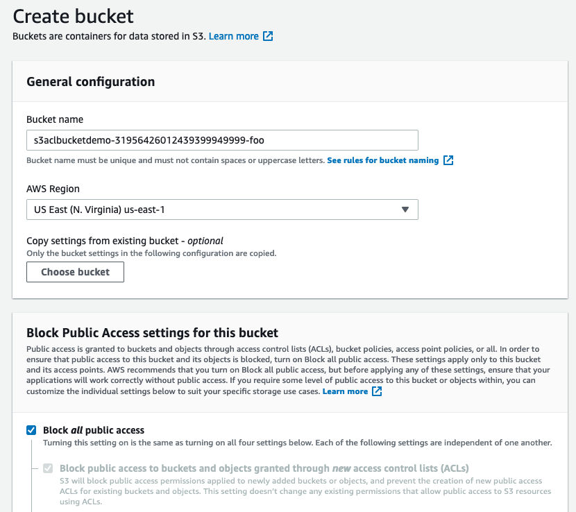
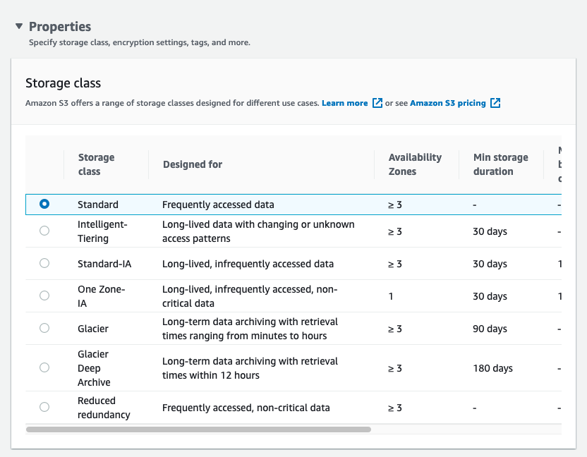
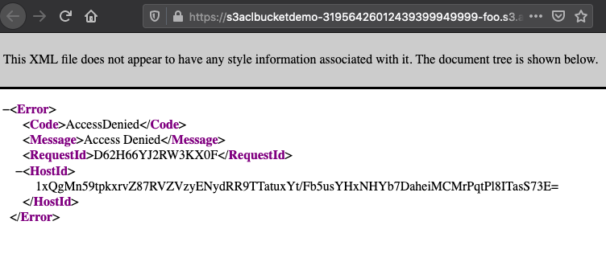
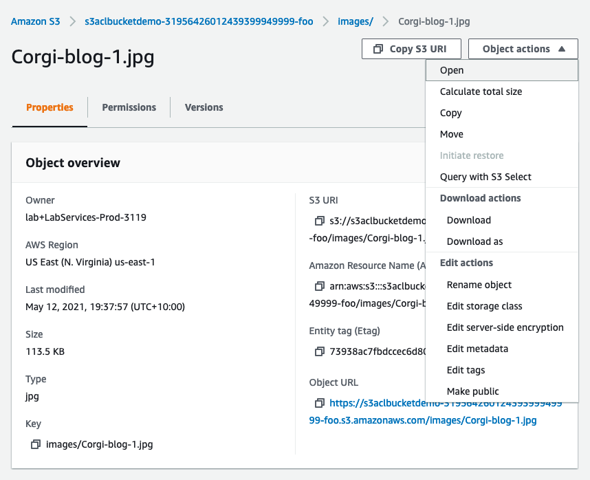
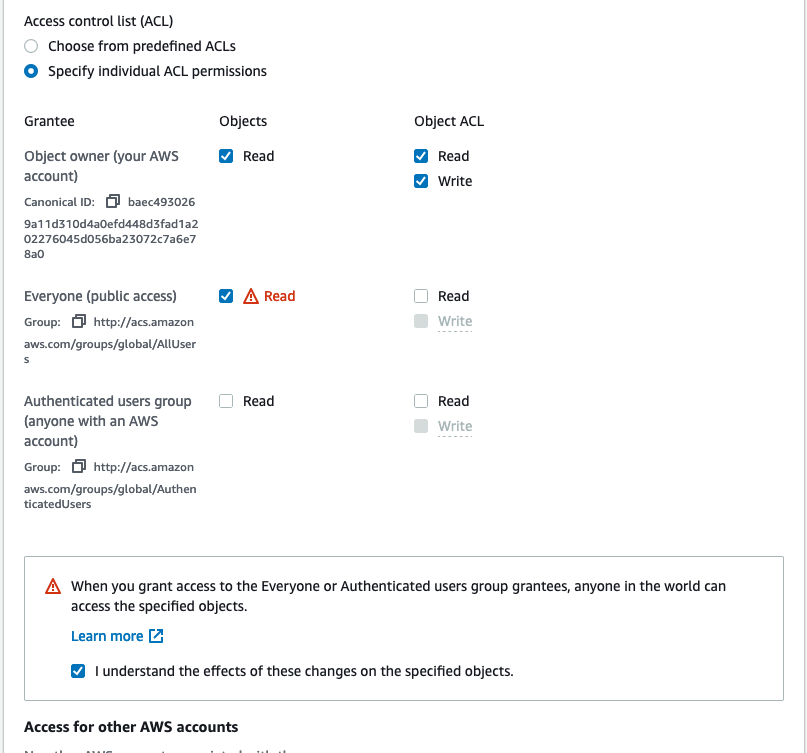
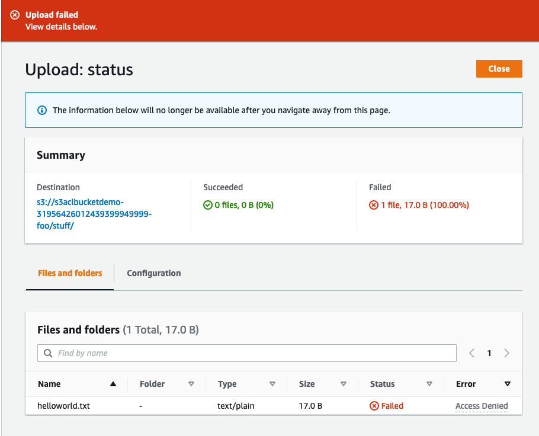
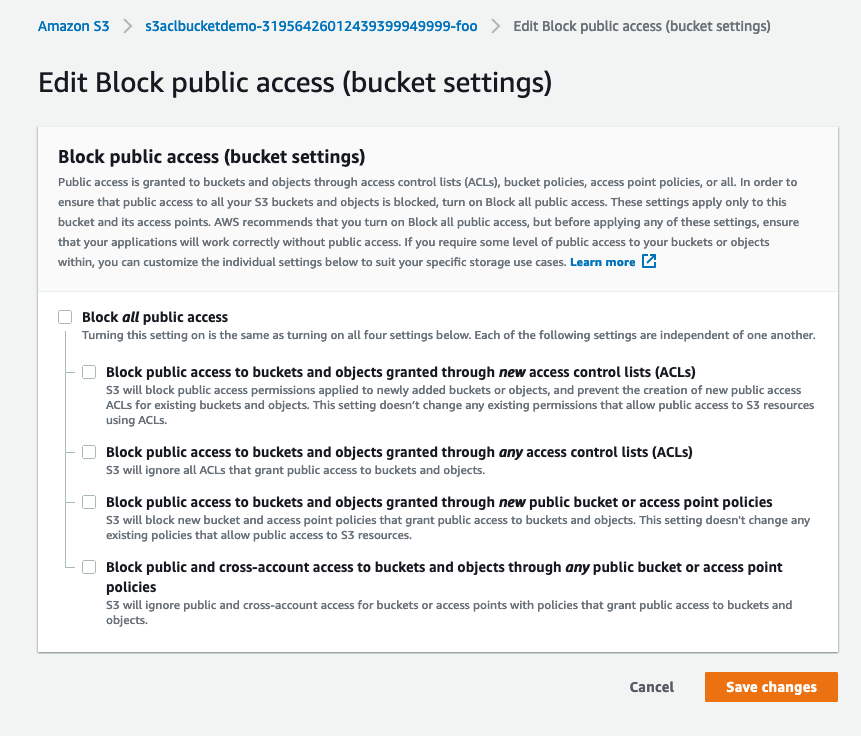
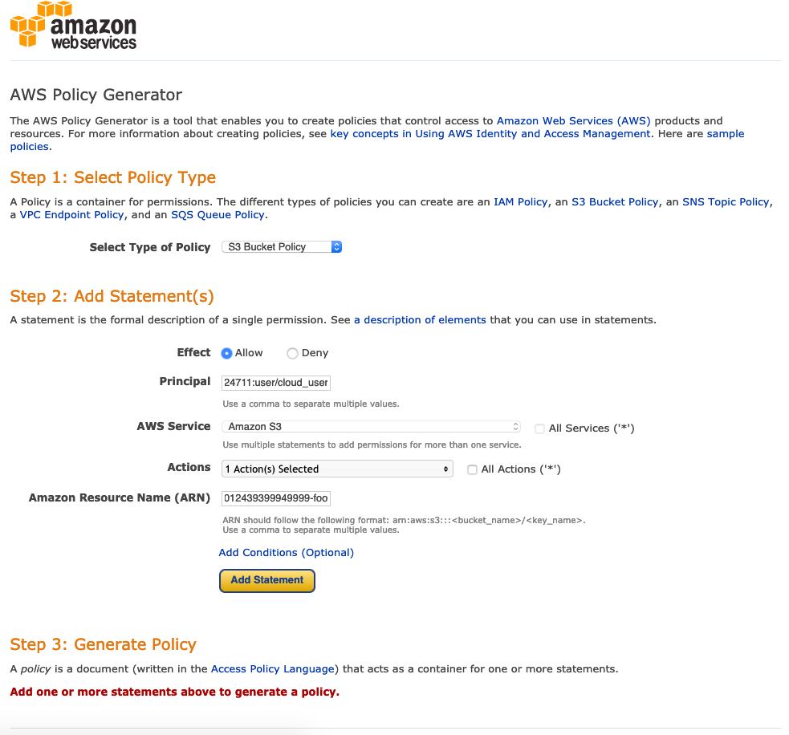
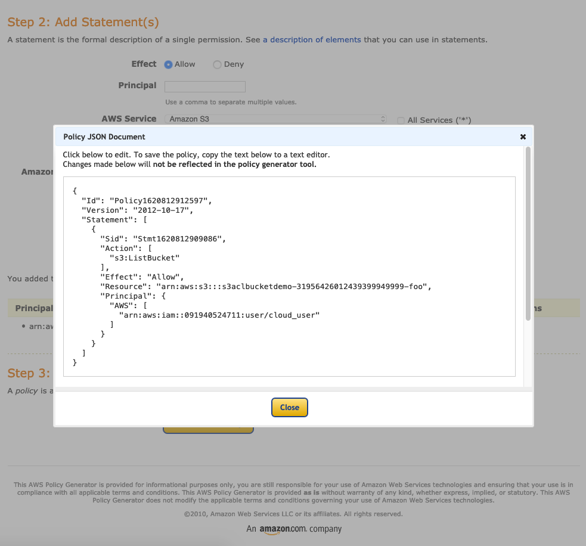
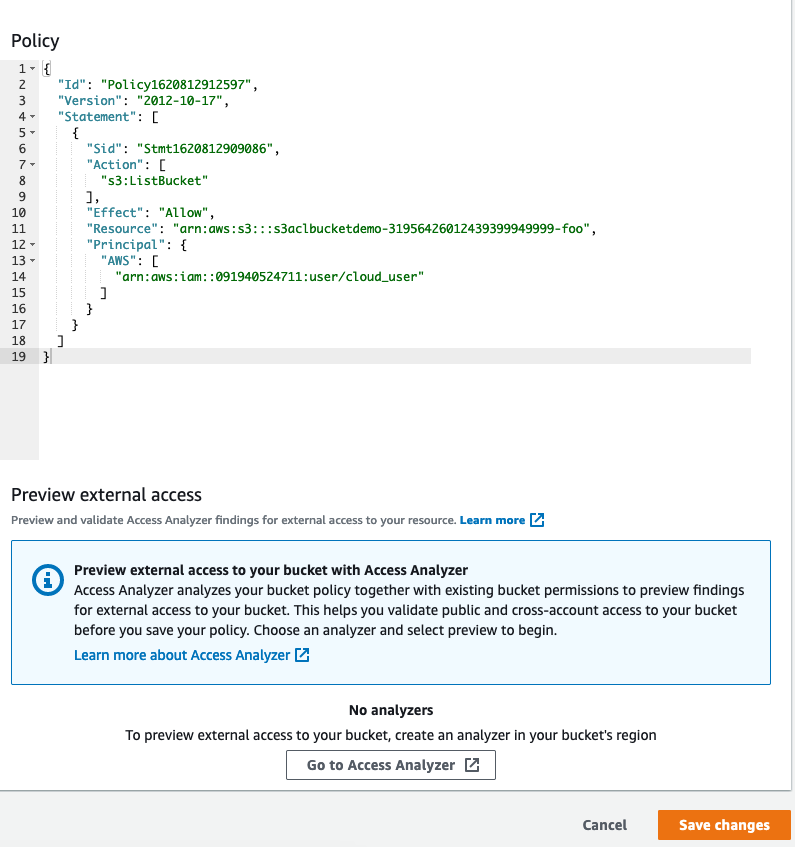

# S3 ACL demo

## Summary
- Create S3 bucket
- Upload files
- Configure ACL
- Configure bucket policy

## Create bucket

Creating a bucket

## Configure ACL

Bucket ACL

S3 object is not publicly accessible

Can open the object through the console

Uploading the public file

We are not allowed to upload public files due to bucket policy

## Configure bucket policy

Allo public bucket policy

Policy generator

