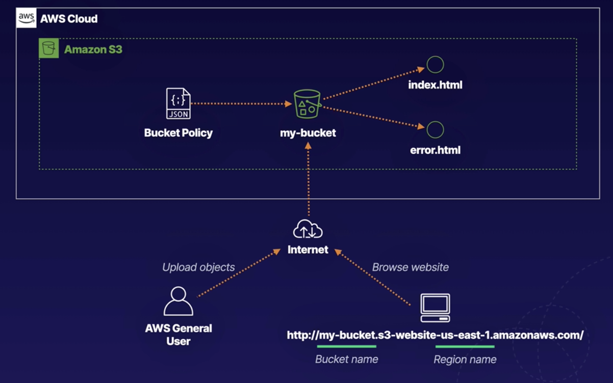
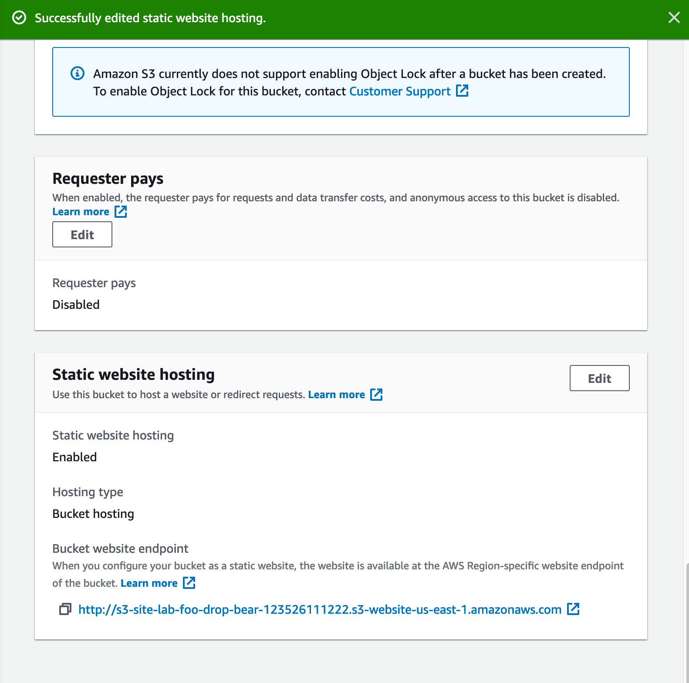
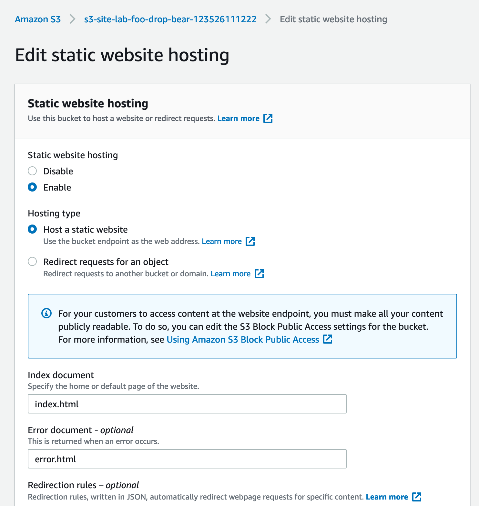
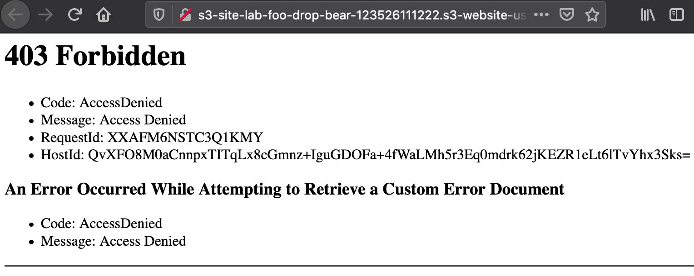
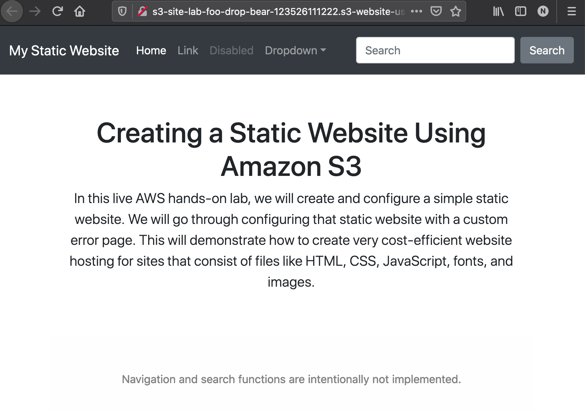
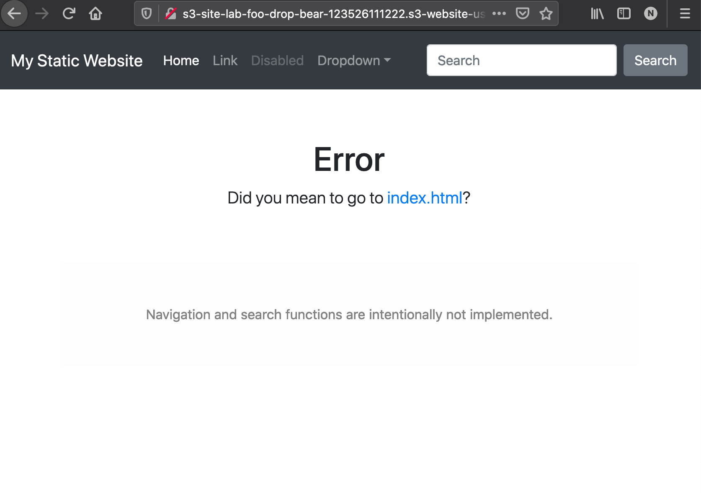

# S3 Website 

## Tasks
- Create S3 Bucket
- Enable Static Website Hosting
- Apply Bucket Policy

Lab architecture


## Create S3 bucket
- Enable public access
- Upload htmls
- Require `index.html` and `error.html`

## Enable static website hosting
- AWS create endpoint

Edit static site option


Enable static site


Visiting the endpoint shows that the page is forbidden due to bucket policy


## Apply bucket policy

```json
{
  "Version":"2012-10-17",
  "Statement":[{
     "Sid":"PublicReadGetObject",
     "Effect":"Allow",
     "Principal": "*",
     "Action":["s3:GetObject"],
     "Resource":["arn:aws:s3:::s3-site-lab-foo-drop-bear-123526111222/*"]
  }]
}
```

Site now enab led


Error page now works when endpoint does not exist

