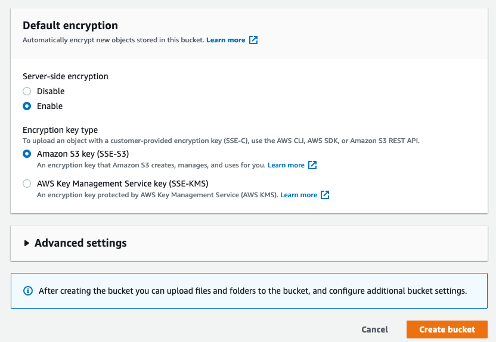
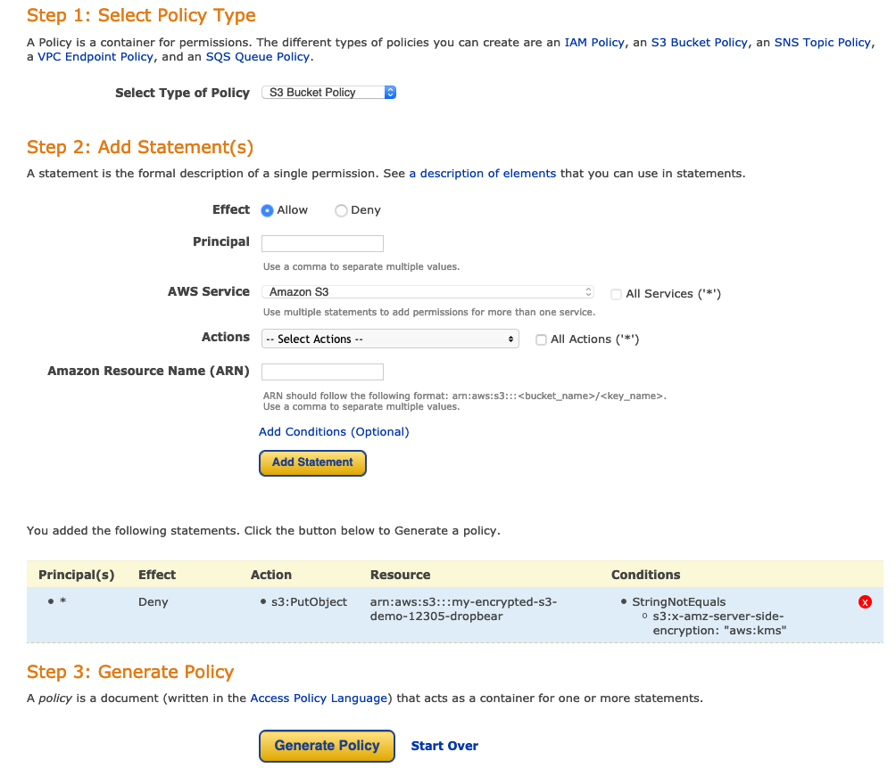
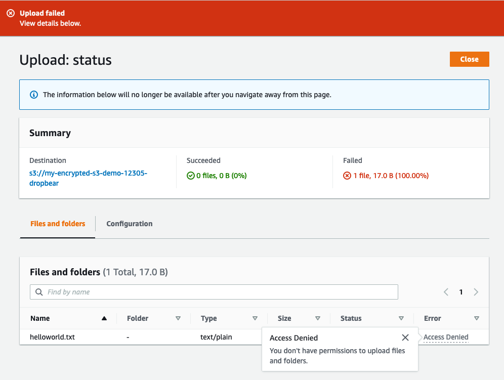

# S3 Encryption

## Types
- Encryption in transit (to and from S3 buckets)
  - SSL/TLS
  - HTTPS
- Encryption at rest (server side encryption)
  - SSE-S3 - encrypt with keys managed by aws using AES 256
  - SSE-KMS - separate permission for envelope key that encrypts data encryption key. Audit trail on encryption
  - SSE-C - customer provided keys
- Encryption at rest (client side encryption)
  - Encrypt files yourself before uploading to s3

## Enforcing server side encryption
- Using console - check box on s3 bucket
- Bucket policy 

## S3 put request
```http
PUT /myFile HTTP/1.1
Host: myBucket.s3amazonaws.com
Date: Wed, 25 Nov 2020 09:50:00 GMT
Authorization: authorization string
Content-Type: text/plain
Content-Length: 27364
x-amz-meta-author: Raph
Expect: 100-continue
[27364 byes of object data]
```

`Expect: 100-continue` - bucket will reject body depending on the headers

## Server side encryption
- Encryption at upload time
- PUT request header `x-amz-server-side-encryption` included
  - Two options:
  - `x-amz-server-side-encryption: AES256` - SSE-S3
  - `x-amz-server-side-encryption: aws:kms` - SSE-KMS
- Header tells S3 to encrypt using the method provided
- Can have bucket policy that doesnt have this header

## Summary
- Encryption in transit - SSL/TLS - HTTPS during upload
- Encryption at rest - SSE - SSE-S3, SSE-KMS, SSE-C
- Client side encrytpion
- Enforcing encryption with bucket policy possible

## Demo
- Create new bucket
- Review encryption options
- Enforce encryption
- Test policy

Encryption at rest


Encryption with bucket policy - deny any upload without server side encryption

Policy generator


```json
{
  "Id": "Policy1620882571921",
  "Version": "2012-10-17",
  "Statement": [
    {
      "Sid": "Stmt1620882440514",
      "Action": [
        "s3:PutObject"
      ],
      "Effect": "Deny",
      "Resource": "arn:aws:s3:::my-encrypted-s3-demo-12305-dropbear/*",
      "Condition": {
        "StringNotEquals": {
          "s3:x-amz-server-side-encryption": "aws:kms"
        }
      },
      "Principal": "*"
    }
  ]
}
```

Testing policy - upload without server side encryption

