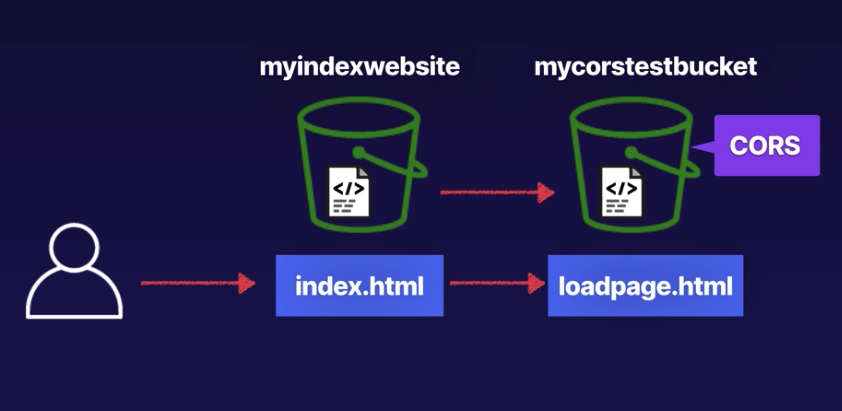
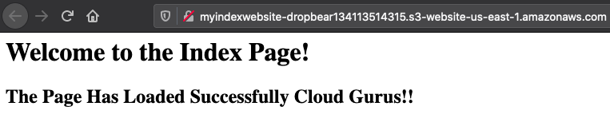
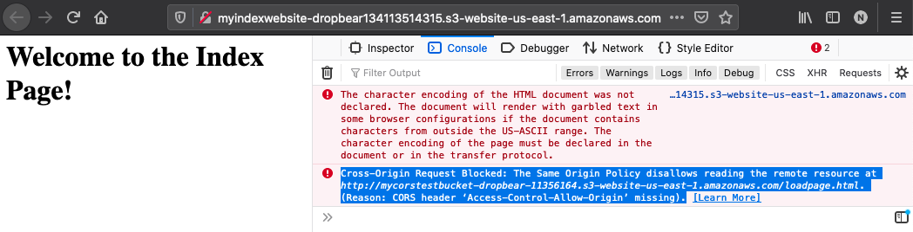
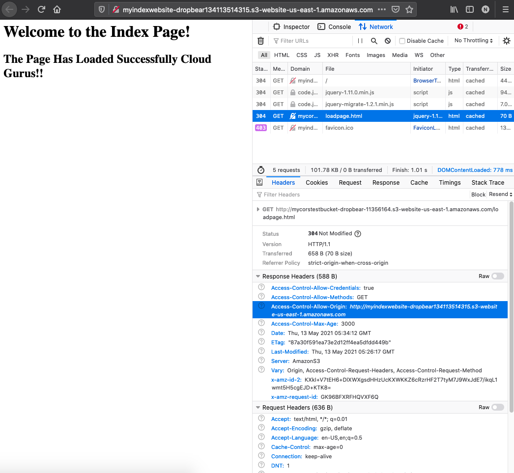

# CORS

## Definition
- Allow one resource to access another resourse
- Demo



## Demo
Create public index bucket with
- index.html, error.html with public access
- Enable static site hosting

Note this has loadpage in the index bucket. We move this loadpage to another bucket


Create public cors bucket with
- loadpage.html

Change public index bucket index.html with link to loadpage.html

Page does not load the loadpage.html now


Add CORS config in the corsbucket
```json
[
  {
    "AllowedHeaders": [
      "Authorization"
    ],
    "AllowedMethods": [
      "GET"
    ],
    "AllowedOrigins": [
      "http://myindexwebsite-dropbear134113514315.s3-website-us-east-1.amazonaws.com"
    ],
    "MaxAgeSeconds": 3000
  }
]
```

Site now loads the loadpage as well as CORS has been enabled


