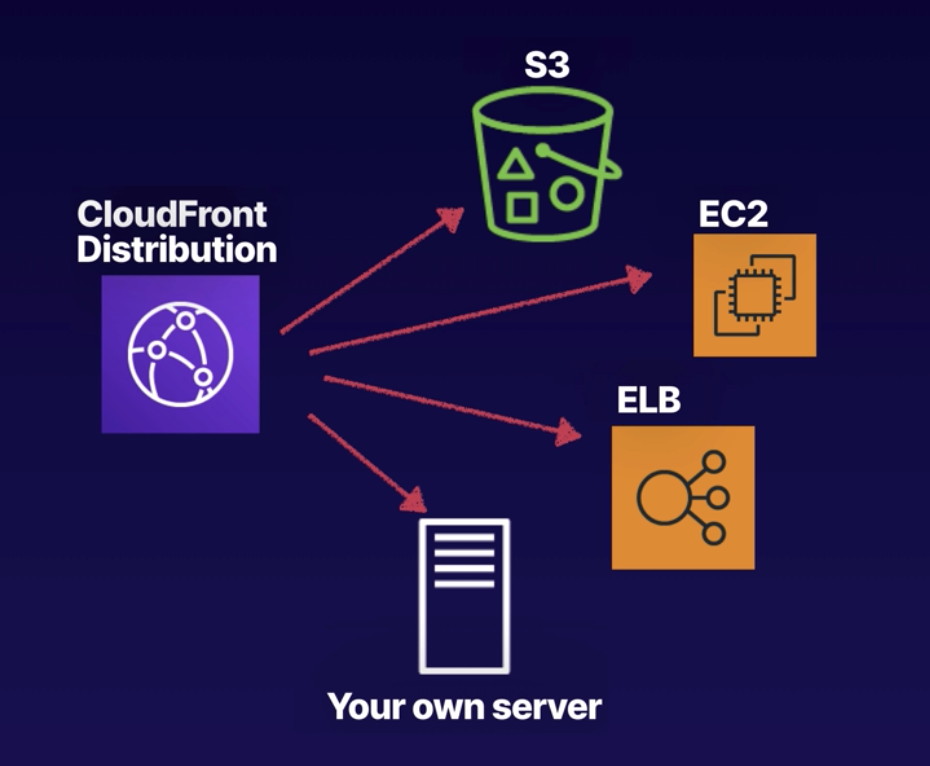
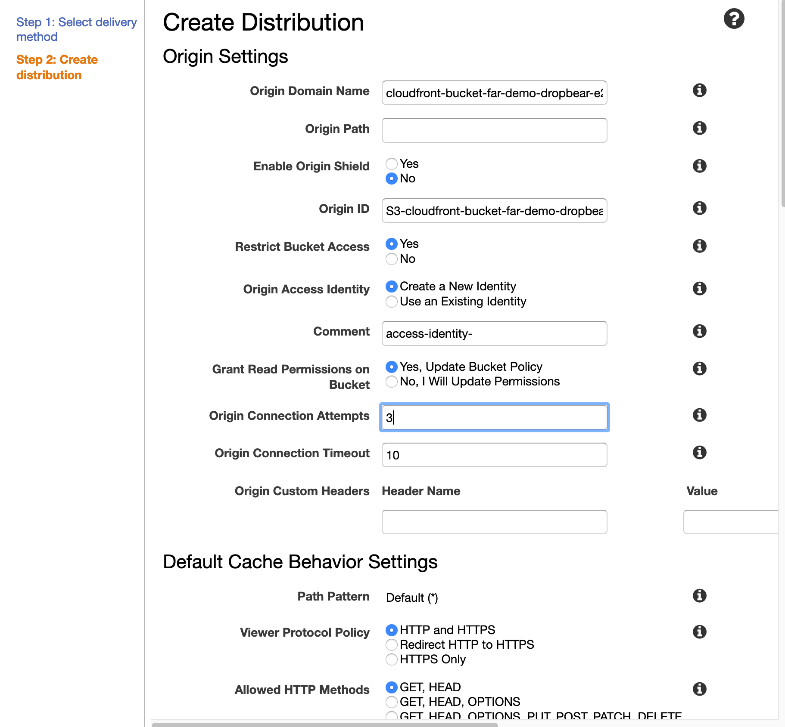
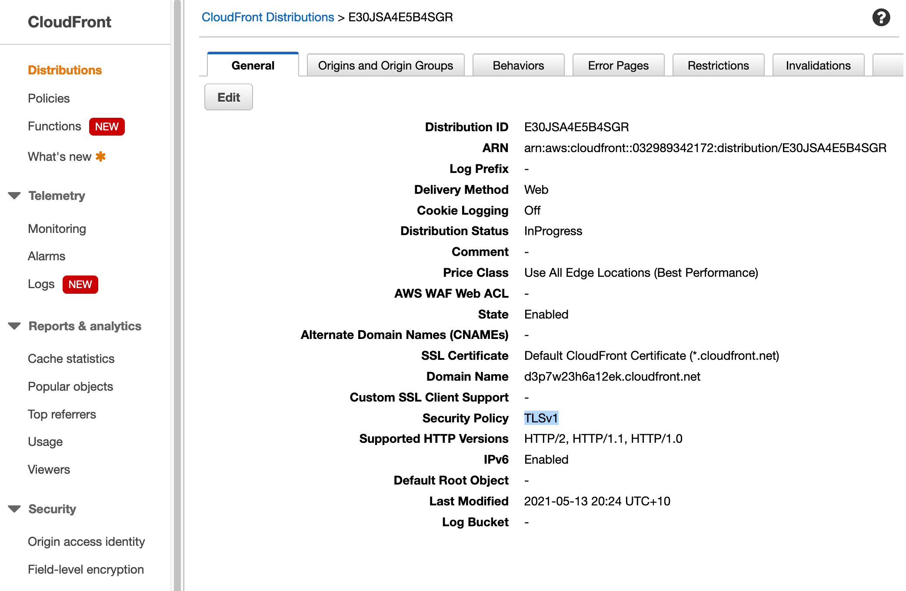

# Cloudfront

## Definition
- AWS Content delivery network
- Distributed servers delivering content
- Edge locations
  - geographically dispersed servers where data is cached
- Origin
  - origin of the file
  - Can be bucket, EC2
- Cloudfront distribution - origin and configuration setting of content to be distribute
- Improve performance of requests
- Requests automatically routed to the nearest edge location
- Optimised with other aws services
- Time to live 
  - how long the objects are cached - default 1 day
  - Clearing the cache yourself costs money
- S3 transfer acceleration - fast over long distances
  - Can write to these edge locations as well

## Demo
- Create S3 bucket
- Access an image from the S3 bucket
- Create cloudfront distribution
- Prevent access to S3
- Access the image via cloudfront

Create cloudfront distribution

cloudfront distribution details

Access image via cloudfront domain 

