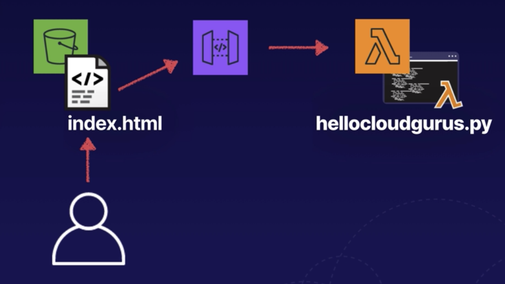
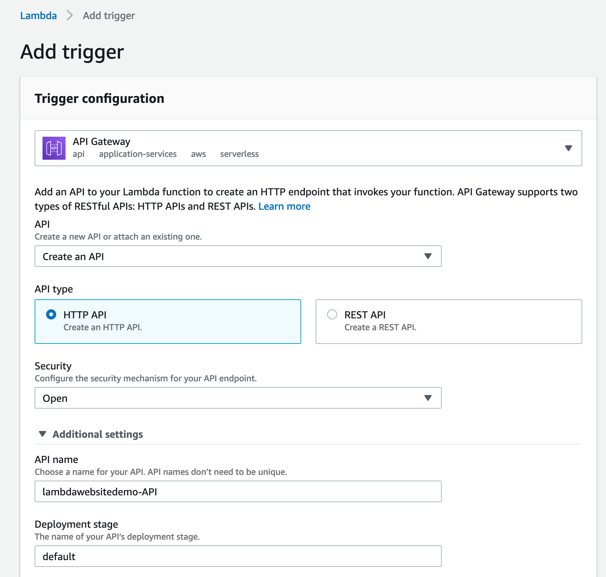
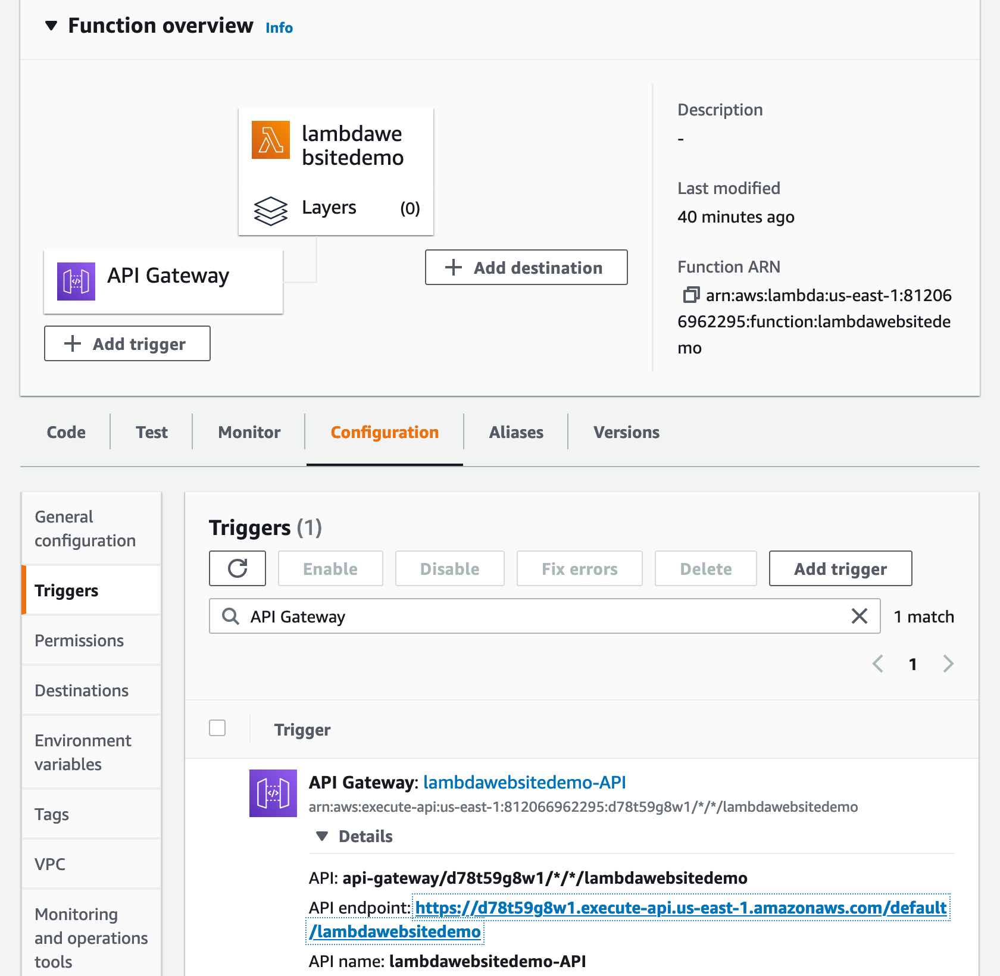

# Serverless

## Lambda website demo



Add trigger, configure api gateway



API gateway link



Create S3 bucket and add index.html file. THe file has a link to API gateway which executes lambda and returns the result in the body

Lambda

```python
def lambda_handler(event, context):
    print("In lambda handler")

    resp = {
        "statusCode": 200,
        "headers": {
            "Access-Control-Allow-Origin": "*",
        },
        "body": "Hello world!!!"
    }

    return resp
```

index.html

```html
<html>
  <head>
    <script>
      function myFunction() {
        var xhttp = new XMLHttpRequest();
        xhttp.onreadystatechange = function () {
          if (this.readyState == 4 && this.status == 200) {
            document.getElementById("my-demo").innerHTML = this.responseText;
          }
        };
        xhttp.open(
          "GET",
          "https://d78t59g8w1.execute-api.us-east-1.amazonaws.com/default/lambdawebsitedemo",
          true
        );
        xhttp.send();
      }
    </script>
  </head>

  <body>
    <div align="center">
      <br />
      <br />
      <br />
      <br />
      <h1><span id="my-demo">Lambda demo!</span></h1>
      <button onclick="myFunction()">Click me</button>
    </div>
  </body>
</html>
```
