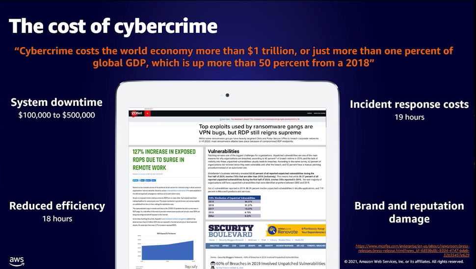

# Monitoring and observability

App architecture modernisation

## Monitoring

- Something you already know

## Observability

# Network firewall

Powered by gateway load balancer

# Optimise security operations using AWS Systems Manager

