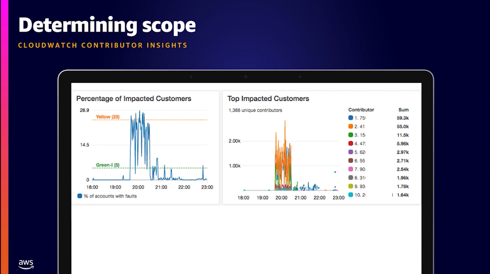
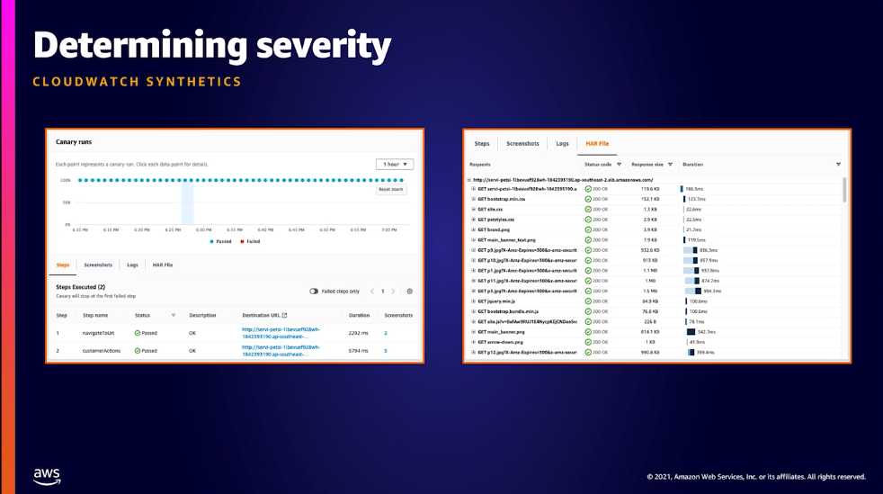
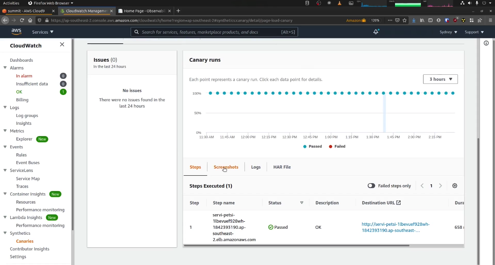
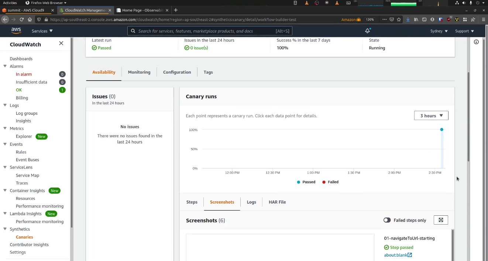
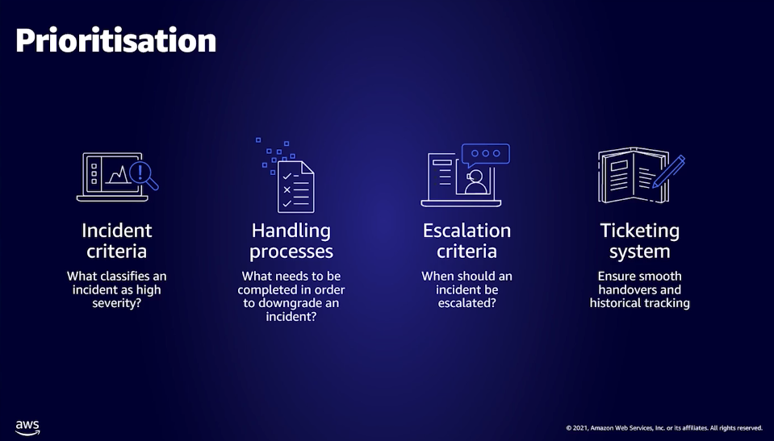
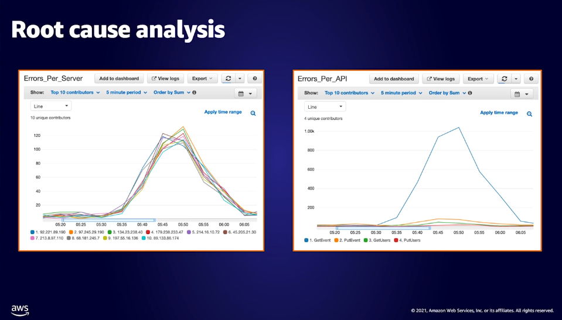
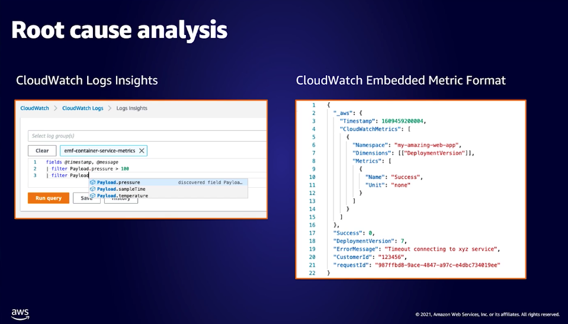
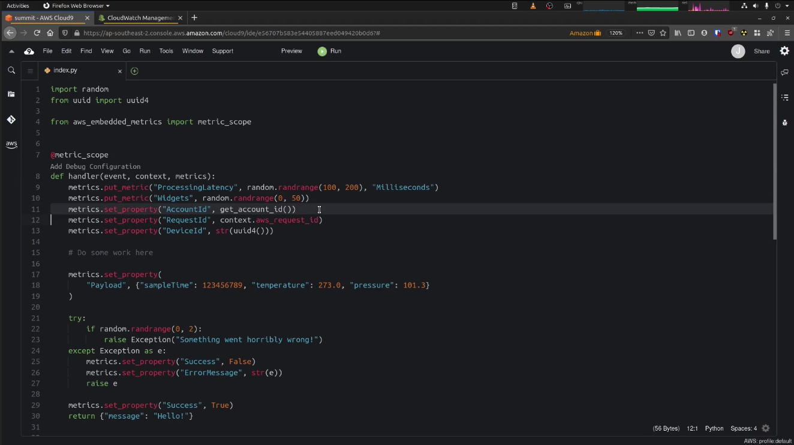
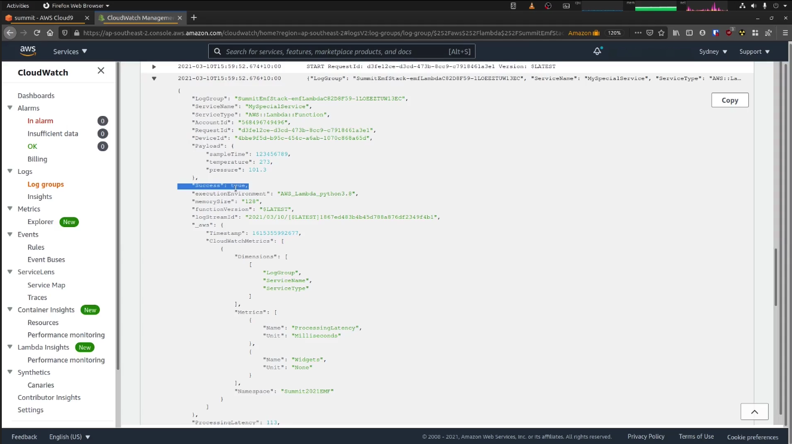
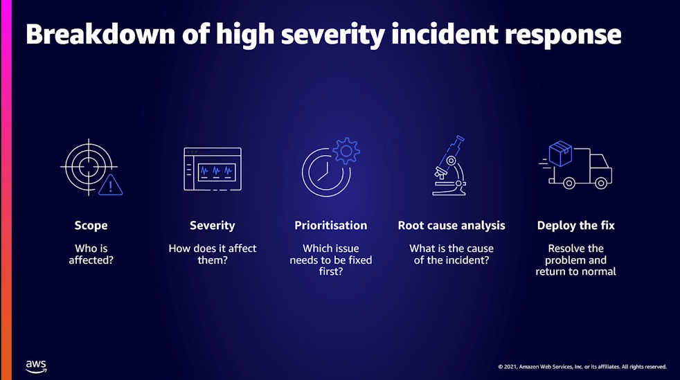

# Well architected framework

# Adopting multi-account strategy

Set up landing zone

Leverage control tower

Inventory and resources

Self service approach

Operations with system manager

Recommendations with trusted advisor

Key take aways

# Serverless microservies design patterns

Get complete audit log

CQRS

# Reduce time spent on high sev incidents

Determine the scope

Determin severity

Prioritisation

Root cause analysis - contributor insights - find what API operation is failing

Root cause analysis - logs insights & embedded metrtic format - correlate logs and metrics

