# Well architected framework

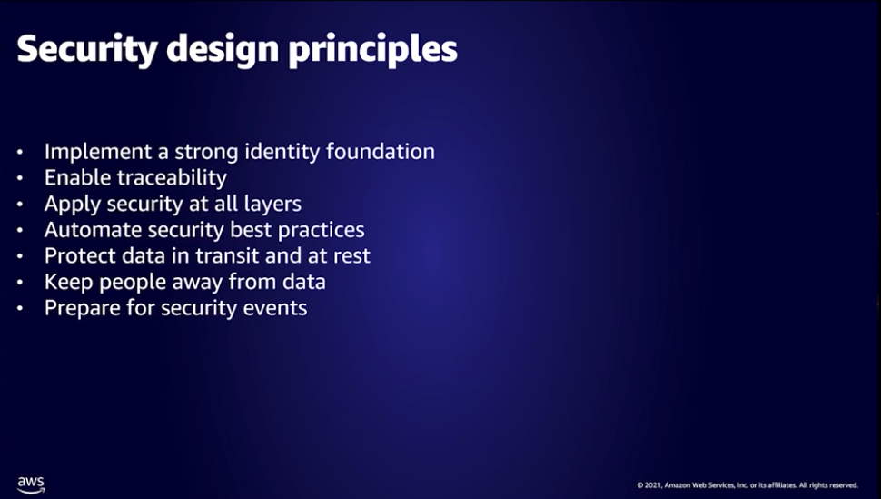

# Adopting multi-account strategy

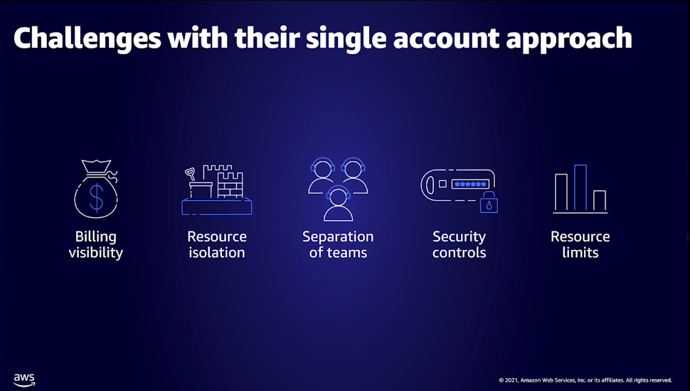

Set up landing zone

Leverage control tower

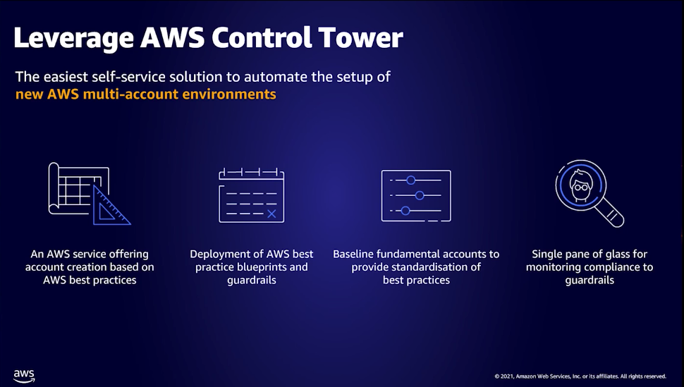

Inventory and resources

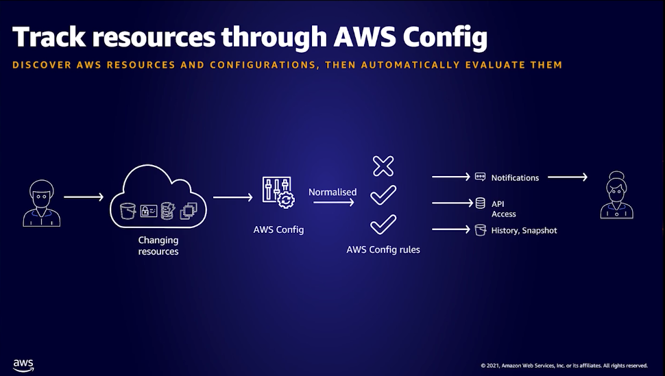

Self service approach

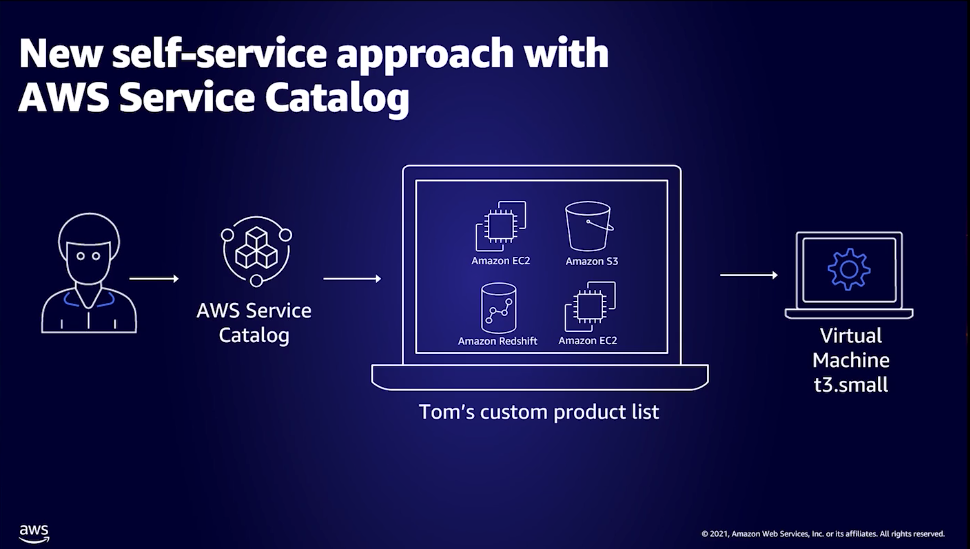

Operations with system manager

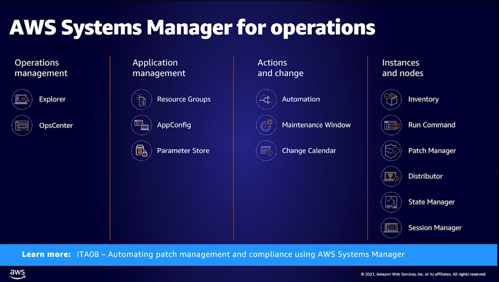

Recommendations with trusted advisor

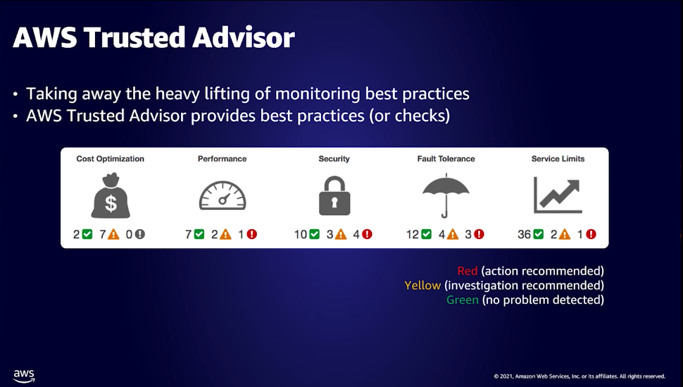

Key take aways

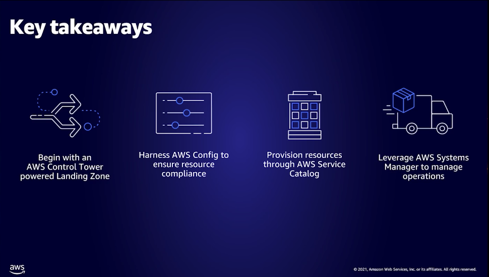

# Serverless microservies design patterns

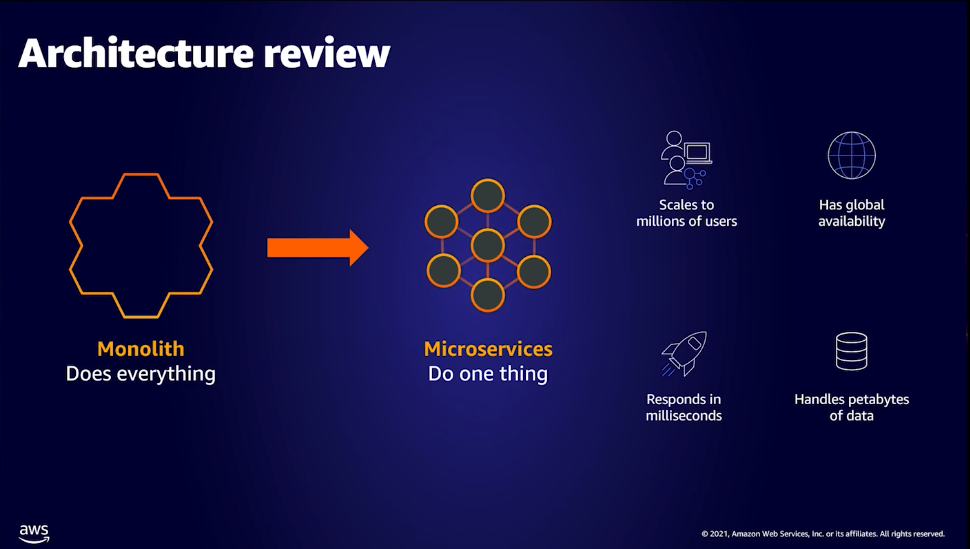

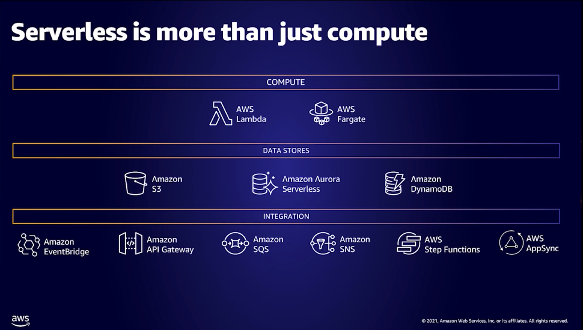

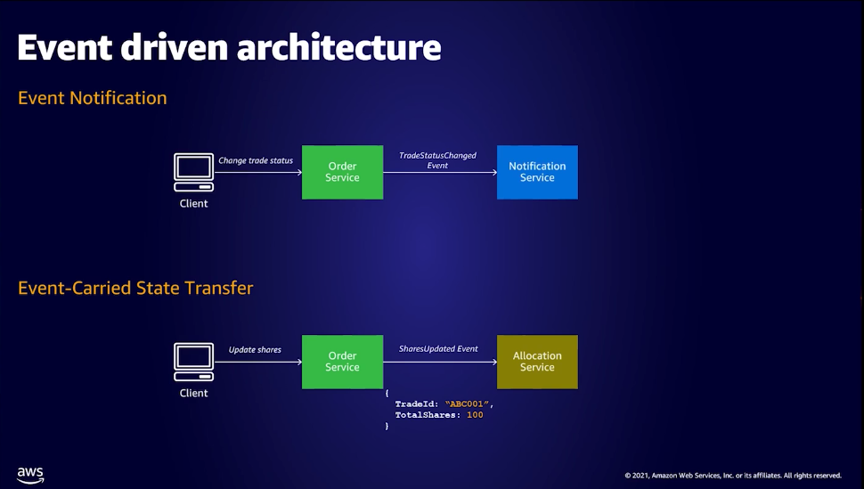

Get complete audit log
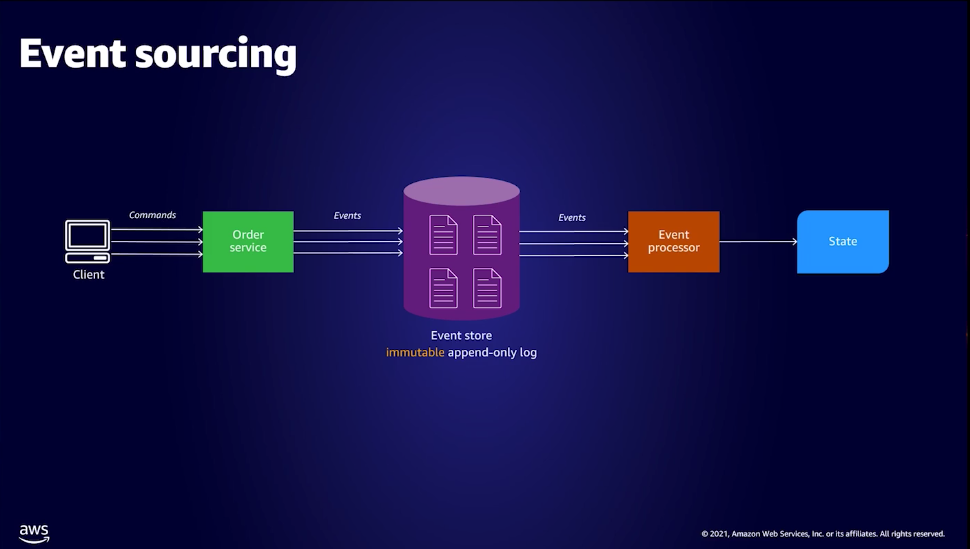

CQRS

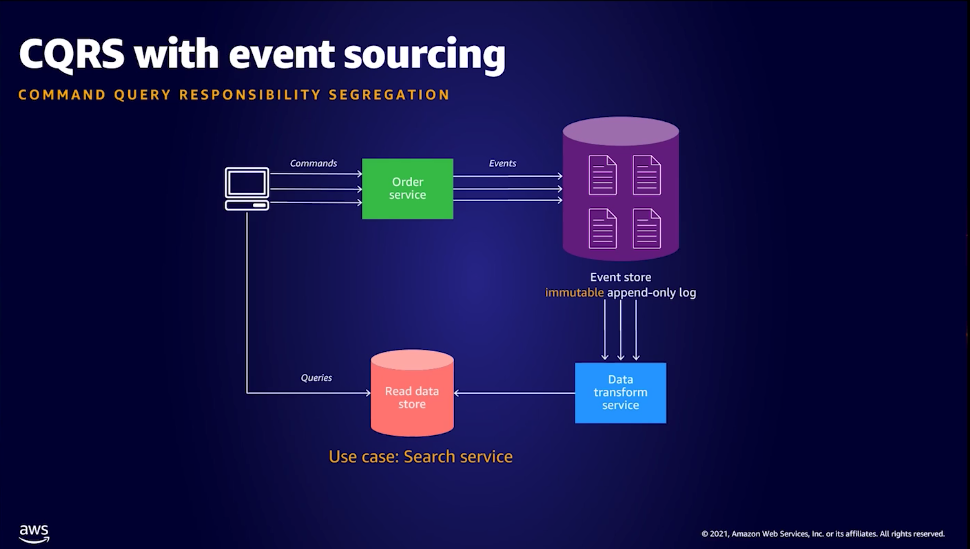

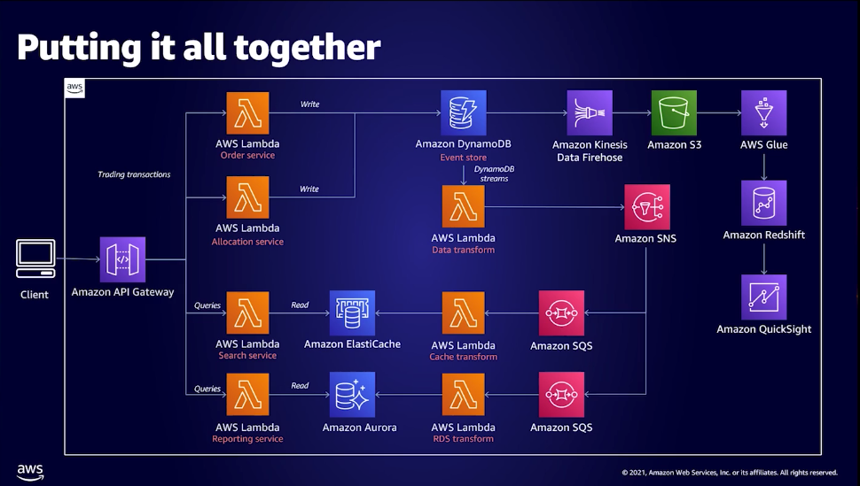
