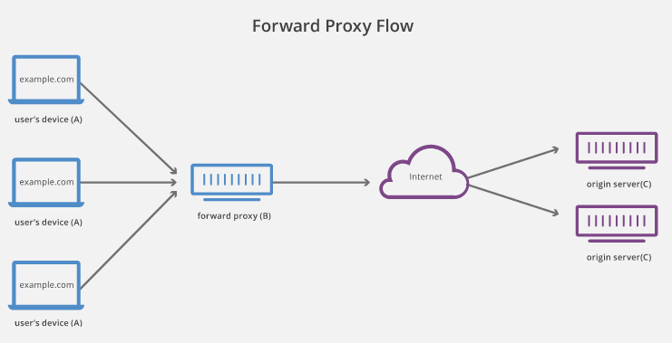
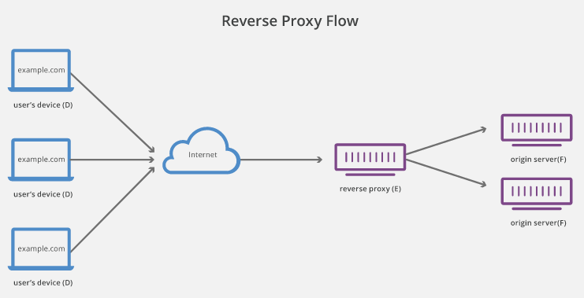

# Reverse proxy

https://www.cloudflare.com/learning/cdn/glossary/reverse-proxy/

## (Forward) Proxy server
- AKA forward proxy, proxy, proxy server, web proxy
- Sits in front of a group of client machines
- Proxy intercepts requests and forward them to web servers on behalf of clients
- No origin server communicates directly with specific client

Benefits
- Browsing restrictions - government and schools
- Blocked certain sites
- Protect identity online

## Reverse proxy
- Sits in front of web servers and forwards client requests to web servers
- Requests intercepted at network edge
- Help increase security, performance, and reliability
- No client communicates directly with origin server

Benefits
- Load balancing
- Protect from attacks such as DDoS. Service never needs to reveal IP address of origin servers
- Caching
- SSL encryption - proxy can decrypt all incoming requests and encrypt all outgoing responses
