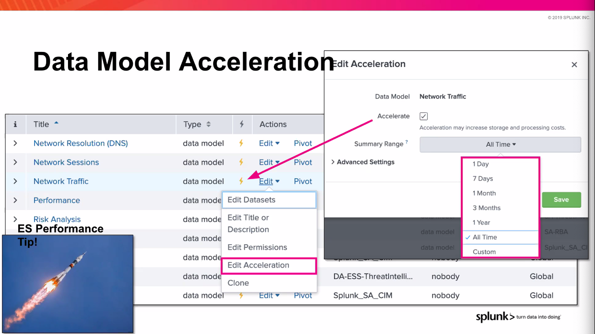
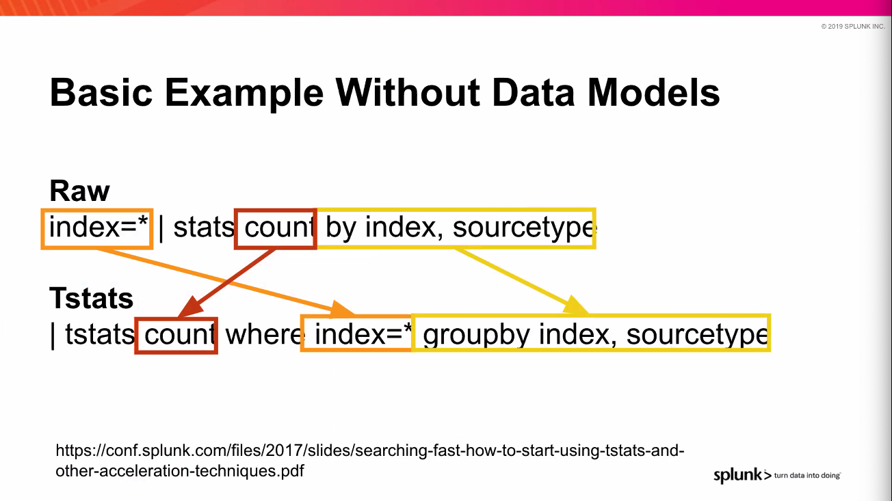
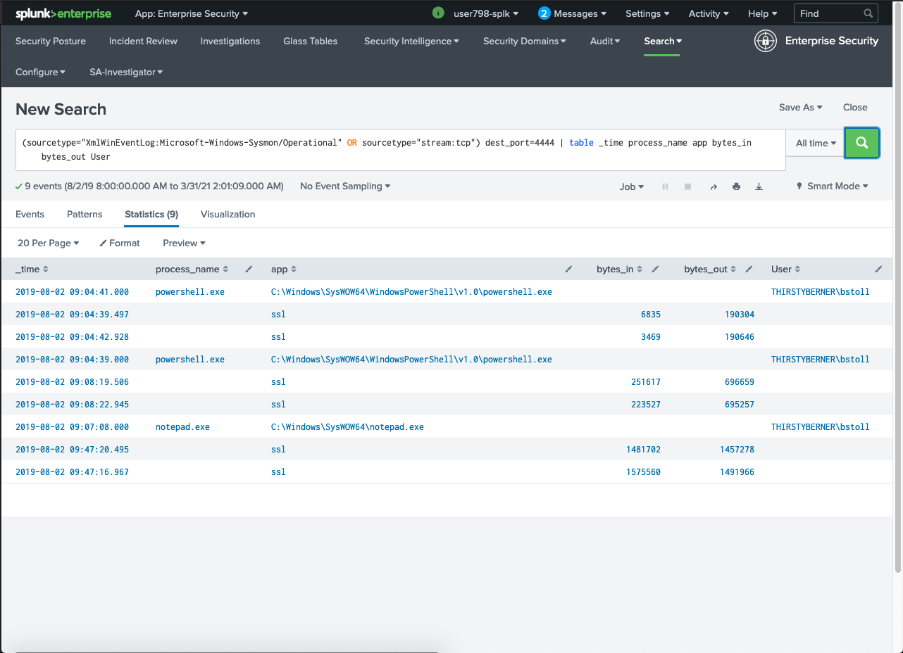
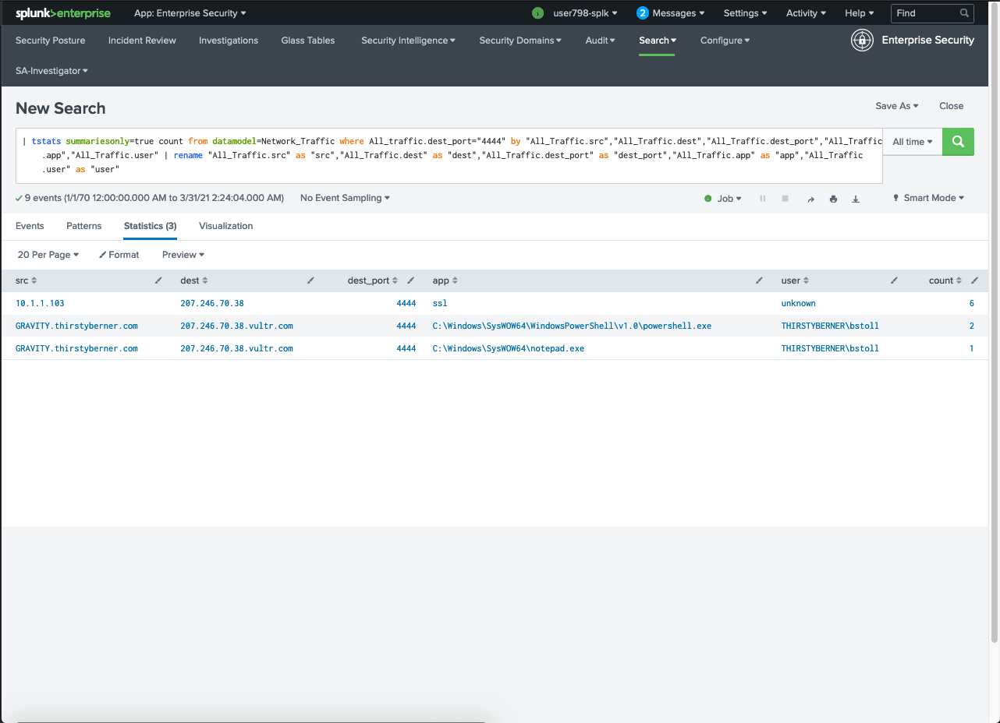
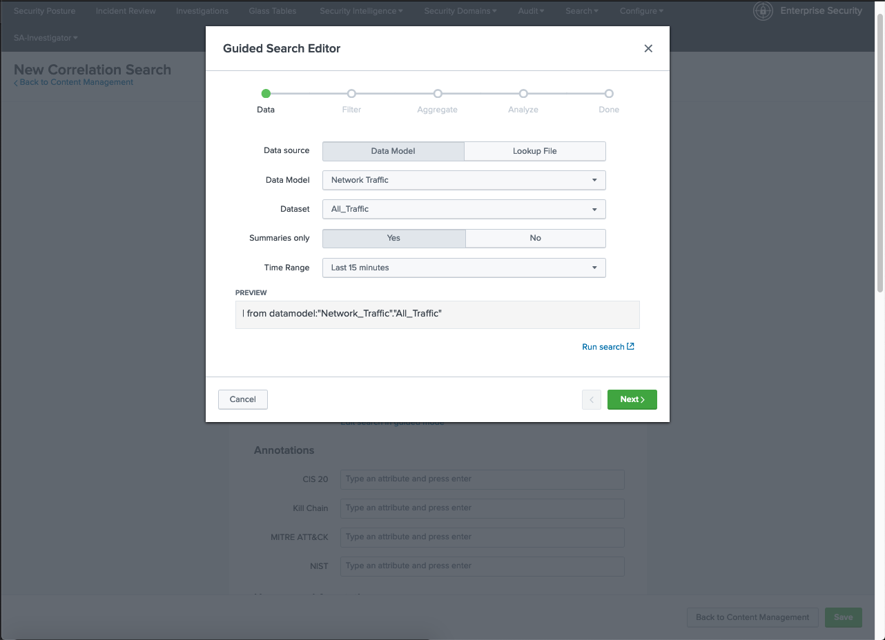
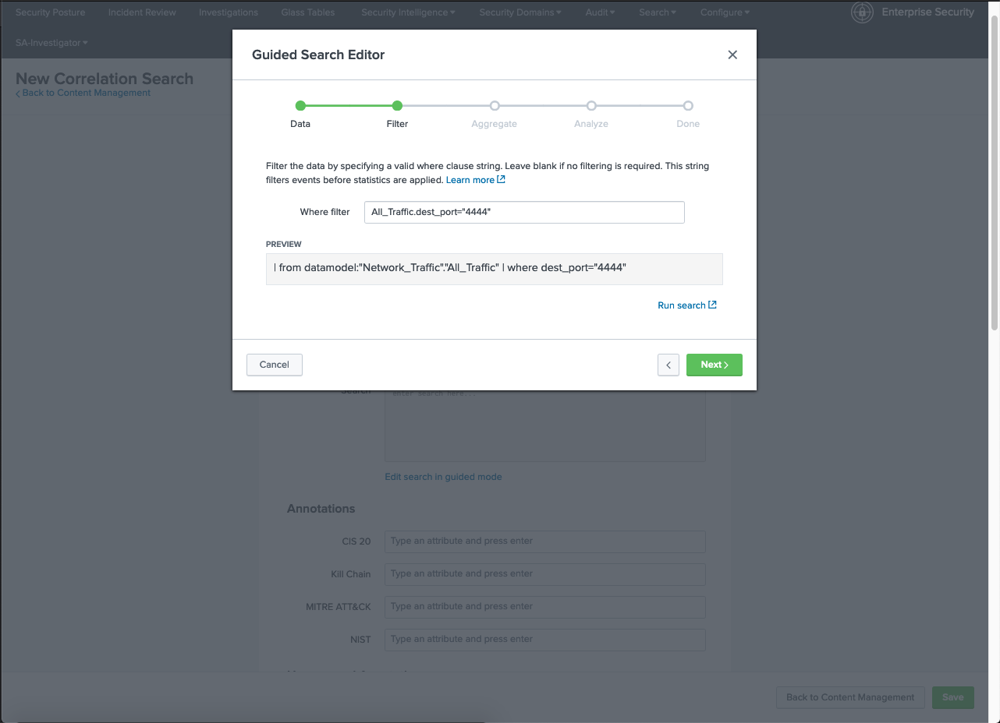
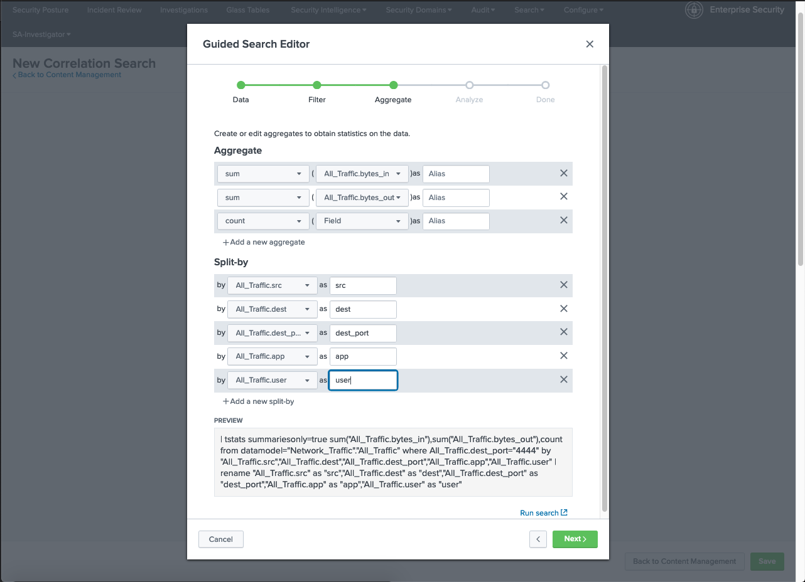
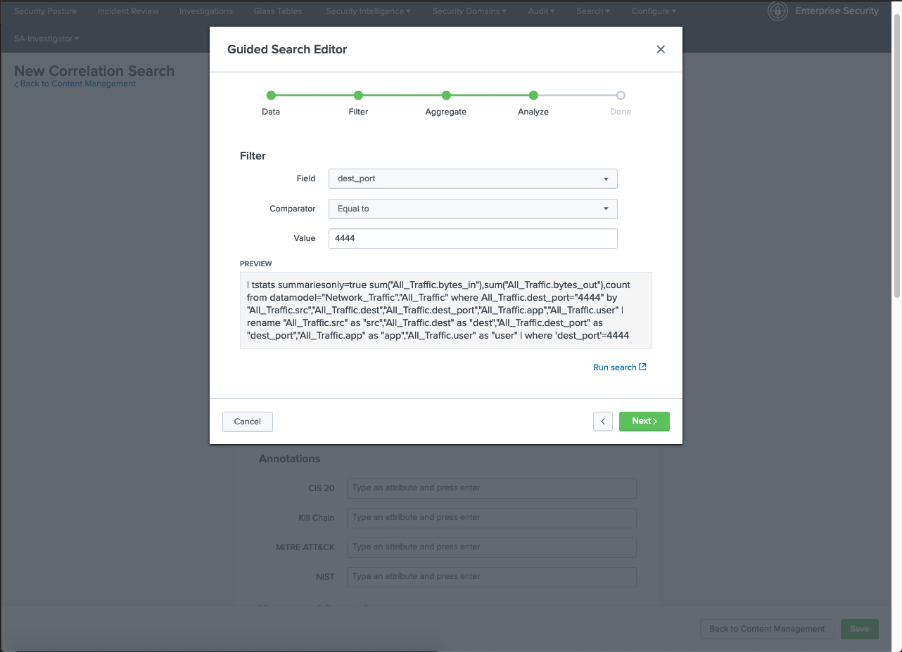
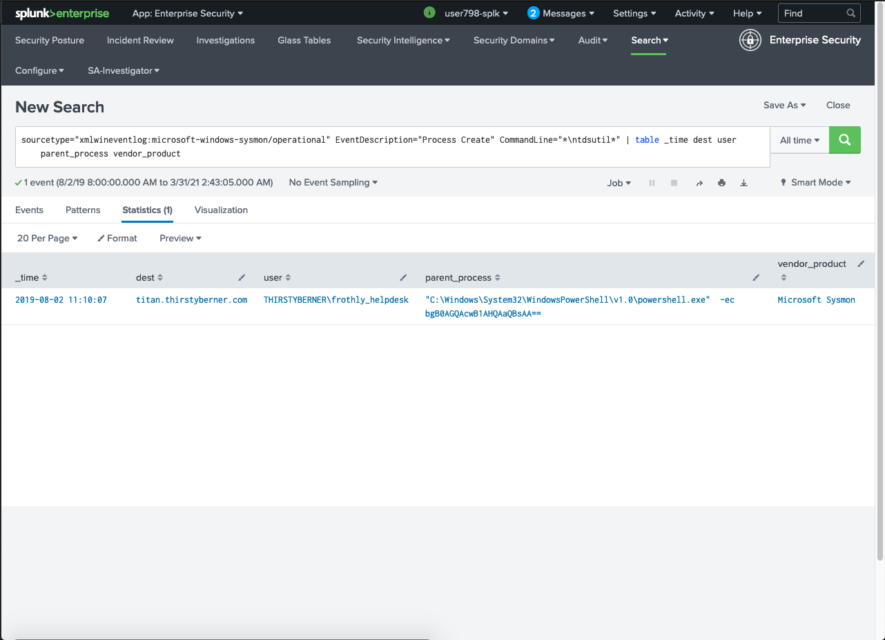
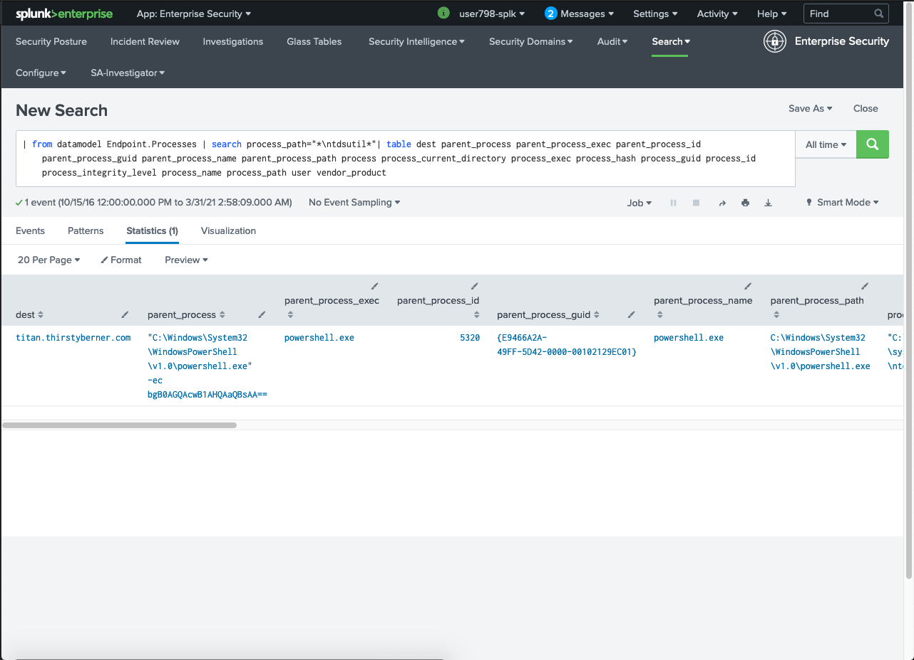

# Building Correlation Searches with Splunk, hands on workshop

foundation
common information modle and datamodels
tstats
correlation search
notable event config
additional fields MITRE

## Search Processing Language

combines SQL and unix pipeline syntax

tstats
from table
stats
where

## Index basics

Raw data contains original data in compressed form
Index files (.tsidx) points to the unique terms in raw data

[Splunk Index Structure]

Raw data stored at offsets. Stored reversed order

## Common information model
Normalising data to make it easier to search
Bring in data in raw format
from datamodel
table

Data is mapped to the CIM with 3 conf files
props.conf
tags.conf
eventtypes.conf

Datamodels contains datasets

## Accelerate data models
Not all searches can be accelerated

tstats - primary command for accelerated searches



Without data models for search


### Example without data models

Raw
index=* | stats count by index, sourcetype

Tstats
| tstats count where index=* groupby index, sourcetype

### Example with data models

...

### tstats syntax

| tstats [options] [statistical-functions like count] FROM [datamodel].[dataset] WHERE [field] = value

## Correlation search
correlation search generates notable event when conditions met

1. Create search with SPL
2. Analyse result
3. Is this what you want alert on
4. What fields do you need
5. Do these fields exist in data model, build data model search to test
6. Convert to tstats to improve search performance

Build network based detection search using SPL

Exercise #1
```
(sourcetype="XmlWinEventLog:Microsoft-Windows-Sysmon/Operational" OR sourcetype="stream:tcp") dest_port=4444 | table _time process_name app bytes_in bytes_out User
```



Convert to accelerated search using tstats

Exercise #2
```
| tstats summariesonly=true count from datamodel=Network_Traffic where All_traffic.dest_port="4444" by "All_Traffic.src","All_Traffic.dest","All_Traffic.dest_port","All_Traffic.app","All_Traffic.user" | rename "All_Traffic.src" as "src","All_Traffic.dest" as "dest","All_Traffic.dest_port" as "dest_port","All_Traffic.app" as "app","All_Traffic.user" as "user"
```



Exercise #3
```
| tstats summariesonly=true sum("All_Traffic.bytes_in"),sum("All_Traffic.bytes_out"),count from datamodel="Network_Traffic"."All_Traffic" where All_Traffic.dest_port="4444" by "All_Traffic.src","All_Traffic.dest","All_Traffic.dest_port","All_Traffic.app","All_Traffic.user" | rename "All_Traffic.src" as "src","All_Traffic.dest" as "dest","All_Traffic.dest_port" as "dest_port","All_Traffic.app" as "app","All_Traffic.user" as "user" | where 'dest_port'=4444
```






Host base detection using SPL

Exercise #4
```
sourcetype="xmlwineventlog:microsoft-windows-sysmon/operational" EventDescription="Process Create" CommandLine="*\ntdsutil*" | table _time dest user parent_process vendor_product

```



Exercise #5
```
| from datamodel Endpoint.Processes | search process_path="*\ntdsutil*"| table dest parent_process parent_process_exec parent_process_id parent_process_guid parent_process_name parent_process_path process process_current_directory process_exec process_hash process_guid process_id process_integrity_level process_name process_path user vendor_product
```


Exercise #6
```
| tstats summariesonly=true count from datamodel=Endpoint.Processes where Processes.process_path="*\ntdsutil*"
by Processes.dest
Processes.parent_process
Processes.parent_process_exec Processes.parent_process_id Processes.parent_process_guid Processes.parent_process_name Processes.parent_process_path Processes.process Processes.process_current_directory Processes.process_exec Processes.process_hash Processes.process_guid Processes.process_id Processes.process_integrity_level Processes.process_name Processes.process_path Processes.user Processes.vendor_product
```


Corellation search -> generates notable event (can be found in Incident review)


MITRE ATT&CK
Builds on Lockheed Martin's kill chain but focuses on tactics and techniques

## Wrap up
- SPL can be used for correlation searches
- Use tstats with data models to scale and rapidly complete searches where possible
- Identify fields for analysts to easily accessible and include them in your search
- Use token and drill downs to customise notables
- Throttling and time windows should be tested for timely alerts
