# Splunk search party

## Simple search

- Click and drag on the mini graph to quickly filter date range

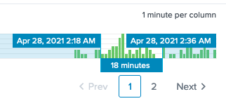

- Boolean operators (AND/OR/NOT)

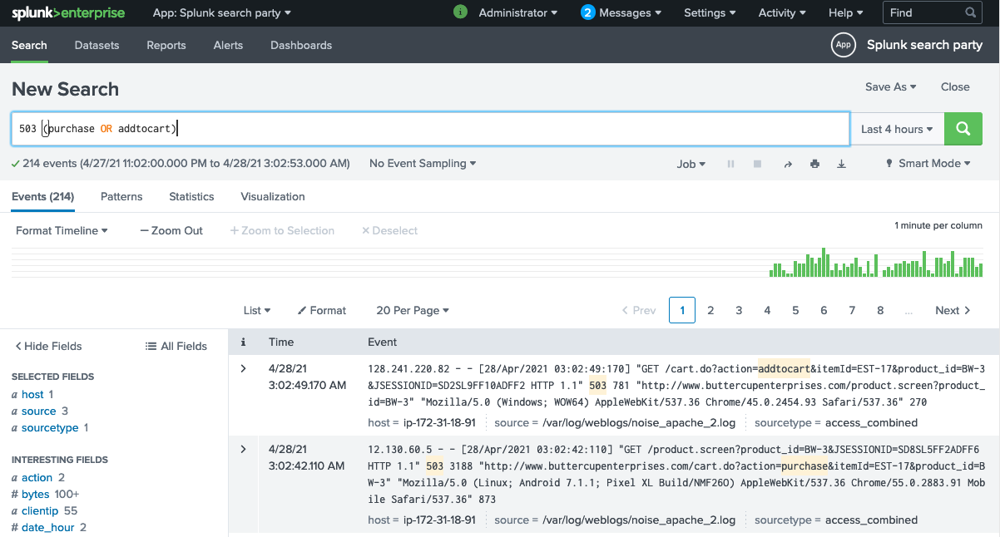

## Search Processing Language (SPL)

Pipe commands

`action=purchase | stats count by status | rename count as "number of events"`

- `stats` - commands

- `count` - functions

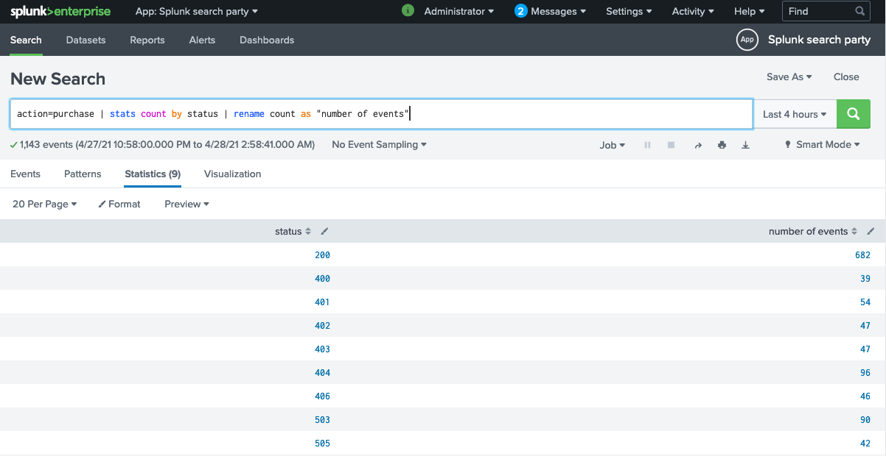

## Visualisation - status codes

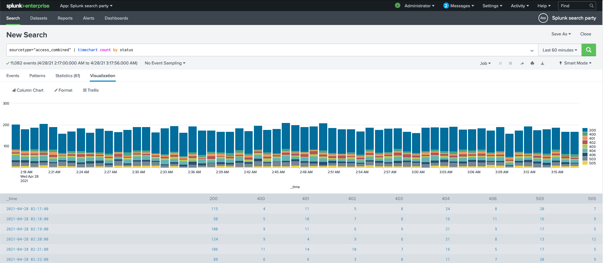

## Extract fields - OS field

- use regex or delimiter

## Create / add to dashboard 

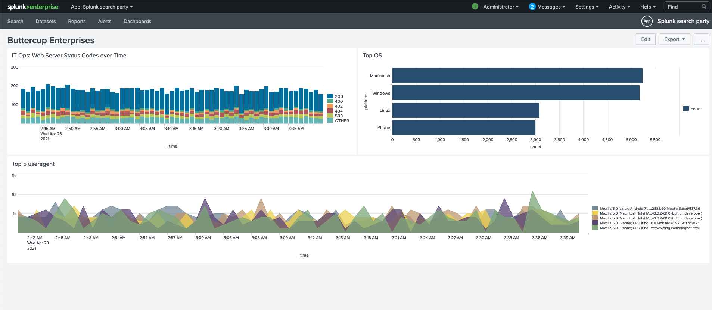

## Top 5 useragent with failures

`status>=400 | timechart count by useragent limit=5 useother=f`

`userother=f` - hide grouped

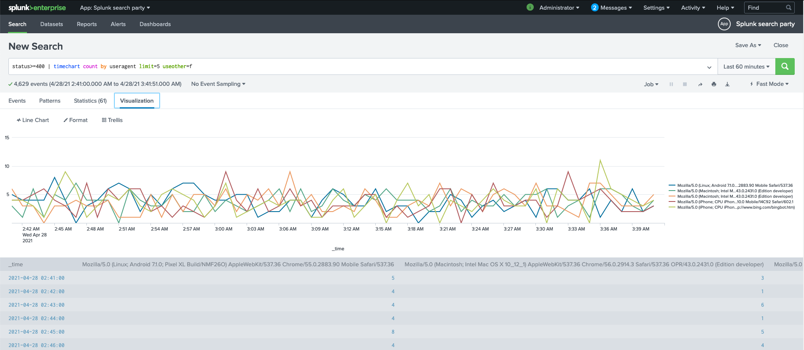

## Statistics 

- `sourcetype=access_combined | stats distinct_count(clientip) by status`
- `sourcetype=access_combined | timechart count by status`

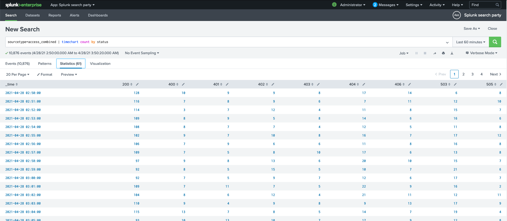

## Predict - machine learning

- `action=purchase | timechart count span=5m | predict count future_timespan=24`

## Lookup - show lost revenue from website

- Upload look up file (eg. csv)
- `action=purchase status >=400 | lookup product_codes.csv product_id | timechart sum(product_price)`

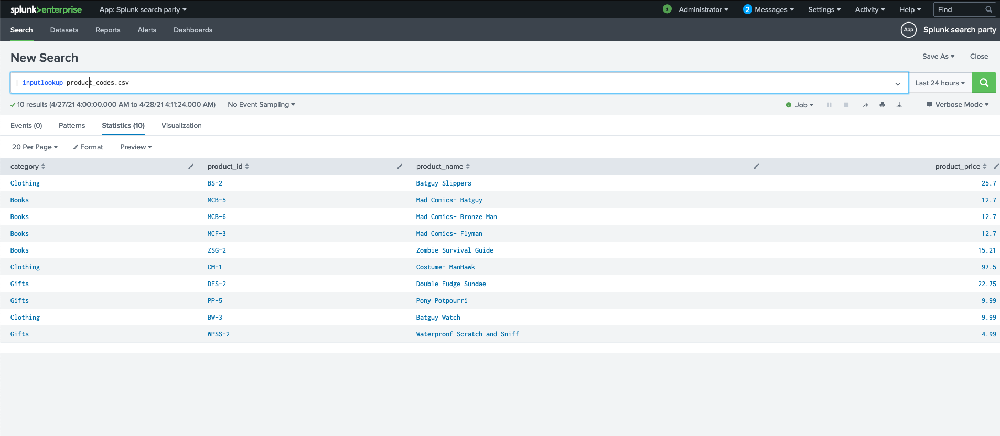

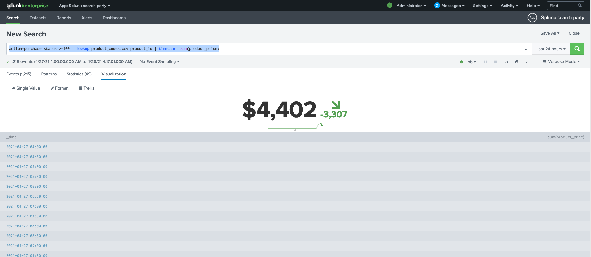

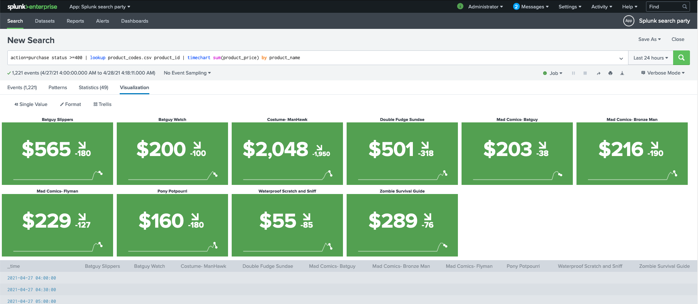

## Geographic location - security fraud teams

- use iplocation to enrich geolocation data
- `action=purchase | iplocation clientip | search Country!="United States" | geostats count by City`

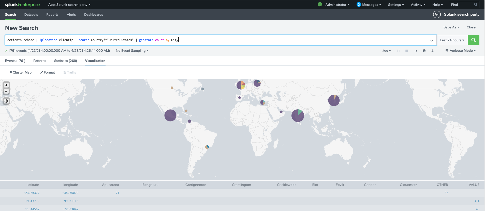

## Make dashboard dynamic

- Add shared time picker

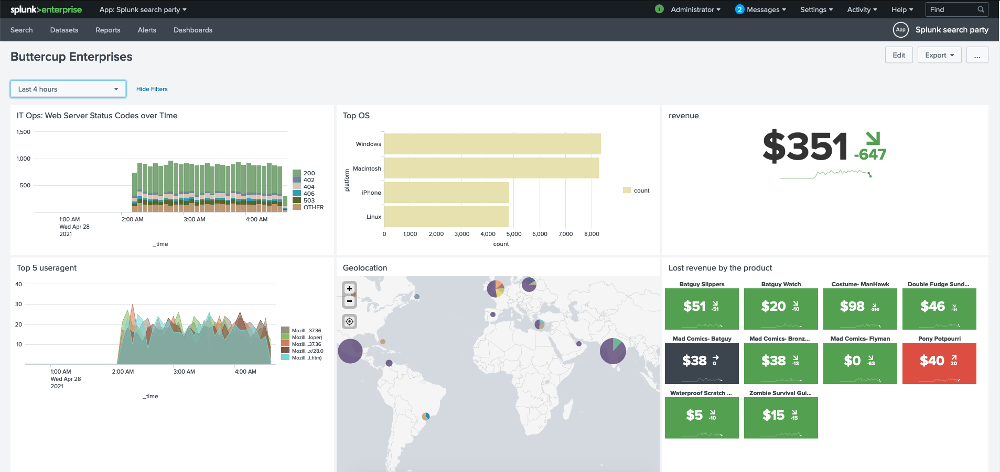
