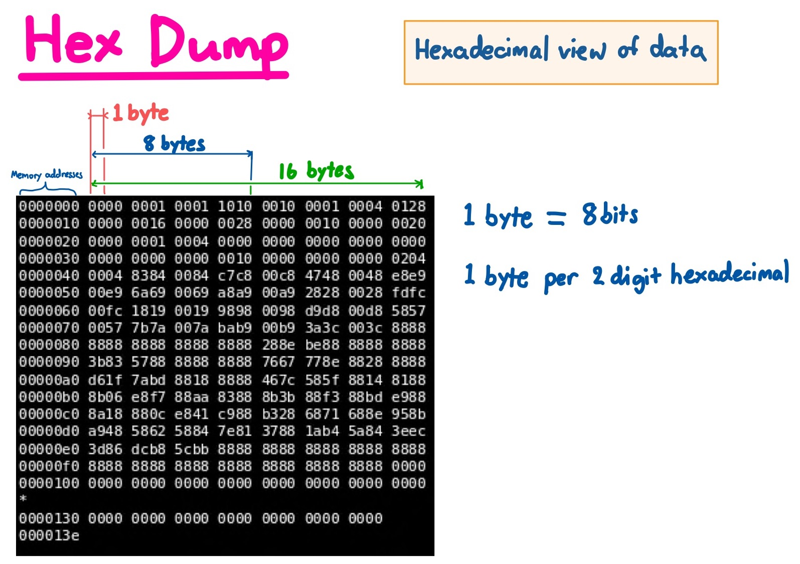

# Over The Wire: Bandit - 12->13

https://overthewire.org/wargames/bandit/bandit13.html

- **Category:** wargames basic

## Challenge

> The password for the next level is stored in the file data.txt, which is a hexdump of a file that has been repeatedly compressed. For this level it may be useful to create a directory under /tmp in which you can work using mkdir. For example: mkdir /tmp/myname123. Then copy the datafile using cp, and rename it using mv (read the manpages!)
Commands you may need to solve this level: grep, sort, uniq, strings, base64, tr, tar, gzip, bzip2, xxd, mkdir, cp, mv, file

> Helpful Reading Material: [Hex dump on Wikipedia](https://en.wikipedia.org/wiki/Hex_dump)

## Solution

- This one requires a bit of enumeration. You will need several decompression tools such as `tar` `gzip` `bzip`. Stick with it, you'll be relieved when you solve it!
  
- First you need to know what this text file looks like. As the challenge hinted, it is a hexdump
  

  
- You will also need to identify the file type using `file` command 
  
- The challenge also recommends you create a directory in the `/tmp` folder. You can do this with the `mkdir` command and `cd` change directory into the new folder

- You will also need to rename files to appropriate extensions with the `mv` command
  
### Step by step solution

1. ssh into `bandit12` with password `5Te8Y4drgCRfCx8ugdwuEX8KFC6k2EUu`
2. Make a new directory to play with in `/tmp`
3. Copy the data.txt file over
4. When you `cat` the file, you can see the file is of a [hexdump format](./hexdump.jpg)
5. Reverse the hexdump into the data file it was with `xxd -r`
6. Begin decompression depending on the file type you see

```
ssh bandit12@bandit.labs.overthewire.org -p 2220

bandit12@bandit:~$ mkdir -p /tmp/taco
bandit12@bandit:~$ cp data.txt /tmp/taco
bandit12@bandit:~$ cd /tmp/taco
bandit12@bandit:/tmp/taco$ ls
data.txt

bandit12@bandit:/tmp/taco$ xxd -r data.txt > file
bandit12@bandit:/tmp/taco$ file file
file: gzip compressed data, was "data2.bin", last modified: Thu May  7 18:14:30 2020, max compression, from Unix
bandit12@bandit:/tmp/taco$ mv file file.gz
bandit12@bandit:/tmp/taco$ gunzip file.gz
bandit12@bandit:/tmp/taco$ ls
data.txt  file
bandit12@bandit:/tmp/taco$ file file
file: bzip2 compressed data, block size = 900k
bandit12@bandit:/tmp/taco$ mv file file.bz
bandit12@bandit:/tmp/taco$ bzip2 -d file.bz
bandit12@bandit:/tmp/taco$ ls
data.txt  file
bandit12@bandit:/tmp/taco$ file file
file: gzip compressed data, was "data4.bin", last modified: Thu May  7 18:14:30 2020, max compression, from Unix
bandit12@bandit:/tmp/taco$ mv file file.gz
bandit12@bandit:/tmp/taco$ gunzip file.gz
bandit12@bandit:/tmp/taco$ file file
file: POSIX tar archive (GNU)
bandit12@bandit:/tmp/taco$ mv file file.tar
bandit12@bandit:/tmp/taco$ tar -xvf file.tar
data5.bin
bandit12@bandit:/tmp/taco$ file data5.bin
data5.bin: POSIX tar archive (GNU)
bandit12@bandit:/tmp/taco$ mv data5.bin file.tar
bandit12@bandit:/tmp/taco$ tar -xvf file.tar
data6.bin
bandit12@bandit:/tmp/taco$ file data6.bin
data6.bin: bzip2 compressed data, block size = 900k
bandit12@bandit:/tmp/taco$ mv data6.bin file.bz
bandit12@bandit:/tmp/taco$ bzip2 -d file.bz
bandit12@bandit:/tmp/taco$ file file
file: POSIX tar archive (GNU)
bandit12@bandit:/tmp/taco$ mv file file.tar
bandit12@bandit:/tmp/taco$ tar -xvf file.tar
data8.bin
bandit12@bandit:/tmp/taco$ file data8.bin
data8.bin: gzip compressed data, was "data9.bin", last modified: Thu May  7 18:14:30 2020, max compression, from Unix
bandit12@bandit:/tmp/taco$ mv data8.bin file.gz
bandit12@bandit:/tmp/taco$ gunzip file.gz
bandit12@bandit:/tmp/taco$ file file
file: ASCII text
bandit12@bandit:/tmp/taco$ cat file
The password is 8ZjyCRiBWFYkneahHwxCv3wb2a1ORpYL
```

Flag
```
8ZjyCRiBWFYkneahHwxCv3wb2a1ORpYL
```
