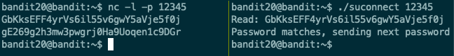

# Over The Wire: Bandit - 20->21

https://overthewire.org/wargames/bandit/bandit21.html

- **Category:** wargames basic

## Challenge

> There is a setuid binary in the homedirectory that does the following: it makes a connection to localhost on the port you specify as a commandline argument. It then reads a line of text from the connection and compares it to the password in the previous level (bandit20). If the password is correct, it will transmit the password for the next level (bandit21).

> NOTE: Try connecting to your own network daemon to see if it works as you think. Commands you may need to solve this level: ssh, nc, cat, bash, screen, tmux, Unix ‘job control’ (bg, fg, jobs, &, CTRL-Z, …)

## Solution

This one will teach you a bit about `nc`.

Try experiment with a connection between two terminals

Terminal 1
```
bandit20@bandit:~$ nc -l -p 12345
```

Terminal 2
```
bandit20@bandit:~$ nc localhost 12345
```

After you type something in either terminal, you can send each other messages!

Terminal 1
```
bandit20@bandit:~$ nc -l -p 12345
hello
```

Terminal 2
```
bandit20@bandit:~$ nc localhost 12345
hello
```

The goal of this challenge is to receive the flag from the setuid binary (`suconnect` program). The program will give you the flag if it connects to a port and receives the current level password

1. ssh into `bandit20` with password `GbKksEFF4yrVs6il55v6gwY5aVje5f0j`
2. Create another terminal session. I suggest running tmux or you can just open a new terminal and connect that way
3. Terminal 1: Start a `nc` listener on a port of your choice
4. Terminal 2: run `./suconnect <port>`
5. Terminal 1: Input current level password

Log in
```
ssh bandit19@bandit.labs.overthewire.org -p 2220
```

Terminal 1: Start nc listener
```
bandit20@bandit:~$ nc -l -p 12345
```

Terminal 2: Launch suconnect
```
bandit20@bandit:~$ ./suconnect 12345
```

Back to terminal 1: input current level password
Terminal 1: Start nc listener
```
GbKksEFF4yrVs6il55v6gwY5aVje5f0j
```

Terminal 2: responded with password
```
bandit20@bandit:~$ ./suconnect 12345
Read: GbKksEFF4yrVs6il55v6gwY5aVje5f0j
Password matches, sending next password
```

Check Terminal 1: for password
```
gE269g2h3mw3pwgrj0Ha9Uoqen1c9DGr
```

Side-by-side of terminal 1 and terminal 2



Flag
```
gE269g2h3mw3pwgrj0Ha9Uoqen1c9DGr
```
