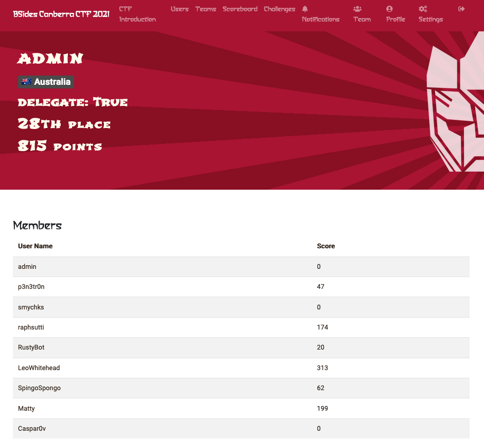

Event held 9/4/21 - 10/4/21

We came 28th 😌. Had lots of fun

## Story

Cybears /path/to/enlightenment

Sifting through the wreckage and destruction of the Cyberpocalypse of 2020, the Cybears stumble upon an ancient space bridge. Thinking that anywhere would be better than Cybeartron, they power it up and step through to the unknown. They enter another time and place, the world of Wu Kong Prime, the monkey-bot king, and his disciples Sanditron, Pigbot and Trypitakon. The monkey-bot king invites the Cybears to join them on their path to enlightenment. But first the Cybears will need to solve a series of puzzles and challenges to prove their worth...

## Overview

The BSides Canberra 2021 CTF will run on-site at the conference in the competitions space on 9-10 April 2021. The CTF will commence at 10:00 local time on 9 April (00:00UTC) and finish at 15:00 on 10 April (05:00UTC). Pre-registration for users and teams will open prior to the event so we don't HCF when the competition starts.

The CTF will be run mostly online, however there will be some challenges which are only available to BSides Canberra 2021 ticket holders. We welcome participation from non-ticket-holder teams but unfortunately cannot award them prizes for trophy challenges or final ranking placements.

We'll be running an event Discord server which can be joined here. The server has a moderate moderation policy set meaning that accounts must have a verified email attached and have existed for more than 5 minutes to speak. There is a support bot which you can use to make tickets.
