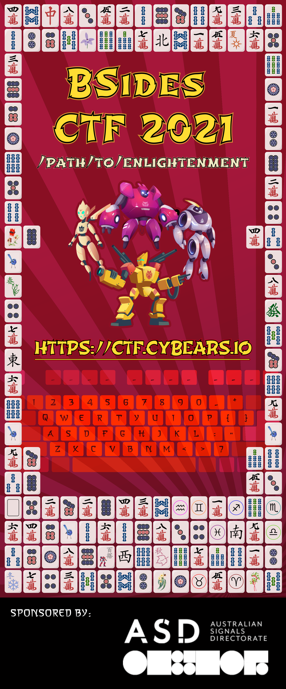
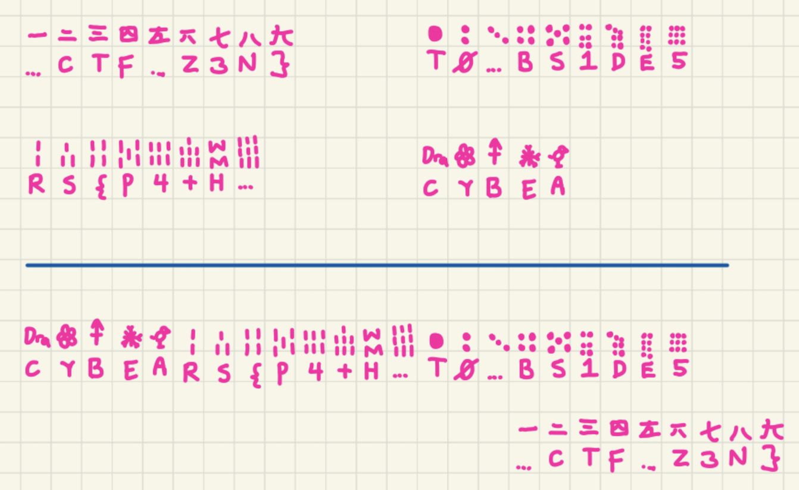

# A Sign of Enlightenment

- **Category:** Misc

## Challenge

> There is Earth, and there is Heaven. In the space between these two
> there is room for all who wish to learn.

The start of the `/path/to/enlightenment` is where you begin your
journey. Consider the seasons and all the directions in which you might
go.



## Solution

Notice that these are standard Mahjong tiles execpt for weird zodiacs and a Cybear mascot joker tile

What do we do with Mahjong games (not the actual Mahjong game)? We match them

We notice there are 4 of the same standard tiles for numbers, dots, bamboos

If we draw a line across, the lines meet at the keyboard which spells out the flag




Flag
```
cybears{p4+h_t0_bs1de5_ctf_z3n}
```
