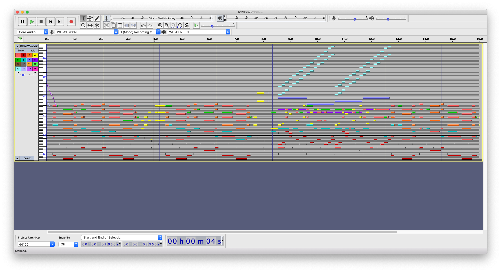

# X

- **Category:** Misc

## Challenge

> Sounds of Godiego

> The harp does not play music if its strings are too tight or too loose. The music comes only when the strings are stretched just right.

> Use your senses, listen closely, great mysteries can be found even at the beginning of the /path/to/enlightenment.
Points: 500

## Solution

```html
<button
          class="get-hyped"
          onClick="MIDIjs.play('themes/cybears/static/midi/R29kaWVnbw==.mid');"
        >
          <i class="fas fa-play"></i> Get hyped!
        </button>
```



This is a stego challenge and there are something hidden in there.. with a special characteristics

Flag
```

```
