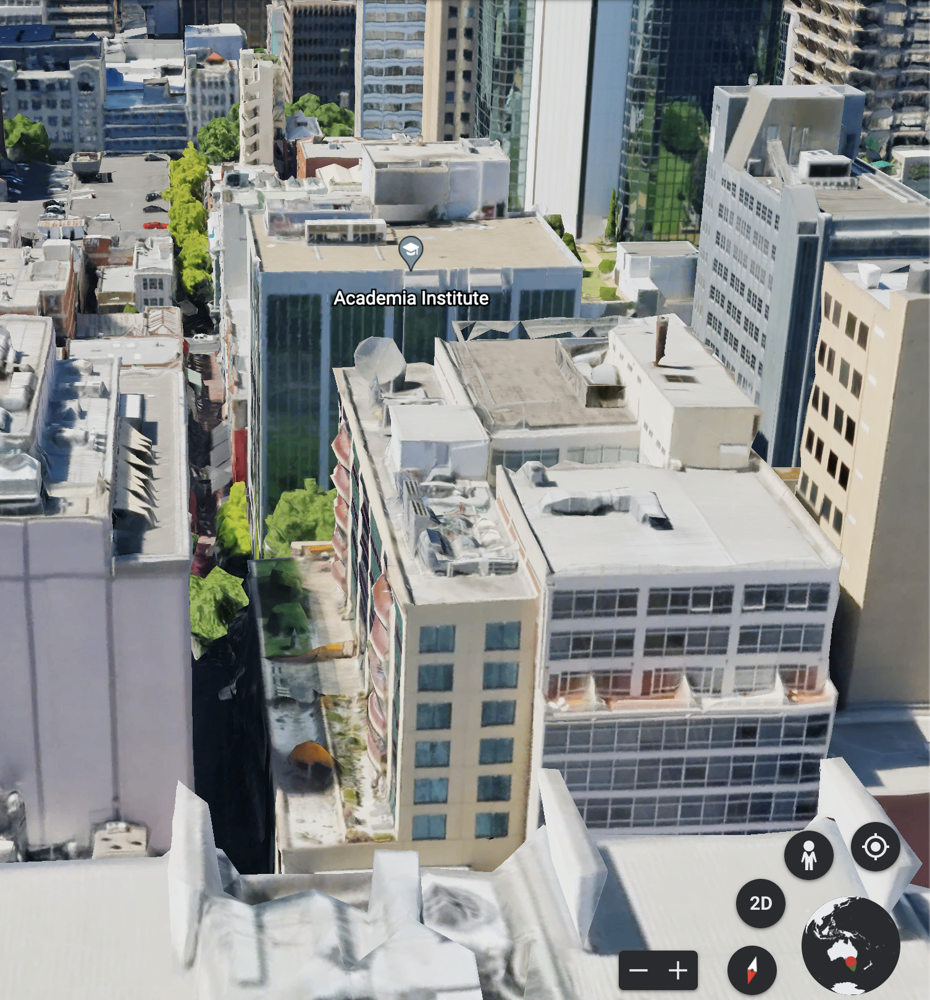
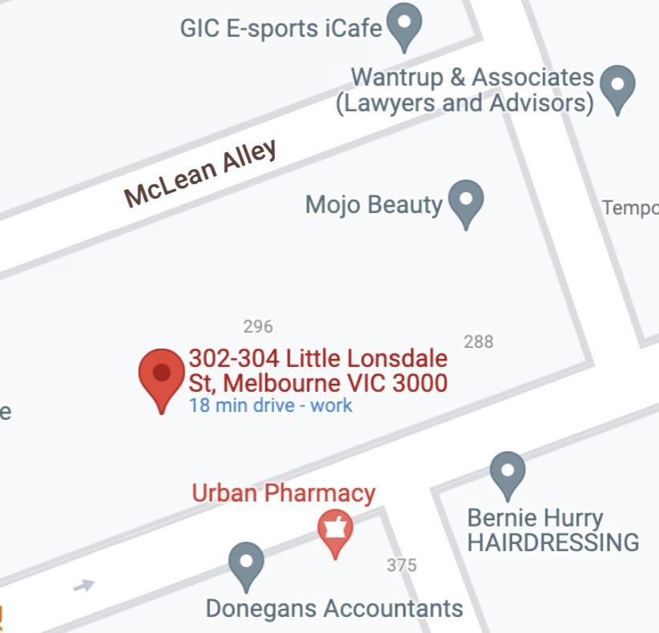

# Apartment Views

- **Category:** OSINT

## Challenge

We received intel that the accomplice we have been following is meeting with the ringleader of RaaS operation, they shared this photo online a few years back - believed to be the view from their apartment building (hideout).

Between you and me, our sources say the ringleader was testing the ransomware they were going to sell and instead infected their own laptop.

We think we may be able to setup a sting to apprehend the ringleader and retrieve the decryption key when they meet the accomplice at a dead drop in a nearby alleyway. Can you work out what the name of the street is?

Flag format: DUCTF{street_name}

Author: xXl32t_h@x0rXx


## Solution

Found unique ANZ building - 131 queen street
https://www.theaustralian.com.au/anzs-gothicstyle-tower-in-melbourne-sold-to-gpt/news-story/fd0de7387a72d04773866dd0d692c10c

Got the angle relative to the Westpac building, the apartment is north of the ANZ building


Found the building in view of the photo


Found the apartment address - 302-304 Little Lonsdale street and the nearby alley - McLean alley


Flag

```
DUCTF{mclean_alley}
```
