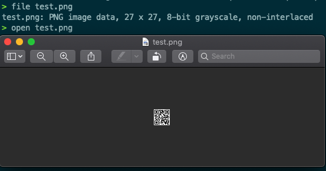

# Flag in a tweet

https://twitter.com/4n6Bexaminer/status/1385837229415694340?s=20

Mysterious message - `iVBORw0KGgoAAAANSUhEUgAAABsAAAAbCAAAAACov6uJAAAAmElEQVR42nVRCw5DIQzi/pdmyxNocXs1JtovUPDdQBzjueX5Hufw9lAVzy9R5eSlvvwTY6I7Rvd7sHDPW6hwecJGRdj8OOTU2ZQObE1UoQbnojXoNzJsNHAEA5ut3dA1AiNLbTsNykANdzCmjVQhVs7KCqNSL+pYn1Hd2/BKrv3B0xddoUV995YZIIs9i1bw95bD69r7r30AoCCNgWHvchUAAAAASUVORK5CYII=`

Looks like base64 so lets decode it
```
>  echo "iVBORw0KGgoAAAANSUhEUgAAABsAAAAbCAAAAACov6uJAAAAmElEQVR42nVRCw5DIQzi/pdmyxNocXs1JtovUPDdQBzjueX5Hufw9lAVzy9R5eSlvvwTY6I7Rvd7sHDPW6hwecJGRdj8OOTU2ZQObE1UoQbnojXoNzJsNHAEA5ut3dA1AiNLbTsNykANdzCmjVQhVs7KCqNSL+pYn1Hd2/BKrv3B0xddoUV995YZIIs9i1bw95bD69r7r30AoCCNgWHvchUAAAAASUVORK5CYII=" | base64 -d
�PNG

IHDR�����IDATx�uQ
                 C!
w0��T!V��          ���f�hq{5&�/P��@������P�/Q�䥾�c�;F�{�p�[�py�FE��8��ٔlMT��5�72l4p����5#Km;
�R/�X�Q���J����]�E}� �=�V������}� ��a�rIEND�B`�%
```

A lot of gibberish because it's a binary and specifically a PNG, so lets get do a hex dump

```
> echo "iVBORw0KGgoAAAANSUhEUgAAABsAAAAbCAAAAACov6uJAAAAmElEQVR42nVRCw5DIQzi/pdmyxNocXs1JtovUPDdQBzjueX5Hufw9lAVzy9R5eSlvvwTY6I7Rvd7sHDPW6hwecJGRdj8OOTU2ZQObE1UoQbnojXoNzJsNHAEA5ut3dA1AiNLbTsNykANdzCmjVQhVs7KCqNSL+pYn1Hd2/BKrv3B0xddoUV995YZIIs9i1bw95bD69r7r30AoCCNgWHvchUAAAAASUVORK5CYII=" | xxd
00000000: 6956 424f 5277 304b 4767 6f41 4141 414e  iVBORw0KGgoAAAAN
00000010: 5355 6845 5567 4141 4142 7341 4141 4162  SUhEUgAAABsAAAAb
00000020: 4341 4141 4141 436f 7636 754a 4141 4141  CAAAAACov6uJAAAA
00000030: 6d45 6c45 5156 5234 326e 5652 4377 3544  mElEQVR42nVRCw5D
00000040: 4951 7a69 2f70 646d 7978 4e6f 6358 7331  IQzi/pdmyxNocXs1
00000050: 4a74 6f76 5550 4464 5142 7a6a 7565 5835  JtovUPDdQBzjueX5
00000060: 4875 6677 396c 4156 7a79 3952 3565 536c  Hufw9lAVzy9R5eSl
00000070: 7676 7754 5936 4937 5276 6437 7348 4450  vvwTY6I7Rvd7sHDP
00000080: 5736 6877 6563 4a47 5264 6a38 4f4f 5455  W6hwecJGRdj8OOTU
00000090: 325a 514f 6245 3155 6f51 626e 6f6a 586f  2ZQObE1UoQbnojXo
000000a0: 4e7a 4a73 4e48 4145 4135 7574 3364 4131  NzJsNHAEA5ut3dA1
000000b0: 4169 4e4c 6254 734e 796b 414e 647a 436d  AiNLbTsNykANdzCm
000000c0: 6a56 5168 5673 374b 4371 4e53 4c2b 7059  jVQhVs7KCqNSL+pY
000000d0: 6e31 4864 322f 424b 7276 3342 3078 6464  n1Hd2/BKrv3B0xdd
000000e0: 6f55 5639 3935 595a 4949 7339 6931 6277  oUV995YZIIs9i1bw
000000f0: 3935 6244 3639 7237 7233 3041 6f43 434e  95bD69r7r30AoCCN
00000100: 6757 4876 6368 5541 4141 4141 5355 564f  gWHvchUAAAAASUVO
00000110: 524b 3543 5949 493d 0a                   RK5CYII=.
```

Then do a hexdump reverse into a proper binary into a file

```
> echo "iVBORw0KGgoAAAANSUhEUgAAABsAAAAbCAAAAACov6uJAAAAmElEQVR42nVRCw5DIQzi/pdmyxNocXs1JtovUPDdQBzjueX5Hufw9lAVzy9R5eSlvvwTY6I7Rvd7sHDPW6hwecJGRdj8OOTU2ZQObE1UoQbnojXoNzJsNHAEA5ut3dA1AiNLbTsNykANdzCmjVQhVs7KCqNSL+pYn1Hd2/BKrv3B0xddoUV995YZIIs9i1bw95bD69r7r30AoCCNgWHvchUAAAAASUVORK5CYII=" | base64 -d | xxd | xxd -r > test.png
```

Now we open it 
```
> file test.png
test.png: PNG image data, 27 x 27, 8-bit grayscale, non-interlaced
> open test.png
```



Which translate to `Bsides Perth Quokka <3`
