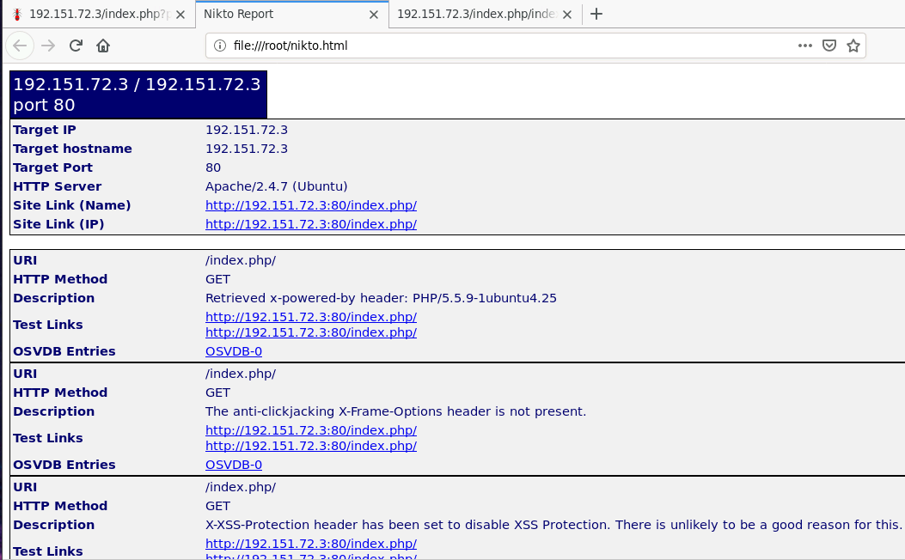
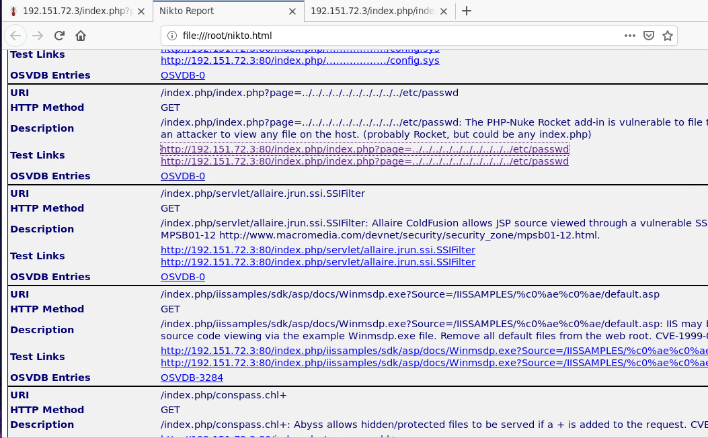
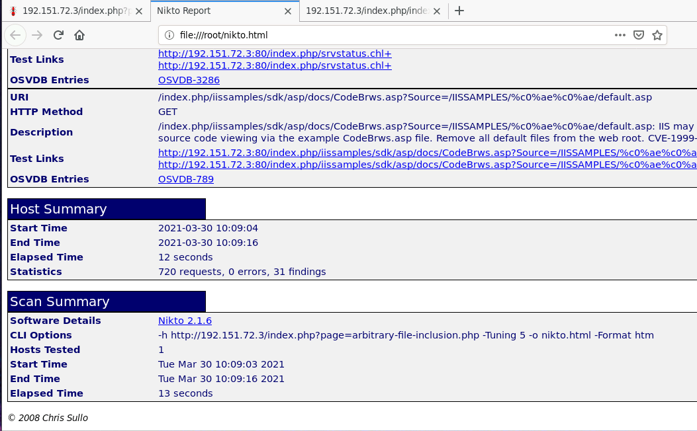
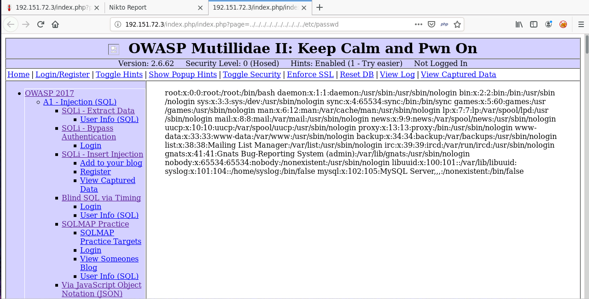

# Nikto recon

## Start with nmap

```
nmap 192.151.72.3
Starting Nmap 7.70 ( https://nmap.org ) at 2021-03-30 09:58 IST
Nmap scan report for target-1 (192.151.72.3)
Host is up (0.000014s latency).
Not shown: 998 closed ports
PORT     STATE SERVICE
80/tcp   open  http
3306/tcp open  mysql
MAC Address: 02:42:C0:97:48:03 (Unknown)

Nmap done: 1 IP address (1 host up) scanned in 0.22 seconds
```

## Running Nikto

```
nikto -h 192.151.72.3
- Nikto v2.1.6
---------------------------------------------------------------------------
+ Target IP:          192.151.72.3
+ Target Hostname:    192.151.72.3
+ Target Port:        80
+ Start Time:         2021-03-30 10:00:00 (GMT5.5)
---------------------------------------------------------------------------
+ Server: Apache/2.4.7 (Ubuntu)
+ Retrieved x-powered-by header: PHP/5.5.9-1ubuntu4.25
+ The anti-clickjacking X-Frame-Options header is not present.
+ X-XSS-Protection header has been set to disable XSS Protection. There is unlikely to be a good reason for this.
+ Uncommon header 'logged-in-user' found, with contents: 
+ The X-Content-Type-Options header is not set. This could allow the user agent to render the content of the site in a different fashion to the MIME type
+ Cookie PHPSESSID created without the httponly flag
+ Cookie showhints created without the httponly flag
...
```

## Save result to html

```
nikto -h http://192.151.72.3/index.php?page=arbitrary-file-inclusion.php -Tuning 5 -o nikto.html -Format htm
- Nikto v2.1.6
---------------------------------------------------------------------------
+ Target IP:          192.151.72.3
+ Target Hostname:    192.151.72.3
+ Target Port:        80
+ Start Time:         2021-03-30 10:09:04 (GMT5.5)
---------------------------------------------------------------------------
+ Server: Apache/2.4.7 (Ubuntu)
+ Retrieved x-powered-by header: PHP/5.5.9-1ubuntu4.25
+ The anti-clickjacking X-Frame-Options header is not present.
+ X-XSS-Protection header has been set to disable XSS Protection. There is unlikely to be a good reason for this.
+ Uncommon header 'logged-in-user' found, with contents: 
+ The X-Content-Type-Options header is not set. This could allow the user agent to render the content of the site in a different fashion to the MIME type
+ Cookie PHPSESSID created without the httponly flag
+ Cookie showhints created without the httponly flag
+ No CGI Directories found (use '-C all' to force check all possible dirs)
+ Apache/2.4.7 appears to be outdated (current is at least Apache/2.4.37). Apache 2.2.34 is the EOL for the 2.x branch.
+ Allowed HTTP Methods: GET, HEAD, POST, OPTIONS 
```





